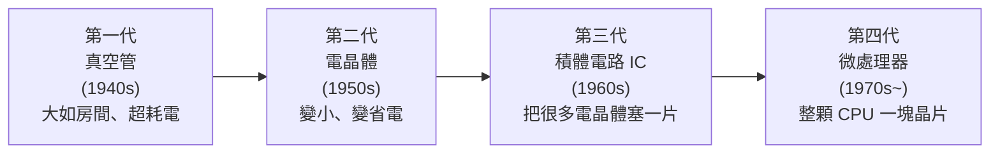

# [cs-0-3] 🎈 電腦發展簡史：從算盤、真空管到 AI

> **本章目標**：用一趟輕鬆的時光之旅，認識電腦怎麼從「笨重的計算機器」一路演化到今天的 AI，並從歷史中看懂幾個影響至今的關鍵轉折。

## 你會學到

- 電腦演化的幾個重要里程碑
- 「世代」是怎麼用核心元件劃分的
- 幾個影響深遠的人物與發明
- 為什麼了解歷史能幫你理解現在

## 概念說明

> 🎈 這是一個**趣味章節**，輕鬆讀就好。但別小看歷史——很多今天「理所當然」的設計，都是從這些故事裡長出來的。

### 一切始於「想算得更快」

電腦的故事，本質是人類「想把計算這件事做得更快、更省力」的歷史。

```
算盤（數千年前）→ 機械計算機（17 世紀）→ 電子計算機（20 世紀）→ 今天
```

最早人們用**算盤**計算，後來有人做出**機械齒輪計算機**（17 世紀的帕斯卡、萊布尼茲）。19 世紀，**巴貝奇（Charles Babbage）** 設計了「分析機」——被視為現代電腦的概念雛形，而 **愛達·勒芙蕾絲（Ada Lovelace）** 為它寫下被認為是史上第一個「演算法」，因此常被尊稱為**第一位程式設計師**。

### 用「核心元件」劃分世代

電腦的「世代」通常用「**用什麼元件來做運算與記憶**」來劃分。元件越來越小、越來越快、越來越省電：



這張圖在說：電腦的進步，核心是「**把運算元件做得越來越小**」——從一根根真空管，到指甲大的晶片上塞下數十億個電晶體。這條「越做越小」的路，正是 Part 2-5 摩爾定律的故事。

幾個標誌性的機器：

- **ENIAC（1940s）**：早期著名的電子計算機，用了上萬根真空管，重達數十噸、佔滿一整個房間，卻沒有你手機的運算力。
- **個人電腦（PC，1970-80s）**：電腦從「實驗室/大公司專屬」走進尋常家庭，蘋果、IBM PC 是代表。
- **智慧型手機（2007~）**：一台口袋裡的電腦，運算力遠超當年的超級電腦。

### 幾個改變世界的名字

- **圖靈（Alan Turing）**：奠定「什麼是計算」的理論基礎（Part 9-1 的圖靈機），二戰時破解密碼。
- **馮紐曼（John von Neumann）**：提出沿用至今的電腦架構（Part 3-1）。
- **這些理論先驅**：在「還沒有電腦」的年代，就想清楚了電腦「能算什麼、該怎麼設計」——今天的機器仍走在他們畫的藍圖上。

### 然後，AI 來了

近幾十年，電腦不只「照指令算」，還開始能「從資料中學習」——這就是**人工智慧（AI）與機器學習**（Part 9-4）。從會下棋、會辨識圖片，到今天會寫文章、寫程式的大型語言模型，電腦的角色正在從「計算工具」往「智慧協作者」轉變。而支撐這一切的，仍是這門課要講的那些底層原理。

### 為什麼要懂歷史？

因為**很多今天的設計，都是歷史遺留的結果**——你會更懂「為什麼是這樣」。例如：

- 為什麼資料用二進位？因為電子元件「開/關」兩種狀態最好做（從真空管時代就如此）。
- 為什麼鍵盤是 QWERTY 排列？是打字機時代留下的習慣。

懂了來龍去脈，很多「奇怪的設計」就有了合理的解釋。

## 範例：你口袋裡的超級電腦

一個有趣的對比，感受進步有多誇張：

```
1969 年送人類上月球的太空船，其電腦運算力與記憶體，
遠遠不如今天一支最普通的智慧型手機。
你口袋裡那支手機，運算力是當年「超級電腦」的數百萬倍。
```

## 小練習

1. 用「核心元件」說出電腦四個世代的順序（提示：真空管 → ？ → ? → ?）。
2. 查一個你有興趣的人物（圖靈、馮紐曼、愛達·勒芙蕾絲），用兩三句話寫下他/她的貢獻。
3. 想一個「歷史遺留」的電腦設計（例如 QWERTY 鍵盤、檔案的副檔名），查查它為什麼長這樣。

## 課外讀物

> 更多有趣的電腦冷知識 → [課外讀物 E-5-3：史上第一隻 bug](../../../課外讀物/E-5-fun-facts/E-5-3-first-bug.md)、[課外讀物 E-5-4：Hello World 的由來](../../../課外讀物/E-5-fun-facts/E-5-4-hello-world.md)

> 圖靈與「什麼是計算」 → 本書 Part 9-1：計算理論初探
