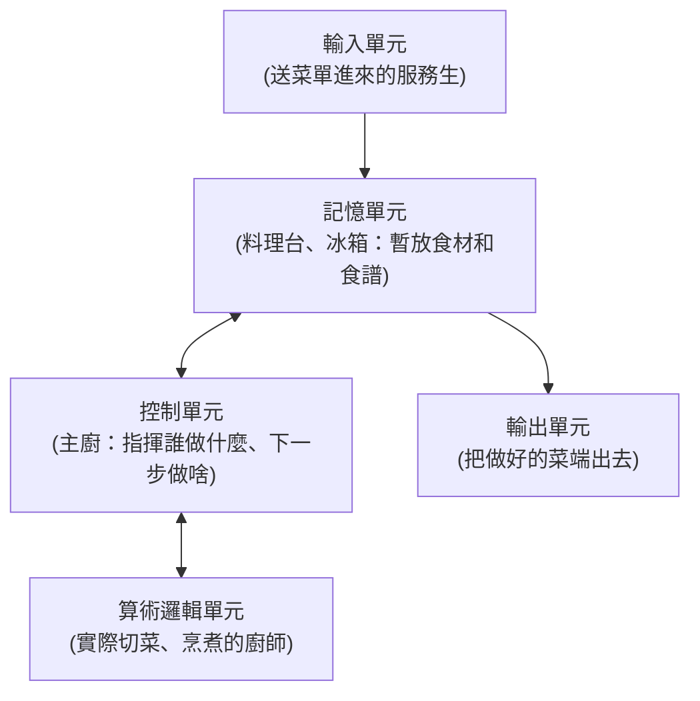

# [cs-0-4] 電腦的五大單元：輸入、輸出、記憶、控制、算術邏輯

> **本章目標**：認識任何一台電腦都具備的五大功能單元，建立「電腦由哪些零件組成、各自負責什麼」的整體框架——這是後面所有硬體章節的地圖。

## 你會學到

- 電腦的五大基本單元各做什麼
- 它們怎麼對應到你看得到的硬體（CPU、記憶體…）
- 「控制單元」和「算術邏輯單元」合稱什麼
- 這五個單元怎麼合作完成一件工作

## 概念說明

### 把 IPO 模型放大來看

[cs-0-2] 說電腦的本質是「輸入 → 處理 → 輸出」。現在把「處理」這塊放大，會看到它其實由幾個分工的單元組成。經典的劃分是**五大單元**：

```
輸入單元 ── 把外界的東西送進電腦
輸出單元 ── 把結果送出給外界
記憶單元 ── 暫存資料與指令
控制單元 ── 指揮調度，決定下一步做什麼
算術邏輯單元 ── 真正做運算（加減、比較）
```

用一個比喻——把電腦想成一間**餐廳廚房**：



這張圖在說：輸入單元把「訂單」（資料與指令）送進來、暫放在記憶單元；控制單元（主廚）看著指令、指揮算術邏輯單元（廚師）做運算；做好的結果經由輸出單元送出去。**五個單元各司其職、密切配合。**

### 對應到你看得到的硬體

這五個「功能單元」不是五個一定分開的零件，而是**功能上的劃分**。它們對應到的實體硬體是：

| 功能單元 | 對應的硬體 |
|---------|-----------|
| 輸入單元 | 鍵盤、滑鼠、麥克風、觸控螢幕、網路卡 |
| 輸出單元 | 螢幕、喇叭、印表機、網路卡 |
| 記憶單元 | 記憶體（RAM）、硬碟（廣義的儲存）|
| 控制單元 | CPU 內部的「控制單元」|
| 算術邏輯單元 | CPU 內部的「ALU」|

注意到了嗎——**控制單元 + 算術邏輯單元，這兩個「處理核心」都在 CPU 裡面**。所以人們說「CPU 是電腦的大腦」，就是因為它包辦了「指揮」和「運算」這兩件最核心的事。

### CPU = 控制單元 + ALU（+ 其他）

把這兩個關鍵單元的全名記一下：

- **控制單元（CU，Control Unit）**：像主廚，**不自己做菜，但決定整個流程**——讀取指令、解讀它、然後指揮其他單元動作。
- **算術邏輯單元（ALU，Arithmetic Logic Unit）**：像廚師，**真正動手算**——做加減乘除（算術）、以及比較大小、判斷真假（邏輯）。

這兩個合起來是 CPU 的核心（CPU 裡還有暫存器等，Part 3-2 詳講）。記住這個對應，你之後看 CPU 構造就有地圖了。

### 它們怎麼合作完成一件事

以「計算 3 + 5」為例，五大單元的接力：

```
1. 輸入單元：你從鍵盤打入「3 + 5」
2. 記憶單元：把「3」「5」和「相加」這個指令暫存起來
3. 控制單元：讀到「相加」指令，指揮 ALU 去做
4. 算術邏輯單元：實際把 3 和 5 加起來得到 8
5. 記憶單元：暫存結果 8
6. 輸出單元：把 8 顯示在螢幕上
```

每一個你覺得「瞬間完成」的動作，背後都是這樣一棒接一棒的合作。Part 3-3「指令週期」會把這個流程講得更精細。

## 範例：認一認你電腦的五大單元

拿你正在用的電腦或手機，對照一下：

```
輸入：你的鍵盤、觸控螢幕、鏡頭
輸出：你正在看的這個螢幕、喇叭
記憶：裡面的 RAM（執行時用）、硬碟/快閃記憶體（長期存）
控制 + 算術邏輯：那顆 CPU 晶片（手機可能叫「處理器」或「晶片」）
```

整台裝置，其實就是這五大單元的組合。

## 小練習

1. 把你身邊一台電子裝置（電腦、手機、平板）的零件，分類到五大單元裡。
2. 用「廚房」的比喻，向別人解釋「控制單元」和「算術邏輯單元」的分工。
3. 用五大單元的接力，描述「在計算機 App 按下 7 × 8」這件事的完整流程。

## 課外讀物

> CPU 裡的控制單元、ALU、暫存器的細節 → 本書 Part 3-2：CPU 構造

> 五大單元接力完成一條指令的精細流程 → 本書 Part 3-3：指令週期
