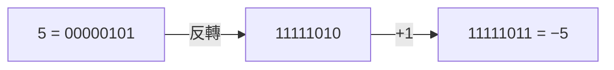

# [cs-1-3] 負數怎麼存：補數（two's complement）的巧思

> **本章目標**：理解電腦沒有「負號」這個符號，卻能用一個巧妙的編碼「二補數」來表示負數，並讓加減法用同一套電路完成。

## 你會學到

- 電腦表示負數的難題
- 最直覺的「符號位元」做法，以及它的問題
- 「二補數」的巧思：負數怎麼編碼
- 為什麼二補數讓「減法 = 加法」

## 概念說明

### 難題：電腦只有 0 和 1，沒有「負號」

我們寫負數會用「−」符號，例如 −5。但電腦的世界只有 0 和 1（[cs-1-1]），**沒有「負號」這種東西**。那它怎麼表示 −5？

答案是：**用其中一個位元（或一種編碼規則）來「代表正負」**。最直覺的想法是——

### 做法一：符號位元（直覺但有問題）

拿最左邊那個 bit 當「符號位」：**0 代表正、1 代表負**，其餘位元表示數值大小。例如用 8 個 bit：

```
0 0000101 = +5
1 0000101 = −5   （最左邊的 1 代表負）
```

直覺吧？但這個做法有兩個麻煩：

1. **出現兩個零**：`0 0000000` 是 +0，`1 0000000` 是 −0——「正零」和「負零」？很尷尬。
2. **加減法很麻煩**：要先看符號、再決定該加還是該減，電路變複雜。

所以實際的電腦**不用**這個做法，而是用一個更巧妙的——二補數。

### 做法二：二補數（電腦實際用的）

**二補數（two's complement）** 是電腦表示負數的標準方法。它的編碼規則是：

```
要表示一個負數 −N：
   1. 先寫出 N 的二進位
   2. 把每個位元「反轉」（0變1、1變0）
   3. 結果再「加 1」
```

舉例，用 8 bit 表示 −5：

```
   5 的二進位：     0000 0101
   反轉每個位元：   1111 1010
   加 1：           1111 1011  ← 這就是 −5 的二補數
```



這張圖在說：二補數透過「反轉再加一」，把一個正數變成它的負數版本。看起來怪，但它有個神奇的好處——

### 二補數的魔法：減法變加法

二補數最大的價值是：**用它來表示負數後，「減法」可以直接用「加法」完成**，不需要另外設計減法電路！

例如算 `7 − 5`，等於 `7 + (−5)`：

```
   7 的二補數：       0000 0111
   −5 的二補數：      1111 1011
   直接相加：       1 0000 0010
                    ↑
            最左邊溢出的進位被丟掉
   留下 8 bit：       0000 0010 = 2  ✓
```

`7 + (−5)` 用「直接相加、丟掉溢出位」就得到正確答案 2！這代表 **CPU 只要會做加法，就自動會做減法**——只要把減數轉成二補數再加。這大大簡化了硬體（[cs-2-3] 的加法器一個就夠用）。

這就是二補數的巧思所在：它不只解決了「怎麼表示負數」，還順便解決了「怎麼省下減法電路」。也因此它沒有「+0/−0」的尷尬（零只有一種表示）。**一個編碼設計，同時解決好幾個問題**——這種優雅，在計算機科學裡隨處可見。

## 範例：看懂一個二補數

二補數的數有個快速判斷法——**看最左邊那個 bit**：

```
0 開頭 → 正數，直接照二進位讀
1 開頭 → 負數，要用二補數規則還原

例：8 bit 的 11111111
   開頭是 1 → 負數
   反推：減 1 → 11111110，反轉 → 00000001 = 1
   所以它是 −1

→ 有趣的結論：8 bit 二補數裡，全部都是 1（11111111）代表 −1！
```

## 小練習

1. 用 8 bit 二補數，寫出 −3 的二進位（提示：3 → 反轉 → 加 1）。
2. 驗證 `6 − 4`：把 6 和 −4 的二補數相加、丟掉溢出位，看結果是不是 2。
3. 思考題：為什麼「符號位元」做法會有兩個零（+0 和 −0），而二補數沒有這個問題？

## 課外讀物

> 下一步：有了整數，那「小數」怎麼存？ → 本書 Part 1-4：浮點數

> 加法電路怎麼用邏輯閘做出來 → 本書 Part 2-3：從邏輯閘到加法器
