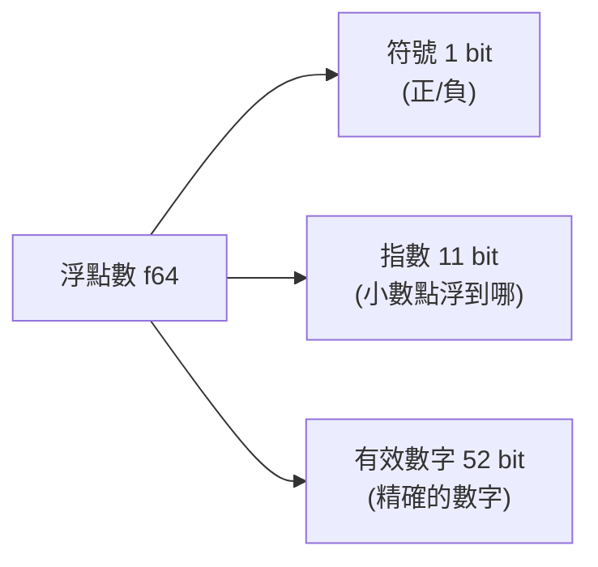

# [cs-1-4] 小數怎麼存：浮點數與它的精度陷阱（為什麼 0.1 + 0.2 ≠ 0.3）

> **本章目標**：理解電腦怎麼用「浮點數」表示小數，以及為什麼這套方法會帶來「算不準」的精度問題——這是每個工程師都該知道的經典陷阱。

## 你會學到

- 電腦表示小數的挑戰
- 「浮點數」的核心點子（像科學記號）
- 為什麼 `0.1 + 0.2` 不等於 `0.3`
- 寫程式時怎麼面對這個陷阱

## 概念說明

### 挑戰：小數點放哪？

整數好辦（[cs-1-2]、[cs-1-3]）。但小數呢？例如 `3.14`，那個小數點要怎麼用 0 和 1 表示？而且小數有大有小——`0.0000001` 和 `1234567.8` 都要能表達。

電腦的解法叫 **浮點數（floating point）**。「浮動的小數點」這個名字就點出了精髓——**小數點的位置是「浮動」的，不固定**。

### 核心點子：像科學記號

浮點數的概念，和你學過的**科學記號**幾乎一樣。科學記號這樣寫大數或小數：

```
300000 = 3.0 × 10⁵
0.0025 = 2.5 × 10⁻³
```

把一個數拆成「**有效數字 × 基底的某次方**」。浮點數就是這個概念的二進位版：

```
一個浮點數 = 符號 × 有效數字 × 2^(指數)
              ↑       ↑           ↑
            正負    精確的數字   小數點浮動到哪
```

電腦用固定的幾個 bit 分別存「符號、有效數字、指數」三部分（這是 IEEE 754 標準，你只要知道概念）。用「指數」來浮動小數點，就能用有限的位元，表達從超大到超小的各種數。這就是為什麼 [rust-1-2]、[basic] 裡的 `f64`、`f32` 叫「浮點數」。



這張圖在說：一個 64 位元的浮點數，把位元分成「符號、指數、有效數字」三塊——用這三塊組合，表達各種大小的小數。

### 陷阱：有些小數「存不準」

這套方法有個無法避免的副作用：**很多十進位小數，在二進位裡是「無限循環」的，存不下完整的值，只能存「最接近的近似值」。**

這就像十進位無法精確寫出 `1/3`（= 0.3333... 無限）一樣。在二進位裡，連看似簡單的 `0.1` 都是無限循環的——電腦只能存一個「非常接近 0.1、但不完全等於 0.1」的值。

於是經典現象出現了：

```
0.1 + 0.2 的結果，在電腦裡是 0.30000000000000004
而不是剛好的 0.3
```

因為 `0.1` 和 `0.2` 存進去時就各有一點點誤差，相加後誤差顯現出來。**這不是哪個語言的 bug——幾乎所有語言（Python、JavaScript、Rust、C…）都這樣**，因為它們都用同一套 IEEE 754 浮點數標準。

> 你在 **rust 課程 [rust-1-2]** 和 **basic 課程**都會遇到這個現象，原理就在這裡。

### 寫程式怎麼面對它？

知道這個陷阱後，幾個實用原則：

1. **別用 `==` 直接比較兩個浮點數**。`if (a == 0.3)` 可能因為誤差永遠不成立。改成「看兩者差距夠不夠小」（`if (abs(a - 0.3) < 0.0001)`）。
2. **錢千萬別用浮點數**。處理金額時，誤差會出大事。改用「整數存到最小單位」（例如用「分」當單位存整數），或用專門的「十進位/定點數」型別。
3. **顯示時做四捨五入**。要給人看時，把結果 round 到合理的小數位。

## 範例：親眼看誤差

```
在任何支援浮點數的語言裡試試：
   印出 0.1 + 0.2
   → 你會看到 0.30000000000000004（而非 0.3）

   印出 0.1 + 0.2 == 0.3
   → 結果是 false（因為左邊不剛好是 0.3）

這不是電腦壞了，是浮點數的本質。記住它，就不會被坑。
```

## 小練習

1. 用任何你會的語言，印出 `0.1 + 0.2` 的結果，親眼看看那串小數。
2. 用自己的話解釋：為什麼 `0.1` 在電腦裡「存不準」？（提示：類比十進位無法精確表示 1/3。）
3. 思考題：一個記帳 App 該不該用浮點數存金額？如果不該，你會怎麼存「123.45 元」？

## 課外讀物

> 下一步：數字之外，「文字」怎麼變成 0 和 1 → 本書 Part 1-5：文字編碼

> 這個經典陷阱也是面試常考題與線上事故來源 → **sre 課程**（精度問題曾釀成真實事故）
