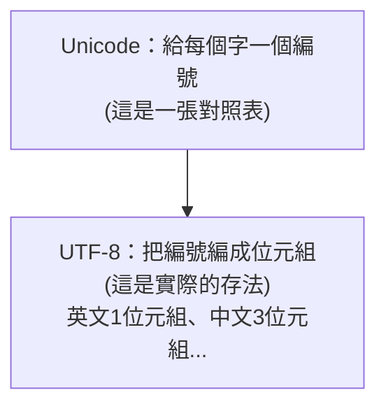

# [cs-1-5] 文字怎麼存：從 ASCII 到 Unicode、UTF-8

> **本章目標**：理解文字（英文、中文、emoji）怎麼被編碼成 0 和 1，認識 ASCII、Unicode、UTF-8 的演進，並搞懂「亂碼」是怎麼來的。

## 你會學到

- 文字編碼的核心點子：字元 ↔ 數字的對照表
- ASCII：最早的編碼，為什麼不夠用
- Unicode：給世界上每個字一個編號
- UTF-8：怎麼把 Unicode 編號變成位元組，以及亂碼的成因

## 概念說明

### 核心點子：一張「字元 ↔ 數字」對照表

電腦只懂數字（0 和 1）。那文字怎麼存？很簡單——**事先約定一張對照表，把每個字元對應到一個數字**。存文字時存數字，顯示時查表還原成字元。

```
約定：'A' = 65，'B' = 66，'a' = 97，'!' = 33 ...
存 "A" → 其實存的是數字 65 → 二進位 01000001
顯示時 → 查表知道 65 是 'A' → 畫出 A
```

關鍵在於：**大家要用「同一張對照表」**，否則你存的 65 在別人的表裡可能是別的字——這就是亂碼的根源（後面說）。

### ASCII：最早的對照表

最早的標準對照表叫 **ASCII**（美國資訊交換標準碼）。它用 **7 個 bit**（後來常用 8 bit/1 byte），能表示 128 個字元：

```
ASCII 涵蓋：英文大小寫字母、0~9 數字、常見標點、一些控制字元
例：'A'=65, 'a'=97, '0'=48, ' '(空格)=32
```

ASCII 在英文世界很好用。但問題很明顯——**它只有 128 個位置，放得下英文，卻放不下中文、日文、阿拉伯文、emoji……** 全世界有幾萬個漢字，128 個位置遠遠不夠。

### Unicode：給世界上每個字一個編號

為了解決「容納全世界文字」的問題，**Unicode** 誕生了。它的目標很宏大：**給世界上每一個字元，都分配一個獨一無二的編號**（叫「碼點」，code point）。

```
Unicode 給每個字一個編號（通常寫成 U+ 開頭的十六進位）：
   'A'  = U+0041（沿用 ASCII 的 65）
   '你' = U+4F60
   '好' = U+597D
   '🦀' = U+1F980
```

Unicode 能容納上百萬個字元，中文、emoji、各種語言文字全都有位置。它是「**字元 ↔ 編號**」的對照表。但還有一個問題沒解決——**這些編號，實際上怎麼用位元組存？** 這就是 UTF-8 的工作。

### UTF-8：把 Unicode 編號變成位元組

Unicode 只規定「每個字的編號」，但沒規定「編號怎麼存成位元組」。**UTF-8** 是目前最流行的「存法」（編碼方式）。它的聰明之處是**長度可變**：

```
常用的英文字（編號小）→ 只用 1 個位元組（和 ASCII 完全相容！）
中文、常見符號         → 用 3 個位元組
emoji 等              → 用 4 個位元組
```



這張圖在說：**Unicode 負責「編號」，UTF-8 負責「怎麼存」**——兩者分工。UTF-8 的「英文只用 1 位元組且相容 ASCII」這個設計超棒，讓舊的英文文件不用改就能用，所以它成了網路世界的事實標準（絕大多數網頁都用 UTF-8）。

> 這也解釋了 **rust 課程 [rust-6-2]** 為什麼 `String` 的 `.len()` 算的是「位元組數」而非「字元數」——因為一個中文字佔 3 個位元組。

### 亂碼是怎麼來的？

現在你能理解亂碼了——**用「錯的對照表/編碼」去解讀位元組**，就會還原成錯的字：

```
你用 UTF-8 存了「你好」（一串特定的位元組）
對方用「另一種編碼」（例如舊的 Big5 或 GBK）去讀那串位元組
→ 同樣的位元組，在不同編碼表裡對應不同的字
→ 顯示出一堆問號或怪符號 = 亂碼
```

解法就是「**存和讀用同一種編碼**」，現代統一用 UTF-8，亂碼問題就大幅減少了。

## 範例：一個字的編碼之旅

```
你想存中文字「好」：
   1. 查 Unicode：'好' 的編號是 U+597D
   2. 用 UTF-8 編碼：變成 3 個位元組 E5 A5 BD（十六進位）
   3. 這 3 個位元組存進檔案
   4. 別人用 UTF-8 打開 → 查回 U+597D → 顯示「好」 ✓
   （若用錯編碼打開 → 亂碼 ✗）
```

## 小練習

1. 用自己的話解釋 Unicode 和 UTF-8 的分工（一個負責什麼、另一個負責什麼）。
2. 查一下你名字裡某個中文字的 Unicode 編號（搜尋「某字 unicode」）。
3. 思考題：為什麼 UTF-8 讓「英文只用 1 位元組」是個很聰明的設計？（提示：和舊的 ASCII 文件相容。）

## 課外讀物

> 一個中文字佔 3 位元組，影響字串長度計算 → **rust 課程 [rust-6-2]：String vs &str**

> 下一步：圖片、聲音、影片怎麼也變成 0 和 1 → 本書 Part 1-6：多媒體編碼
