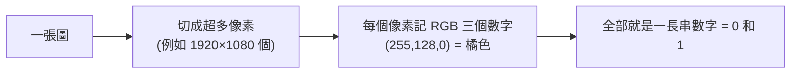

# [cs-1-6] 圖片、聲音、影片怎麼變成 0 和 1

> **本章目標**：理解圖片、聲音、影片這些「類比世界」的東西，怎麼被轉換成電腦能存的 0 和 1，以及「壓縮」為什麼不可或缺。

## 你會學到

- 「取樣」：把連續的東西切成一格一格的數字
- 圖片怎麼變成數字（像素與顏色）
- 聲音怎麼變成數字（取樣率）
- 為什麼需要壓縮，以及「無損 vs 有損」

## 概念說明

### 共同手法：取樣（把連續的切成一格格）

真實世界的圖片、聲音是**連續**的（顏色平滑漸變、聲音是連續波形）。但電腦只能存「一個一個分開的數字」。怎麼辦？

答案是**取樣（sampling）**——**把連續的東西，切成很多「一小格一小格」，每格記一個數字**。格子切得夠細，人眼人耳就分辨不出它其實是「一格一格」的。

比喻：像用「馬賽克拼貼」重現一幅畫，或用「很多小階梯」逼近一條斜坡——只要格子夠小、階梯夠密，看起來/聽起來就跟原本一樣。

### 圖片：像素與顏色

一張數位圖片，是由超多的小方格組成的，每格叫一個**像素（pixel）**。每個像素記錄「那一點是什麼顏色」：

```
顏色怎麼用數字表示？最常見的是 RGB：
   每個像素記 紅(R)、綠(G)、藍(B) 三個數字，各 0~255
   例：(255, 0, 0) = 純紅，(255, 255, 255) = 白，(0, 0, 0) = 黑
   三種光的不同比例 → 混出各種顏色
```



這張圖在說：圖片 = 一大堆像素，每個像素 = 幾個顏色數字。所以一張 1920×1080 的圖有兩百多萬個像素，每個又有 RGB 三個值——**這就是為什麼圖片檔案會這麼大**（也帶出下面的「壓縮」）。還記得 [cs-1-2] 嗎？顏色值 255 = 十六進位 FF，這就是為什麼網頁顏色寫成 `#FF8000` 這種十六進位。

### 聲音：取樣率

聲音是一種「氣壓隨時間變化的波」。數位化的方法是：**每隔極短的時間，量一次「現在波的高度」，記成一個數字**。

```
每秒量幾次 = 取樣率（sample rate）
CD 音質：每秒取樣 44100 次（44.1 kHz）
→ 一秒鐘的聲音 = 44100 個數字（單聲道）
取樣越密，還原的聲音越接近原本
```

所以一首歌，本質是「幾百萬個記錄音量高低的數字」串起來。

### 影片：圖片 + 聲音 + 時間

影片最簡單——**它就是「很多張圖片快速連續播放」+「聲音」**。每張圖叫一個「影格（frame）」：

```
影片 = 每秒 24~60 張圖片（影格）連續播放 + 同步的聲音
你眼睛的「視覺暫留」讓連續的靜態圖看起來像在動
```

這也說明為什麼影片檔案**超大**——一秒就要幾十張高解析度圖片，沒壓縮的話一部電影會大到無法想像。

### 壓縮：不可或缺

從上面你會發現一個問題：**這些媒體「原始」存起來都大得嚇人**。一張沒壓縮的照片可能幾十 MB、一部沒壓縮的電影可能上 TB。所以**壓縮（compression）** 是必須的——用聰明的方法，讓檔案變小但內容差不多。壓縮分兩種：

| 類型 | 做法 | 例子 |
|------|------|------|
| **無損壓縮** | 縮小但能「完全還原」原始資料 | PNG 圖片、ZIP 檔、FLAC 音樂 |
| **有損壓縮** | 丟掉「人感覺不太出來」的細節換更小 | JPEG 圖片、MP3 音樂、MP4 影片 |

```
無損：像把衣服摺整齊收進箱子——攤開後一模一樣。
有損：像把不太重要的東西丟掉——換來小很多，但回不去原樣。
```

有損壓縮為什麼可行？因為它利用「**人的感官有極限**」——丟掉人眼人耳本來就察覺不到的細節（例如人聽不到的高頻、人眼不敏感的細微色差）。這就是 JPEG、MP3 能把檔案縮到原本幾十分之一，你卻幾乎看不出差別的祕密。

## 範例：算算一張圖多大

```
一張 1920×1080 的「未壓縮」圖片：
   像素數 = 1920 × 1080 ≈ 200 萬個
   每像素 RGB 三個位元組 = 約 600 萬位元組 ≈ 6 MB

但你手機拍的照片常常只有 2~3 MB？
→ 因為存成 JPEG（有損壓縮）了，丟掉了人眼難察覺的細節。
```

## 小練習

1. 用自己的話解釋「取樣」，並說明它怎麼把「連續的聲音」變成「一串數字」。
2. 一張圖片放很大時會看到一格一格的小方塊，那是什麼？（提示：本章的某個名詞。）
3. 思考題：拍照存成 JPEG 和存成 PNG，哪個檔案通常比較小？哪個能保留完整原始資料？各適合什麼場合？

## 課外讀物

> 顏色值 255 / FF 與進位制 → 複習本書 Part 1-2：數字系統

> 下一步：這些資料量怎麼計量（KB、MB、GB）→ 本書 Part 1-7：資料量單位

> 圖片影片的傳輸與快取（為什麼網站圖片要優化） → **快取課程**、[課外讀物 E-11：效能](../../../課外讀物/E-11-performance/E-11-1-frontend-performance.md)
