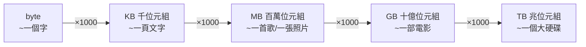

# [cs-1-7] 資料量單位：bit / byte / KB / MB / GB，與「1KB 到底是 1000 還 1024」

> **本章目標**：搞懂從 bit 到 TB 的資料量單位階梯，理解 byte 為什麼是 8 個 bit，並釐清「1KB 是 1000 還 1024」這個讓很多人困惑的問題。

## 你會學到

- bit 與 byte 的關係
- KB、MB、GB、TB 的階梯
- 「1024 vs 1000」的歷史糾葛，與「為什麼買的硬碟容量好像縮水」
- 怎麼估算資料大小

## 概念說明

### 從 bit 到 byte

[cs-1-1] 講過最小單位是 **bit**（0 或 1）。但 1 個 bit 能裝的太少，所以實務上以 **byte（位元組）** 為基本單位：

```
1 byte = 8 bits
```

為什麼是 8？歷史與實用的結果——8 個 bit 剛好能表示 256 種組合（2⁸），足以涵蓋一個 ASCII 字元（[cs-1-5]）和常用數值，成了通用的「基本包裝單位」。你可以記成：

```
1 bit  = 一盞燈（0 或 1）
1 byte = 8 盞燈一組 = 能表示 256 種值 = 大約「一個英文字母」
```

> 注意大小寫慣例：**大寫 B 通常指 byte（位元組），小寫 b 指 bit（位元）**。所以「網速 100 Mbps」的小寫 b 是 bit，下載速度「12.5 MB/s」的大寫 B 是 byte——兩者差 8 倍，這常讓人誤會「網路為什麼比廣告慢」。

### 容量階梯：KB、MB、GB、TB

byte 還是太小（一個字而已），所以往上有一層層更大的單位，每層大約是前一層的 1000 倍：



這張圖在說：單位每往上一階大約是 1000 倍，配上「生活中的東西」幫你建立直覺——一首歌約幾 MB、一部高畫質電影約幾 GB、一個現代硬碟是 TB 級。

### 1024 還是 1000？這就是那個經典困惑

你可能聽過「1 KB = 1024 bytes」，但上面我寫「×1000」——到底哪個對？答案是：**兩種定義都存在，這正是混亂的來源。**

問題出在：電腦用二進位，所以「整齊的數字」是 2 的次方。`2¹⁰ = 1024` 剛好很接近 1000，於是早期工程師就把「1024」叫做「1K」——方便又接近。但十進位世界的「K」明明是 1000。於是出現兩套：

```
傳統電腦慣例： 1 KB = 1024 bytes（用 2 的次方）
國際標準單位： 1 KB = 1000 bytes（用 10 的次方）

為了消除混淆，後來訂了新名字給「1024 那套」：
   1 KiB（kibibyte）= 1024 bytes
   1 MiB = 1024 KiB ...
```

### 「硬碟容量縮水」之謎

這個差異造成一個你可能遇過的現象——**買的硬碟好像比標示的小**：

```
你買一個標示「1 TB」的硬碟。
硬碟廠商用「1 TB = 1,000,000,000,000 bytes」（1000 那套）。
但你的作業系統可能用「1024 那套」來顯示，
   它把同樣的位元組數除以 1024³，算出來約「931 GB」。
→ 同一個硬碟，標 1 TB，電腦顯示 931 GB——沒人騙你，只是兩套定義。
```

所以下次看到「容量怎麼少了一截」，你就知道是 1000 vs 1024 的把戲，不是被坑了。

## 範例：估算資料大小

學會估算很實用：

```
一部 2 小時、約 5 GB 的電影，存進一個 64 GB 的隨身碟，能放幾部？
   64 GB ÷ 5 GB ≈ 12 部多

一張照片約 3 MB，1 GB 能存幾張？
   1 GB ≈ 1000 MB，÷ 3 ≈ 約 330 張

→ 用「單位階梯」做除法，就能快速估算。
```

## 小練習

1. 回答：1 byte 等於幾個 bit？2 bytes 能表示幾種不同的值？
2. 你的手機儲存空間是多少 GB？用「一張照片約 3 MB」估算它大約能存幾張照片。
3. 思考題：朋友抱怨「買的 256 GB 手機，實際可用空間只有 240 幾 GB」。用本章學到的，給他兩個可能的原因。

## 課外讀物

> 一個 ASCII 字元 = 1 byte 的由來 → 複習本書 Part 1-5：文字編碼

> 本 Part 完成！下一步：這些 0 和 1 怎麼被電路「運算」 → 本書 Part 2：數位邏輯

> 大量資料的儲存與傳輸（雲端、頻寬成本） → **aws 課程**、**快取課程**
