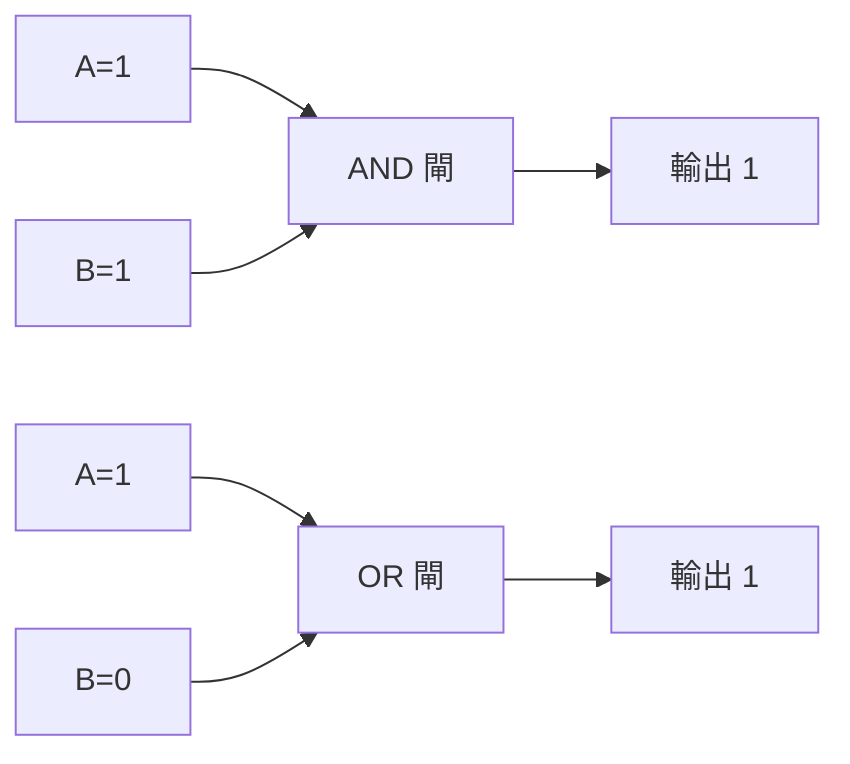

# [cs-2-1] 邏輯閘：AND / OR / NOT，最小的「思考」單位

> **本章目標**：認識邏輯閘——電腦用來「做判斷」的最基本電路元件，理解 AND、OR、NOT 怎麼從 0 和 1 算出新的 0 和 1。

## 你會學到

- 邏輯閘是什麼：吃 0/1、吐 0/1 的小電路
- 三個基本邏輯閘：AND、OR、NOT
- 「真值表」怎麼描述一個邏輯閘
- NAND/NOR/XOR 等其他常見閘

## 概念說明

### 從「儲存 0 和 1」到「運算 0 和 1」

Part 1 我們學會「萬物如何變成 0 和 1」。但光能存還不夠——電腦要能**處理**這些 0 和 1，算出新結果。最底層做這件事的，就是**邏輯閘（logic gate）**。

邏輯閘是一個小電路，**吃進一個或多個 0/1，吐出一個 0/1**。它就像數位世界最小的「決策單位」。比喻：

```
邏輯閘像一個「規則很簡單的小門衛」：
   你給它幾個「是/否」（1/0），
   它照固定規則，回你一個「是/否」。
把超多這種小門衛組合起來 → 就能做出 CPU 這種複雜的東西。
```

### 三個基本閘：AND、OR、NOT

**AND（且）**：所有輸入都是 1，才輸出 1（像「兩個條件都要成立」）。

```
比喻：要『有鑰匙』AND『知道密碼』才能開門 → 兩個都要 1，門才開(1)
```

**OR（或）**：只要有一個輸入是 1，就輸出 1（像「滿足任一條件即可」）。

```
比喻：『刷卡』OR『按密碼』任一個都能進 → 只要有一個 1，就放行(1)
```

**NOT（非）**：把輸入反過來——0 變 1、1 變 0（只有一個輸入）。

```
比喻：一個「唱反調」的閘，你說 1 它說 0，你說 0 它說 1。
```

### 真值表：把規則列清楚

描述邏輯閘最清楚的方式是**真值表（truth table）**——把「所有可能的輸入組合，各自輸出什麼」列成表：

```
AND              OR               NOT
A B │ 輸出       A B │ 輸出       A │ 輸出
0 0 │  0         0 0 │  0         0 │  1
0 1 │  0         0 1 │  1         1 │  0
1 0 │  0         1 0 │  1
1 1 │  1         1 1 │  1
```

讀法：AND 只有「兩個都 1」那行輸出 1；OR 只有「兩個都 0」那行輸出 0；NOT 把輸入顛倒。真值表把一個閘的行為「完整、無歧義」地寫了出來——這是數位邏輯的標準語言。



這張圖在說：邏輯閘把輸入的 0/1 依規則組合成輸出。AND 要全部是 1、OR 只要有一個 1。

### 其他常見閘

由基本閘可以組合出更多：

| 閘 | 意思 | 輸出 1 的條件 |
|----|------|--------------|
| **NAND** | NOT AND | 不是「全部都 1」時（AND 的相反）|
| **NOR** | NOT OR | 全部都 0 時（OR 的相反）|
| **XOR** | 互斥或 | 兩個輸入「不一樣」時（一個 0 一個 1）|

`XOR`（互斥或）特別有用——「兩者相異才為 1」這個性質在加法、加密裡都會用到（[cs-2-3] 加法器會看到）。

有個驚人的事實：**光用 NAND 一種閘，就能組合出所有其他邏輯閘**（NAND 是「萬能閘」）。這意味著理論上整台電腦的邏輯，都能用大量的 NAND 堆出來——簡單的東西，組合起來能產生無限複雜，這是數位世界最美的觀念之一。

## 範例：你每天都在用邏輯

邏輯閘的概念，其實就是你寫程式時的條件判斷：

```
程式裡的：
   if (已登入 AND 是管理員) { ... }   ← 這就是 AND
   if (是假日 OR 是國定假日) { ... }  ← 這就是 OR
   if (NOT 已付款) { ... }            ← 這就是 NOT

你寫的每個邏輯條件，底層都對應到這些邏輯閘的運算。
```

## 小練習

1. 寫出 XOR（互斥或）的真值表（兩個輸入「不一樣」才輸出 1）。
2. 用 AND、OR、NOT 描述這個規則：「會員 AND（有優惠券 OR 是生日當天）才打折」。
3. 思考題：一個 AND 閘接在另一個 AND 閘後面，「A AND B AND C」要怎麼用兩個 AND 閘做出來？

## 課外讀物

> 邏輯閘對應到程式裡的布林運算，下一步用數學描述它 → 本書 Part 2-2：布林代數

> 這些邏輯運算對應程式裡的條件判斷 → **basic 課程**（if、布林）、**rust 課程 [rust-1-5]**
