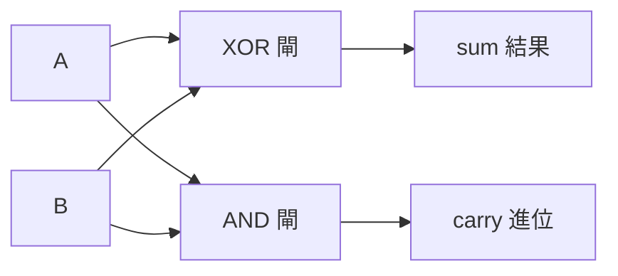

# [cs-2-3] 從邏輯閘到加法器：電腦怎麼做「1 + 1」

> **本章目標**：見證一個奇蹟——只用幾個邏輯閘（[cs-2-1]），怎麼組合出「會做加法」的電路。這是「從簡單堆出複雜」最動人的例子。

## 你會學到

- 二進位加法的規則
- 「半加器」：用 XOR 和 AND 做出一位元加法
- 「全加器」：怎麼處理進位
- 為什麼這代表「電腦的算術，全是邏輯閘堆出來的」

## 概念說明

### 先看二進位加法

回憶 [cs-1-2]，二進位只有 0 和 1。一位元的加法規則很簡單，只有四種情況：

```
0 + 0 = 0
0 + 1 = 1
1 + 0 = 1
1 + 1 = 10   ← 注意！是「0，進位 1」（就像十進位 9+1=10 要進位）
```

關鍵在最後一個：`1 + 1` 在二進位會「進位」。所以一位元加法其實要產生**兩個輸出**：

- **本位的結果（sum）**：這一位留下什麼
- **進位（carry）**：要不要往上一位進 1

把這四種情況列成真值表：

```
A B │ 進位carry  結果sum
0 0 │    0         0
0 1 │    0         1
1 0 │    0         1
1 1 │    1         0
```

### 半加器：兩個閘就搞定

仔細看上面的真值表，對照 [cs-2-1] 的閘：

- **sum（結果）那欄**：`0,1,1,0`——這正是 **XOR**（兩個不一樣才是 1）！
- **carry（進位）那欄**：`0,0,0,1`——這正是 **AND**（兩個都 1 才是 1）！

所以「一位元加法」可以這樣做：

```
sum   = A XOR B
carry = A AND B
```



這張圖在說：**只要一個 XOR 閘 + 一個 AND 閘，就做出了「一位元加法」**——這個小電路叫**半加器（half adder）**。看，加法不是什麼神祕的東西，它就是邏輯閘的組合！

### 全加器：處理「上一位的進位」

半加器有個不足：它只加「A 和 B」，沒考慮「上一位傳來的進位」。但多位數相加時（像十進位 18+15，個位進位要加到十位），每一位都要能接收「下面傳上來的進位」。

能處理「三個輸入」（A、B、來自下一位的進位）的加法電路，叫**全加器（full adder）**。它由**兩個半加器 + 一個 OR 閘**組成——一樣，還是邏輯閘的組合，只是多串了一層。

### 串起來：加任意大的數

有了全加器，怎麼加「8 位元的數」？**把 8 個全加器串起來**——每一位的「進位輸出」接到上一位的「進位輸入」，就像我們手算加法時「逐位進位」一樣：

```
   把 8 個全加器排成一排，進位一個傳一個
   → 就能做「8 位元 + 8 位元」的加法
   → 這就是 CPU 裡 ALU（算術邏輯單元，cs-0-4）做加法的核心
```

而且還記得 [cs-1-3] 的二補數嗎？因為「減法可以變成加負數的加法」，**這個加法器電路同時也會做減法**——不用另外設計減法電路。一個加法器，包辦加減，優雅至極。

## 範例：從閘到 CPU 的縮影

這一章其實是整個計算機科學最核心的縮影：

```
電晶體（cs-2-5）→ 組成 → 邏輯閘（cs-2-1）
邏輯閘 → 組成 → 半加器 → 全加器 → 加法器
加法器 → 是 → ALU 的一部分（cs-0-4）
ALU → 是 → CPU 的核心（cs-3-2）
CPU → 組成 → 電腦

→ 從「開關」一路堆到「電腦」，每一層都只是下一層的組合。
  這就是「抽象層層堆疊」的威力（cs-8-1 會再深入）。
```

電腦不是魔法——它是「簡單的東西，一層一層組合成複雜」的極致展現。

## 小練習

1. 寫出「1 + 1」在半加器裡的 sum 和 carry 各是多少（用 XOR 和 AND 算）。
2. 用自己的話解釋：半加器和全加器的差別是什麼？（提示：和「進位輸入」有關。）
3. 思考題：為什麼有了二補數（cs-1-3），同一個加法器電路就能順便做減法？

## 課外讀物

> 加法器是 ALU 的核心，ALU 是 CPU 的核心 → 本書 Part 3-2：CPU 構造

> 「簡單組合成複雜」是計算機科學的核心思想 → 本書 Part 8-1：抽象
