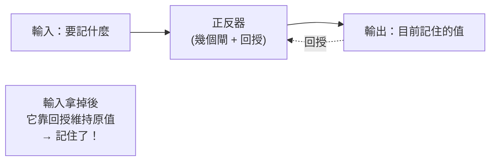

# [cs-2-4] 正反器與記憶：電路怎麼「記住」一個位元

> **本章目標**：理解一個關鍵問題——邏輯閘只會「算」，但電腦怎麼「記住」東西？答案是「正反器」這種能保存狀態的電路，它是記憶體的基礎。

## 你會學到

- 邏輯閘的侷限：算完就忘
- 「回授」的點子：讓電路記住自己
- 正反器（flip-flop）：儲存一個 bit 的基本電路
- 為什麼這是 RAM、暫存器的基礎

## 概念說明

### 問題：邏輯閘「沒有記憶」

[cs-2-1] 到 [cs-2-3] 的邏輯閘和加法器有個共同點——它們**只會「算」，算完就忘**。你給輸入，它立刻給輸出；輸入一變，輸出馬上跟著變，**它不會「記住」任何東西**。

但電腦顯然需要「記憶」——它得記住你打的字、算到一半的結果、程式的狀態。光靠「算完就忘」的閘是辦不到的。所以需要一種**能保存狀態**的電路。

### 巧思：讓電路「回授」自己

怎麼讓電路記住東西？關鍵的點子是**回授（feedback）**——**把電路的輸出，繞回去接到自己的輸入**。

比喻：像兩個人互相扶著對方站穩——

```
A 靠著 B，B 也靠著 A。
一旦兩人站定一個姿勢，他們會「互相維持」這個姿勢不變，
直到外力來改變它。
→ 電路也能這樣「自己撐住自己」的狀態，於是就「記住」了。
```

透過把輸出接回輸入，電路可以「卡」在一個穩定狀態（0 或 1），並一直維持下去——這就是「記住一個 bit」。

### 正反器：儲存一個 bit

這種「能保存一個 bit」的基本電路，叫**正反器（flip-flop）**，或閂鎖（latch）。它用幾個邏輯閘加上回授組成，行為是：

```
正反器能做兩件事：
   1. 「設定」：叫它記住 0 或 1
   2. 「保持」：在你不設定時，維持它記住的值不變

→ 一個正反器 = 一個「記憶細胞」= 存 1 個 bit
```


```mermaid
graph LR
    IN["輸入：要記什麼"] --> FF["正反器<br/>(幾個閘 + 回授)"]
    FF --> OUT["輸出：目前記住的值"]
    OUT -.回授.-> FF
    NOTE["輸入拿掉後<br/>它靠回授維持原值<br/>→ 記住了！"]
```

這張圖在說：正反器透過「輸出回授到輸入」維持狀態——即使你不再給它新輸入，它也會記住之前的值。這就是「記憶」從電路層面誕生的方式。

### 從一個 bit 到整個記憶體

一個正反器存一個 bit。那要存更多呢？**很多正反器排在一起**就行：

```
8 個正反器 = 存 1 byte
幾十億個正反器（或類似的記憶元件）= 你的 RAM、CPU 暫存器

CPU 裡的「暫存器」（cs-3-2）就是用這類電路做的，
速度極快，因為資料就在 CPU 內部、用電路直接保存。
```

所以電腦的「記憶」能力，根源就在這個「會自己撐住狀態」的小電路。**運算靠邏輯閘（組合電路），記憶靠正反器（時序電路）**——這兩類電路合起來，才湊齊了電腦需要的全部基本能力。

### 組合電路 vs 時序電路

順帶認識一個分類，把前幾章串起來：

| 類型 | 特性 | 例子 |
|------|------|------|
| **組合電路** | 輸出只看「當下的輸入」，沒記憶 | 邏輯閘、加法器（cs-2-3）|
| **時序電路** | 輸出還看「之前的狀態」，有記憶 | 正反器、記憶體 |

「組合電路負責算、時序電路負責記」——電腦就是這兩種電路的大規模組合。

## 範例：記憶讓「累加」成為可能

為什麼記憶這麼關鍵？看一個需要記憶的任務：

```
「把 1 加到 10」這種累加：
   要記住「目前累加到多少」（一個會變的狀態）
   每加一次，更新這個記住的值

→ 如果電路不能「記住中間結果」，根本沒辦法累加。
  正反器提供的記憶，讓電腦能保存並更新狀態，
  這也是 rust 課程 [rust-1-1] 的「變數」在硬體層的根。
```

## 小練習

1. 用自己的話解釋：為什麼純粹的邏輯閘（像加法器）「沒有記憶」？
2. 「回授」是什麼意思？它怎麼讓電路「記住」一個值？
3. 把以下歸類成「組合電路」或「時序電路」：AND 閘、正反器、加法器、記憶體。

<details>
<summary>參考解答</summary>

**第 1 題：為什麼純粹的邏輯閘「沒有記憶」？**

因為邏輯閘（和用它組成的加法器）的**輸出只取決於「當下的輸入」**——你給什麼輸入，它立刻照規則算出輸出；輸入一變，輸出馬上跟著變，不會保留任何「之前的值」。

它沒有任何機制去「留住」剛剛的結果：這一瞬間算完，下一瞬間輸入換了，舊結果就消失了。就像一台只會即時計算、算完不做筆記的計算機。這種「只看當下輸入、算完就忘」的特性，就是「沒有記憶」的意思。

**第 2 題：「回授」是什麼？它怎麼讓電路記住一個值？**

**回授（feedback）就是把電路的輸出繞回去、接回它自己的輸入。**

平常的邏輯閘是「輸入 → 輸出」單向流動。但如果把輸出接回輸入，就形成一個「自己影響自己」的迴圈。這個迴圈可以「卡」在一個穩定狀態：

- 假設輸出目前是 1，這個 1 被繞回去當輸入，而這個輸入又讓輸出繼續保持 1……於是它自己撐住自己，一直維持 1。
- 就像章節裡「兩個人互相扶著站穩」的比喻——一旦擺定姿勢，就會互相維持不變，直到外力（新的設定訊號）來改變它。

因為狀態能「自己撐住」，即使你不再給新輸入，電路也還記著之前那個值——這就是「記住一個 bit」。

**第 3 題：分類組合電路 / 時序電路**

判斷標準：輸出只看「當下輸入」的是組合電路；輸出還要看「之前狀態（有記憶）」的是時序電路。

| 元件 | 分類 | 理由 |
|------|------|------|
| AND 閘 | 組合電路 | 輸出只看當下的兩個輸入，沒記憶 |
| 正反器 | 時序電路 | 靠回授保存狀態，會記住之前的值 |
| 加法器 | 組合電路 | 由邏輯閘組成，輸出只看當下輸入 |
| 記憶體 | 時序電路 | 專門用來保存資料，當然有記憶 |

一句話總結：**組合電路負責「算」，時序電路負責「記」。**

</details>

## 課外讀物

> 正反器是暫存器、RAM 的基礎 → 本書 Part 3-2：CPU 構造、Part 3-5：主記憶體

> 本 Part 即將完成，下一章看這些電路背後的「電晶體」與摩爾定律 → 本書 Part 2-5
