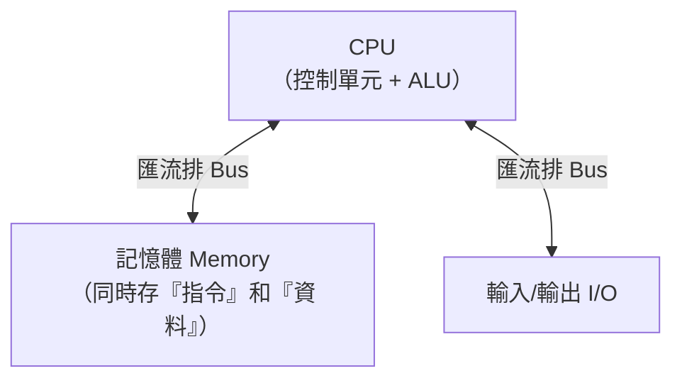

# [cs-3-1] 馮紐曼架構：現代電腦的共同藍圖

> **本章目標**：認識幾乎所有現代電腦都遵循的設計藍圖——馮紐曼架構，理解它「把程式和資料一起存在記憶體」的關鍵洞見。

## 你會學到

- 馮紐曼架構的組成
- 最關鍵的洞見：「程式儲存」概念
- 為什麼「指令和資料放一起」這麼重要
- 順帶認識它的瓶頸

## 概念說明

### 一張用了 80 年的藍圖

[cs-0-4] 講了五大單元，但它們該怎麼組織？1945 年左右，數學家 **馮紐曼（John von Neumann）** 提出一個架構，幾乎所有現代電腦都還在用它——**馮紐曼架構（von Neumann architecture）**。

它的組成是：



這張圖在說：CPU（負責運算控制）、記憶體（存東西）、I/O（和外界溝通），透過「匯流排」（資料的通道，[cs-3-7]）連接。看起來平凡，但它有一個革命性的洞見——

### 關鍵洞見：程式也存在記憶體裡

馮紐曼架構最重要的概念叫 **「程式儲存（stored program）」**：

> **指令（程式）和資料，一起用同樣的方式，存在同一個記憶體裡。**

這聽起來理所當然，但在當年是顛覆性的。在它之前，很多機器的「程式」是靠**實體接線**寫死的——想換一個程式，得重新接線路，耗時又麻煩（[cs-0-3] 的早期電腦就是這樣）。

馮紐曼說：**何不把「指令」也當成「資料」，存進記憶體？** 這樣一來：

```
換程式 = 只要把不同的指令載入記憶體 = 軟體的誕生
不用重新接線，載入不同程式就能做不同的事
→ 這正是 cs-0-2 說的「電腦通用」的真正實現方式
```

回憶 [cs-0-2] 我們說「指令也是一種資料」——馮紐曼架構就是把這個洞見變成了實際設計。**「程式儲存」是現代軟體世界的根基**：因為程式是儲存的資料，所以你能下載 App、更新軟體、執行任何程式，而不用動硬體一根線。

### 指令和資料長一樣

在記憶體裡，指令和資料**都是 0 和 1，外觀沒有差別**。一段位元組，CPU 把它當「指令」就去執行，當「資料」就去處理——取決於 CPU 怎麼解讀它。

```
記憶體裡的 01101000...
   CPU 在「取指令」階段讀它 → 當成指令執行
   CPU 在「取資料」階段讀它 → 當成資料運算
→ 同樣的 0 和 1，角色由「CPU 怎麼看它」決定
```

這個統一性帶來巨大的彈性（程式能像資料一樣被產生、修改、傳輸），但也帶來一點安全隱憂（如果惡意「資料」被當成「指令」執行，就是一類攻擊的根源——這是 [課外讀物 E-10](../../../課外讀物/E-10-security/E-10-1-web-security-overview.md) 會碰到的主題）。

### 順帶一提：馮紐曼瓶頸

這個架構有個著名的限制——**馮紐曼瓶頸（von Neumann bottleneck）**：

```
CPU 很快，但「指令和資料都要透過同一條匯流排、從記憶體搬來搬去」。
這條通道的速度，跟不上 CPU 的處理速度。
→ CPU 常常在「等資料從記憶體送來」，形成瓶頸。
```

這個瓶頸正是為什麼需要「快取記憶體」（[cs-3-4] 的記憶體階層）來緩解——在 CPU 旁邊放一點超快的記憶體，減少「大老遠去主記憶體搬資料」的等待。這也呼應了整個 **快取課程** 的核心動機。

## 範例：軟體世界因它而生

```
因為馮紐曼的「程式儲存」概念：
   你能在手機「下載」一個 App（把程式當資料存進去）
   你能「更新」軟體（換掉記憶體/硬碟裡的指令）
   你能同時裝幾百個程式，想跑哪個跑哪個

→ 如果程式還是靠實體接線（前馮紐曼時代），
  以上全都不可能。整個軟體與 App 經濟，建立在這個藍圖上。
```

## 小練習

1. 用自己的話解釋「程式儲存（stored program）」概念，以及它為什麼革命性。
2. 在馮紐曼架構裡，「指令」和「資料」存在哪？它們外觀有差別嗎？
3. 思考題：「馮紐曼瓶頸」是什麼？為什麼需要快取記憶體來緩解它？（提示：CPU 和記憶體的速度差。）

## 課外讀物

> 為什麼需要快取來緩解瓶頸 → 本書 Part 3-4：記憶體階層、**快取課程 Part 1**

> 下一步：CPU 內部到底長怎樣 → 本書 Part 3-2：CPU 構造
