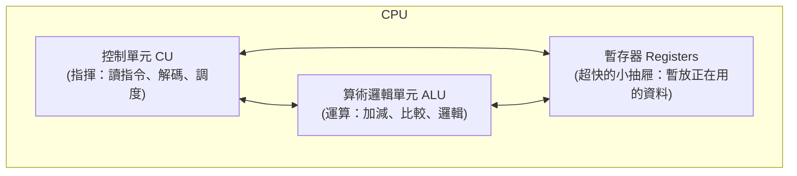

# [cs-3-2] CPU 構造：控制單元、ALU、暫存器

> **本章目標**：打開 CPU 這顆「電腦的大腦」，認識它內部三個關鍵部件——控制單元、算術邏輯單元、暫存器，以及時脈（clock）的角色。

## 你會學到

- CPU 是什麼、為什麼叫「大腦」
- 控制單元（CU）與算術邏輯單元（ALU）的分工
- 暫存器（register）：CPU 內部超快的小儲存
- 時脈（clock）與 GHz 是什麼

## 概念說明

### CPU：電腦的大腦

**CPU（Central Processing Unit，中央處理器）** 是電腦最核心的零件，負責「執行指令、做運算」。[cs-0-4] 說過，五大單元裡的「控制」和「算術邏輯」都在 CPU 裡——所以說它是大腦。

打開 CPU，三個關鍵部件：



這張圖在說：CPU 內部，控制單元負責「指揮」、ALU 負責「運算」、暫存器負責「就近暫存」，三者緊密合作。

### 控制單元（CU）：總指揮

**控制單元（Control Unit）** 是 CPU 的指揮中心。它本身不做運算，而是：

```
讀取下一條指令 → 解讀它是什麼意思 → 指揮其他部件去執行
```

回憶 [cs-0-4] 的「主廚」比喻——控制單元就是主廚，看著食譜（指令），指揮廚師（ALU）和料理台（暫存器）動作。它決定「現在做什麼、下一步做什麼」。

### 算術邏輯單元（ALU）：真正動手算

**ALU（Arithmetic Logic Unit）** 是真正做運算的部件——它包含 [cs-2-3] 的加法器之類的電路，能做：

- **算術**：加、減、乘、除
- **邏輯**：AND、OR、NOT、比較大小（[cs-2-1]）

控制單元叫它算什麼，它就算什麼，把結果交回去。ALU 是「電腦會算數」這件事的最終執行者。

### 暫存器：CPU 內部最快的儲存

CPU 運算時，需要地方「暫放正在處理的資料」。它不會每次都跑去（相對很慢的）記憶體拿——而是用 CPU **內部**的超小、超快儲存：**暫存器（register）**。

```
暫存器像 CPU 手邊的「幾個小抽屜」：
   數量很少（通常幾十個）、容量極小（一個放一個數）
   但速度是所有儲存裡最快的（就在 ALU 旁邊）
   存「此刻正在運算的那幾個值」
```

暫存器是 [cs-3-4] 記憶體階層的「最頂層」——最快、最小、最貴。它也是 [cs-2-4] 正反器電路的應用。CPU 運算的資料流大致是：「資料從記憶體 → 搬進暫存器 → ALU 運算 → 結果放回暫存器 → 再寫回記憶體」。

### 時脈：CPU 的節拍器

CPU 怎麼知道「什麼時候做下一步」？靠**時脈（clock）**——一個固定頻率的電子脈衝，像節拍器一樣「滴答滴答」，每一拍 CPU 就推進一步。

```
時脈頻率 = 每秒滴答幾次 = 用 Hz（赫茲）衡量
   3 GHz = 每秒 30 億次脈衝
   → 頻率越高，CPU 每秒能推進越多步 = 通常越快
```

這就是你看到「3.5 GHz CPU」的意思——它的節拍器每秒跳 35 億下。不過要注意，**GHz 高不一定就快**——還要看「每一拍能做多少事」、有幾個核心（[cs-5-3]）等。時脈只是其中一個指標。

## 範例：CPU 處理一個加法

把這些部件串起來，看「算 3 + 5」在 CPU 裡的流程（簡化版，[cs-3-3] 會更細）：

```
1. 控制單元：讀到「把暫存器A和暫存器B相加」這條指令，解碼
2. 暫存器：A 放著 3、B 放著 5（事先從記憶體載入）
3. 控制單元：指揮 ALU 做加法
4. ALU：把 3 + 5 = 8 算出來
5. 暫存器：結果 8 存進某個暫存器
→ 整個過程在幾個時脈週期內完成，快到你無法察覺
```

## 小練習

1. 說出 CPU 內部三個關鍵部件，並用一句話描述各自的工作。
2. 為什麼 CPU 要有「暫存器」，而不是每次都直接用記憶體？（提示：速度。）
3. 「3 GHz」是什麼意思？為什麼「GHz 比較高」不一定代表 CPU 比較快？

## 課外讀物

> CPU 一步步執行一條指令的完整流程 → 本書 Part 3-3：指令週期

> 暫存器在「記憶體階層」的頂端 → 本書 Part 3-4：記憶體階層

> 「多核心」與並行 → 本書 Part 5-3、**rust 課程 Part 8**
