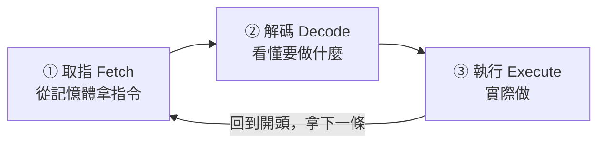

# [cs-3-3] 指令週期：取指 → 解碼 → 執行（fetch-decode-execute）

> **本章目標**：理解 CPU 執行每一條指令時，反覆進行的「取指、解碼、執行」循環——這是電腦「跑程式」最核心的節奏。

## 你會學到

- 指令週期的三（或四）個步驟
- 「程式計數器」怎麼記住「下一條指令在哪」
- 為什麼程式能「一條接一條」自動執行
- 這個循環每秒重複幾十億次

## 概念說明

### CPU 的心跳：一個不斷重複的循環

CPU 執行程式，靠的是一個不斷重複的循環，叫**指令週期（instruction cycle）**。它有三個核心步驟：

```
1. 取指（Fetch）：   從記憶體拿下一條指令
2. 解碼（Decode）：  搞懂這條指令要做什麼
3. 執行（Execute）： 實際做它（運算、存取記憶體等）
```

（有時把「把結果寫回」算成第四步 Write-back。）然後**回到第 1 步，拿下一條指令**——周而復始。



這張圖在說：CPU 像一個永不停歇的循環——取一條、看懂、做掉、再取下一條。**這個循環就是電腦「在跑」的本質**，每秒重複幾十億次（呼應 [cs-3-2] 的時脈）。

### 程式計數器：記住「下一條在哪」

CPU 怎麼知道「下一條指令在記憶體的哪裡」？靠一個特殊的暫存器，叫**程式計數器（PC，Program Counter）**——它永遠記著「下一條要執行的指令的記憶體位址」。

```
每執行完一條，程式計數器就自動 +1（指向下一條）
→ 於是指令被「一條接一條」依序執行
```

比喻：程式計數器像「你讀書時的書籤」——它記住你讀到哪，每讀完一頁就往後移一頁，於是你能連續讀下去。

### 為什麼程式能「跳來跳去」

如果程式計數器只會 +1，程式就只能「從頭到尾直線執行」。但程式需要「**做選擇、重複**」（[cs-0-2]、像 rust 的 if/loop）——怎麼辦？

答案是：**有些指令會「直接改寫程式計數器」**，讓它跳到別的位址：

```
遇到 if 條件 → 用一條「跳躍指令」改程式計數器 → 跳去另一段
遇到迴圈    → 把程式計數器「跳回」迴圈開頭，重複執行
```

所以你寫的 `if`、`for`、函式呼叫，編譯成機器碼後（[cs-4-1]），底層都是「**改變程式計數器的值**」——讓 CPU 跳到該去的地方。控制流程的一切魔法，根源就是「改寫那個記住下一步在哪的暫存器」。

## 範例：執行兩條指令

把流程具體走一遍。假設記憶體裡有兩條指令：

```
位址 100：把 5 載入暫存器 A
位址 101：把暫存器 A 加 3

執行過程：
   PC = 100
   [取指] 從位址 100 拿指令 → [解碼] 「載入 5 到 A」→ [執行] A = 5
   PC 自動變 101
   [取指] 從位址 101 拿指令 → [解碼] 「A 加 3」→ [執行] A = 8
   PC 自動變 102 ... 繼續
→ 一條接一條，這就是程式「跑起來」的樣子
```

每一條看似簡單，但 CPU 每秒跑幾十億輪這個循環，就累積成你看到的所有運算與功能。

## 小練習

1. 說出指令週期的三個核心步驟，並各用一句話描述。
2. 「程式計數器（PC）」的作用是什麼？每執行完一條指令它通常怎麼變？
3. 思考題：程式裡的「迴圈」（重複執行同一段），在指令週期的層面是怎麼做到的？（提示：和改寫程式計數器有關。）

## 課外讀物

> 程式計數器是一種暫存器 → 複習本書 Part 3-2：CPU 構造

> 你寫的高階程式怎麼變成 CPU 執行的這些指令 → 本書 Part 4：程式如何執行

> 控制流程（if/loop）在程式層面 → **rust 課程 [rust-1-5]**、**basic 課程**
