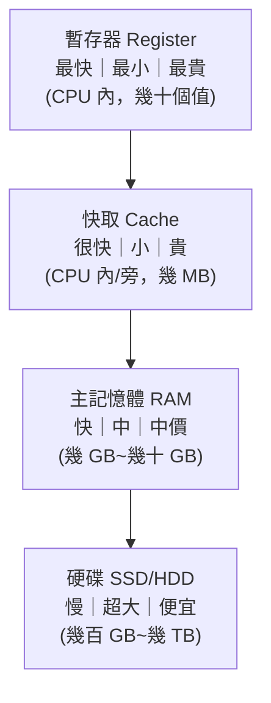

# [cs-3-4] 記憶體階層：暫存器 → 快取 → RAM → 硬碟（越近越快、越貴、越小）

> **本章目標**：理解電腦為什麼有「好幾層」記憶體，以及「速度、容量、價格」之間的取捨——這是理解效能與快取的根本。

## 你會學到

- 記憶體階層的各層（暫存器、快取、RAM、硬碟）
- 「越快越貴越小」的鐵則
- 為什麼要分這麼多層，不能只用一種
- 這個概念怎麼連到「快取」

## 概念說明

### 一個兩難：又要快又要大又要便宜

電腦的儲存有三個我們都想要的特性：**快、容量大、便宜**。但現實是——**三者不可兼得**：

```
又快又貴的記憶體：容量做不大（太貴）
又大又便宜的儲存：速度快不起來
```

怎麼辦？電腦的聰明解法是：**全都要，但分層用**。把不同「快慢/貴賤」的儲存組成一個**階層（hierarchy）**，讓「最常用的少量資料」放在最快的層，「不常用的大量資料」放在又大又便宜的層。

### 記憶體階層金字塔



這張圖是一個金字塔——**越往上越快、越小、越貴；越往下越慢、越大、越便宜**：

| 層級 | 速度 | 容量 | 角色 |
|------|------|------|------|
| 暫存器（[cs-3-2]）| 最快 | 極小 | CPU 正在算的那幾個值 |
| 快取（cache）| 很快 | 小 | 最近常用的資料，就近備著 |
| 主記憶體（RAM）| 快 | 中 | 正在執行的程式與資料 |
| 硬碟（SSD/HDD）| 慢 | 超大 | 長期保存所有檔案 |

各層速度差距很驚人——暫存器比硬碟快上**百萬倍**等級。

### 為什麼這樣分層有效？局部性

分層之所以有效，是因為程式存取資料有個規律，叫**局部性（locality）**：

```
時間局部性：剛用過的東西，很可能馬上又要用（例如迴圈變數）
空間局部性：用了某個東西，附近的東西也很可能要用（例如陣列相鄰元素）
```

因為有局部性，**只要把「最近、最可能用到」的少量資料，放在快的層**，就能讓大部分存取都命中快層、享受高速度，偶爾才需要去慢層拿。這就是「用小容量的快記憶體，撐起大部分的速度需求」的祕密。

### 這就是「快取」的本質

你發現了嗎——「**把常用的東西放在更快/更近的地方**」正是**快取（cache）** 的核心思想！記憶體階層裡的「快取層」就是這個原理在硬體上的體現，而同樣的思想貫穿整個電腦世界：

```
CPU 快取：把常用資料放 CPU 旁邊（本章）
瀏覽器快取：把載過的網頁資源存本機（快取課程 Part 3）
CDN：把內容放在離使用者近的伺服器（快取課程 Part 4）
Redis：把常查的資料庫結果存記憶體（快取課程 Part 5）
```

**全都是同一個道理**——「常用的東西，放近一點、快一點的地方」。所以這一章其實是整個 **快取課程** 的硬體版起點。

## 範例：一次資料存取的旅程

```
CPU 要某個資料時，由快到慢逐層找：
   先看暫存器有沒有 → 沒有
   再看快取有沒有（cache hit?）→ 有就用（超快！）
                              → 沒有(cache miss)，去 RAM 拿
   RAM 也沒有（資料還在硬碟）→ 從硬碟載入（慢，要等）

→ 「命中快取」和「沒命中要去慢層拿」的速度差，
  可能差幾十到上百倍。這就是為什麼「快取命中率」對效能這麼關鍵。
```

## 小練習

1. 把這四個依「速度由快到慢」排序：硬碟、暫存器、RAM、快取。它們的容量和價格趨勢又是如何？
2. 用自己的話解釋「局部性」，以及它為什麼讓「分層」這個策略有效。
3. 思考題：本章的「CPU 快取」和你用瀏覽器時的「瀏覽器快取」，核心思想一樣嗎？共同點是什麼？

## 課外讀物

> 快取的完整世界（瀏覽器、CDN、Redis、各種坑） → **快取課程**（本章是它的硬體版起點）

> 下一步：主記憶體 RAM 的細節 → 本書 Part 3-5

> 效能優化常圍繞「減少慢層存取」 → [課外讀物 E-11：效能](../../../課外讀物/E-11-performance/E-11-6-backend-profiling.md)
