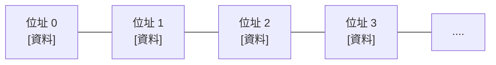

# [cs-3-5] 主記憶體 RAM：位址、揮發性

> **本章目標**：認識主記憶體（RAM）——程式執行時的「工作台」，理解「位址」的概念，以及「揮發性」為什麼讓你關機後檔案要先存檔。

## 你會學到

- RAM 是什麼、扮演什麼角色
- 「位址」：記憶體像一排有編號的格子
- 「揮發性」：為什麼斷電 RAM 就清空
- RAM 和硬碟的分工

## 概念說明

### RAM：程式執行的工作台

**主記憶體**，也就是 **RAM（Random Access Memory，隨機存取記憶體）**，是電腦執行程式時的「工作台」。它在記憶體階層（[cs-3-4]）中位於快取之下、硬碟之上。

比喻：

```
硬碟像「倉庫」：東西都收在裡面，很大，但拿取慢。
RAM 像「你的工作桌」：把「正在用的東西」攤開在桌上，方便快速取用。

你要做一件事 → 從倉庫(硬碟)把需要的東西搬到桌上(RAM) → 在桌上操作
```

當你「打開一個程式」，作業系統就把它從硬碟載入 RAM；程式執行中的資料也放 RAM。CPU 主要和 RAM 來回搬資料（透過快取緩衝）。**這就是為什麼「RAM 越大，能同時開越多程式、跑大型軟體越順」**——工作桌越大，能同時攤開的東西越多。

### 位址：一排有編號的格子

「Random Access（隨機存取）」是 RAM 的關鍵特性——**它能「直接跳到任何一格」拿資料，不用從頭找**。怎麼做到？因為記憶體被組織成「**一排有編號的格子**」，每格有一個唯一的**位址（address）**：



這張圖在說：RAM 像一長排格子，每格有編號（位址）。CPU 想存取某個資料，**只要說出它的位址**，就能「直接跳過去」讀寫——像你知道門牌號碼就能直接找到那戶人家，不用一家家敲門。

這個「位址」概念超級重要——它是 **rust 課程的「指標/參考」、C 的「指標」** 的根：所謂指標，就是「一個記憶體位址」。你在 [rust-2-1] 學的「堆疊、堆積」也都是這片有位址的記憶體裡的區域。

### 揮發性：斷電就清空

RAM 有一個關鍵特性——**揮發性（volatile）**：**一斷電，裡面的東西就全部消失**。

```
RAM 像「白板上的字」：寫得快、擦得快、看得清楚，
   但「電源」就是讓字留著的力量——一停電，白板瞬間擦乾淨。
```

這就是為什麼：

```
你打了半天的文件沒存檔 → 突然當機/斷電 → 心血全沒了
   因為文件還在 RAM（揮發性），沒寫進硬碟（非揮發性）
→ 「記得存檔」的本質：把資料從『揮發的 RAM』寫到『不揮發的硬碟』
```

所以「儲存檔案」這個動作，本質就是「把工作桌（RAM）上的成果，收進倉庫（硬碟）長期保存」。理解了揮發性，你就懂為什麼隨時存檔這麼重要。

### RAM vs 硬碟：分工表

| | RAM | 硬碟（SSD/HDD）|
|---|-----|------|
| 速度 | 快 | 慢 |
| 容量 | 中（幾~幾十 GB）| 大（幾百 GB~TB）|
| 揮發性 | 揮發（斷電清空）| 非揮發（斷電保留）|
| 角色 | 執行時的工作台 | 長期保存倉庫 |

兩者分工：**RAM 負責「跑得快」，硬碟負責「記得住」**。少了 RAM 程式跑不動，少了硬碟東西留不住。

## 範例：開一個程式發生什麼

```
你雙擊打開一個遊戲：
   1. 作業系統從「硬碟」找到這個遊戲的程式檔
   2. 把它載入「RAM」（搬到工作桌上）
   3. CPU 從 RAM 讀指令、執行（透過快取加速）
   4. 遊戲中的即時資料（你的位置、分數）也放 RAM
   5. 你「存檔」→ 把進度從 RAM 寫回硬碟（不然關機就沒了）

→ RAM 不夠時，遊戲會載入慢、卡頓，因為工作桌不夠大。
```

## 小練習

1. 用「倉庫 vs 工作桌」的比喻，解釋硬碟和 RAM 的分工。
2. 「揮發性」是什麼意思？它怎麼解釋「沒存檔就當機，東西會不見」？
3. 思考題：為什麼「RAM 越大，電腦能同時開越多程式、跑大軟體越順」？

## 課外讀物

> 「位址」是指標/參考的根 → **rust 課程 [rust-2-1]（堆疊堆積）、[rust-2-5]（參考）**

> 下一步：長期保存的硬碟，HDD 和 SSD 差在哪 → 本書 Part 3-6：儲存裝置

> 記憶體不夠時作業系統的應對（虛擬記憶體）→ 本書 Part 5-4
