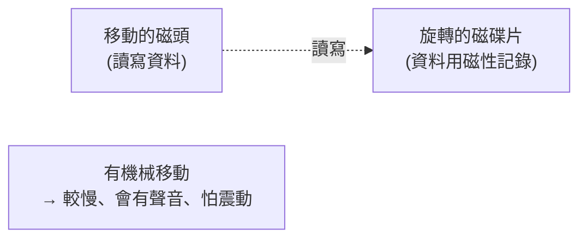

# [cs-3-6] 儲存裝置：HDD vs SSD，持久儲存的原理

> **本章目標**：認識電腦長期保存資料的裝置——傳統硬碟（HDD）與固態硬碟（SSD），理解它們的原理差異，以及為什麼 SSD 讓電腦「開機快如閃電」。

## 你會學到

- 持久儲存（非揮發）為什麼必要
- HDD（傳統硬碟）：用磁碟片和磁頭
- SSD（固態硬碟）：用快閃記憶體、沒有機械零件
- 兩者的取捨，與「為什麼換 SSD 最有感」

## 概念說明

### 持久儲存：關機也記得

[cs-3-5] 說 RAM 是揮發的（斷電就清空）。所以電腦需要另一種「**斷電也記得**」的儲存——這就是**儲存裝置（storage）**，也叫「次要記憶體」。你的所有檔案、作業系統、程式，平時都存在這裡。

主流有兩種：傳統硬碟 HDD 和固態硬碟 SSD。它們達成同一個目的（持久存資料），但**原理天差地別**。

### HDD：旋轉的磁碟片

**HDD（Hard Disk Drive，傳統硬碟）** 用「磁」來記資料，內部有實體的機械零件：

```
HDD 像一台「迷你黑膠唱片機」：
   一張（或多張）高速旋轉的磁碟片
   一個「磁頭」在碟片上方移動，讀寫上面的磁性資料
   要讀某筆資料 → 磁頭移到對的位置 + 碟片轉到對的角度
```



因為有「機械移動」（碟片轉、磁頭移），HDD 有幾個特點：**較慢**（要等機械到位）、**怕震動**（運轉中撞到可能壞）、會有輕微運轉聲。優點是**每 GB 很便宜、容量可以做很大**。

### SSD：沒有機械零件的快閃記憶體

**SSD（Solid State Drive，固態硬碟）** 用「快閃記憶體（flash memory）」晶片來存資料——**完全沒有機械零件**：

```
SSD 像「一大堆超大容量、斷電也不忘的記憶晶片」：
   資料存在晶片裡，用電子方式讀寫
   沒有要轉的碟片、沒有要移動的磁頭
   → 想讀哪筆，電子直接定位，超快
```

沒有機械移動帶來巨大優勢：**快很多**（沒有等待機械到位）、**安靜、省電、不怕震動、輕薄**。缺點是**每 GB 比 HDD 貴**（但價差逐年縮小）。

### 為什麼「換 SSD」是最有感的升級

很多人說「老電腦換上 SSD 像換了新機」，原因就在這——**電腦很多「等待」其實是在等慢速的 HDD**：

```
開機：要從硬碟載入作業系統 → HDD 慢吞吞，SSD 幾秒搞定
開啟大型程式：要從硬碟載入 → SSD 快很多
→ 把 HDD 換成 SSD，這些「等待」大幅縮短，整機體感飛快。
```

這也呼應 [cs-3-4] 的記憶體階層——儲存層雖然是最慢的一層，但它的速度直接影響「載入」體驗。SSD 把這一層提速，整體就順暢許多。

### 對照表

| | HDD（傳統硬碟）| SSD（固態硬碟）|
|---|------|------|
| 原理 | 磁碟片 + 磁頭（機械）| 快閃記憶體晶片（無機械）|
| 速度 | 慢 | 快很多 |
| 價格 | 每 GB 便宜 | 每 GB 較貴 |
| 耐震 | 怕震動 | 耐震 |
| 噪音/耗電 | 有聲音、較耗電 | 安靜、省電 |
| 適合 | 大容量備份、冷資料 | 系統碟、常用程式 |

很多人會「兩者並用」——SSD 裝系統和常用程式（要快），HDD 存大量影片照片備份（要便宜大容量）。

## 範例：資料的三層住所

把 Part 3 的儲存概念串起來，一筆資料可能住在三個地方：

```
你的一份報告：
   平常 → 住在「硬碟 SSD/HDD」（持久，關機也在）
   打開編輯時 → 載入「RAM」（工作台，斷電會沒）
   正在運算的片段 → 進「CPU 快取/暫存器」（最快，最貼近 CPU）

存檔 = 把 RAM 的版本寫回硬碟。
速度：暫存器 > 快取 > RAM > SSD > HDD（cs-3-4 的階層）
```

## 小練習

1. 用「唱片機 vs 記憶晶片」的比喻，說明 HDD 和 SSD 的原理差異。
2. 為什麼 SSD 比 HDD 快、耐震、安靜？（提示：和「有沒有機械零件」有關。）
3. 思考題：如果你要組一台電腦，預算有限，你會怎麼分配 SSD 和 HDD 的用途？

## 課外讀物

> 儲存在記憶體階層的位置 → 複習本書 Part 3-4：記憶體階層

> 本 Part 即將完成，下一步：各零件怎麼互相溝通 → 本書 Part 3-7：匯流排與 I/O

> 雲端的儲存服務（物件儲存、區塊儲存）→ **aws 課程（S3、EBS）**
