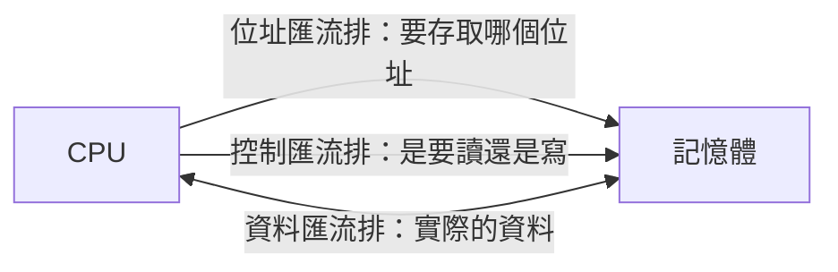

# [cs-3-7] 匯流排與 I/O：各零件之間怎麼溝通

> **本章目標**：理解電腦各零件（CPU、記憶體、硬碟、鍵盤…）之間怎麼傳遞資料——靠「匯流排」這條共用通道，以及 I/O 裝置如何接入系統。

## 你會學到

- 匯流排（bus）是什麼：零件間的共用道路
- 匯流排傳的三種東西（資料、位址、控制）
- I/O 裝置怎麼接到系統
- 「頻寬」為什麼影響效能

## 概念說明

### 零件之間需要「道路」

電腦由很多零件組成（[cs-3-1] 的馮紐曼架構：CPU、記憶體、I/O）。它們之間要不斷傳資料——CPU 要從記憶體拿指令、要把結果送到螢幕、要讀鍵盤的輸入。這些「資料的傳遞」走的道路，叫**匯流排（bus）**。

比喻：

```
匯流排像「城市裡的共用道路」：
   各個零件（CPU、記憶體、硬碟…）像道路旁的建築
   資料像在路上跑的車
   大家共用這條路來傳東西
```

匯流排是「共用」的——多個零件接在同一條匯流排上，輪流使用它傳資料。

### 匯流排傳的三種東西

一條完整的匯流排，其實同時傳三類訊號：



這張圖在說，匯流排傳遞三種訊號：

- **位址匯流排（address bus）**：說「我要存取哪個記憶體位址」（[cs-3-5] 的位址）。
- **資料匯流排（data bus）**：實際傳遞的資料內容。
- **控制匯流排（control bus）**：說「這次是要讀還是寫」等控制訊號。

合起來，CPU 就能精準地對記憶體說「**把『位址 100』那格的資料『讀』給我**」——位址、動作、資料三者齊備。

### I/O：把外界裝置接進來

鍵盤、滑鼠、螢幕、硬碟、網路卡這些**輸入/輸出裝置（I/O devices）**，也是透過匯流排接入系統的。CPU 透過匯流排和它們溝通——讀鍵盤的按鍵、把畫面送給螢幕、跟硬碟要資料。

因為這些裝置速度差很多（鍵盤慢、SSD 快），系統需要協調機制（像 [cs-5-7] 的中斷）來高效處理，不讓快的等慢的。各種接口標準（USB、PCIe、SATA…）本質上都是「不同用途的匯流排」，定義了裝置怎麼接、怎麼傳。

### 頻寬：道路有多寬

匯流排的效能用**頻寬（bandwidth）** 衡量——**單位時間能傳多少資料**，就像「道路有幾線道 + 車速」決定車流量。

```
頻寬 = 匯流排寬度（一次能並行傳幾個 bit）× 速度（每秒幾次）
   更寬、更快的匯流排 = 更高頻寬 = 資料搬得更快
```

頻寬是個常見的效能瓶頸——回憶 [cs-3-1] 的「馮紐曼瓶頸」：就算 CPU 再快，如果「CPU 和記憶體之間的匯流排」頻寬不夠，CPU 也只能乾等資料。所以提升匯流排頻寬，是電腦效能的重要一環。

> 「頻寬」這個概念在網路也通用——你家網路的「頻寬」決定下載多快（[cs-6]、[課外讀物 E-3](../../../課外讀物/E-3-network/E-3-1-how-internet-works.md)）。

## 範例：CPU 從記憶體讀資料

把三種匯流排串起來，看一次「讀取」：

```
CPU 想讀「位址 200」的資料：
   1. CPU 把「200」放上『位址匯流排』
   2. CPU 在『控制匯流排』發出「讀取」訊號
   3. 記憶體收到 → 找到位址 200 的資料 → 放上『資料匯流排』
   4. CPU 從『資料匯流排』收下資料

→ 三種匯流排分工合作，完成一次精準的資料傳遞。
  這個動作每秒發生幾十億次（呼應指令週期 cs-3-3）。
```

## 小練習

1. 用「城市道路」的比喻解釋匯流排是什麼。
2. 匯流排傳的三種訊號（位址、資料、控制）各負責什麼？用「CPU 讀記憶體」的例子說明。
3. 思考題：「頻寬」是什麼？為什麼就算 CPU 很快，匯流排頻寬不足也會拖累整體效能？

## 課外讀物

> 「馮紐曼瓶頸」與這條 CPU-記憶體匯流排有關 → 複習本書 Part 3-1

> I/O 裝置怎麼高效通知 CPU → 本書 Part 5-7：I/O 與中斷

> 本 Part 完成！下一步：你寫的程式怎麼變成 CPU 執行的指令 → 本書 Part 4
