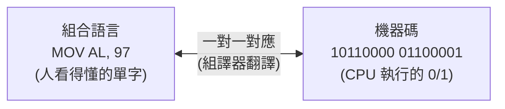

# [cs-4-1] 機器碼與組合語言：CPU 真正讀的東西

> **本章目標**：理解你寫的程式碼和 CPU 實際執行的東西之間的鴻溝——CPU 只懂「機器碼」，而組合語言是它「給人看」的版本。

## 你會學到

- CPU 真正執行的是「機器碼」（一串 0 和 1）
- 為什麼人類不直接寫機器碼
- 組合語言：機器碼的「人類可讀版」
- 「高階語言」離 CPU 有多遠

## 概念說明

### CPU 只懂機器碼

你用 Rust、TypeScript、Python 寫的程式，**CPU 一個字都看不懂**。CPU 真正能執行的，只有**機器碼（machine code）**——一串特定格式的 0 和 1，每一段對應一個它認得的動作（[cs-3-3] 指令週期執行的就是這些）。

```
一條機器碼指令長這樣（示意）：
   10110000 01100001
   ↑前半是「做什麼」(opcode)  ↑後半是「對誰做」(運算元)
   這條可能代表「把數字 97 載入某暫存器」
```

CPU 從記憶體拿到這串 0 和 1，解碼後就知道該做什麼。**這是電腦唯一「母語」**。

### 為什麼人類不寫機器碼？

理論上你可以直接寫 0 和 1 給 CPU，但實際上——**沒有人想這樣做**：

```
機器碼的問題：
   全是 0 和 1，人類根本記不住、看不懂
   一個小程式就是好幾頁的 0/1，極易出錯
   不同 CPU 的機器碼還不一樣，毫無通用性
```

所以人類發明了一層層「更好寫」的語言，最後再「翻譯」成機器碼。最貼近機器碼的那一層，叫組合語言。

### 組合語言：機器碼的人類版

**組合語言（assembly language）** 是機器碼的「**助記符號**」版本——**用人能讀的短英文單字，一對一對應機器碼指令**：

```
機器碼（CPU 讀）        組合語言（人讀）       意思
10110000 01100001  →   MOV AL, 97        把 97 搬進 AL 暫存器
00000100 00000001  →   ADD AL, 1         AL 加 1
```



這張圖在說：組合語言和機器碼**幾乎一對一對應**——`MOV`、`ADD` 這些單字，各自對應一段 0/1。把組合語言翻成機器碼的工具叫「組譯器（assembler）」。組合語言比機器碼好讀，但還是非常「貼近硬體」——你得手動管暫存器、一步步搬資料，寫起來很瑣碎。

### 高階語言離 CPU 有多遠

你平常寫的 Rust、Python 是**高階語言**——它們離 CPU 很遠、離人很近：

```
你寫的高階語言：  let sum = a + b;         （一行，很直覺）
        ↓ 編譯/翻譯（cs-4-2、4-3）
組合語言：        MOV, ADD, MOV ...        （好幾條，貼近硬體）
        ↓ 組譯
機器碼：          10110000... （一堆 0 和 1） （CPU 執行）
```

一行高階程式碼，可能對應好幾條組合語言、更多的機器碼。**高階語言讓你「用接近人類思維的方式表達」，再由工具層層翻譯成 CPU 看得懂的 0 和 1**。這個「翻譯」的過程，就是接下來 [cs-4-2]、[cs-4-3] 的主題：編譯與直譯。

### 抽象層級的階梯

把這串連起來，你會看到一個「抽象階梯」（呼應 [cs-8-1]）：

```
高階語言（Rust/Python）── 最好寫，離硬體最遠
   ↓
組合語言 ── 貼近硬體，一對一對應機器碼
   ↓
機器碼 ── CPU 的母語，一串 0 和 1
   ↓
電晶體開關 ── 最底層的物理（cs-2-5）
```

每往下一層，越貼近機器、越難讀；每往上一層，越貼近人、越好寫。**寫程式的歷史，就是不斷往上加抽象層、讓人更好表達想法的歷史。**

## 範例：同一件事的三種高度

```
「把 5 和 3 相加」這件事：

高階語言（Rust）：   let x = 5 + 3;
組合語言（示意）：   MOV AX, 5
                   ADD AX, 3
機器碼（示意）：     10111000 00000101
                   00000101 00000011

→ 越往下越囉嗦、越貼近 CPU。你寫一行，背後是這些。
```

## 小練習

1. 用自己的話解釋：為什麼 CPU 只懂機器碼，人卻不直接寫機器碼？
2. 組合語言和機器碼是什麼關係？（提示：一對一對應、助記符號。）
3. 思考題：把「高階語言、機器碼、組合語言、電晶體」由「最貼近人」到「最貼近硬體」排序。

## 課外讀物

> 下一步：高階語言怎麼變成機器碼——編譯 vs 直譯 → 本書 Part 4-2

> CPU 執行機器碼的循環 → 複習本書 Part 3-3：指令週期

> 抽象層層堆疊的威力 → 本書 Part 8-1：抽象
