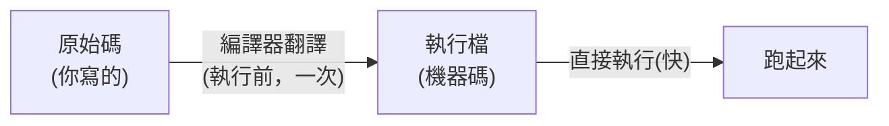

# [cs-4-2] 從原始碼到執行：編譯（compile）vs 直譯（interpret）

> **本章目標**：搞懂高階語言變成可執行東西的兩條主要路線——「編譯」和「直譯」，它們的差別、各自的優缺點，以及為什麼有些語言快、有些靈活。

## 你會學到

- 「編譯」與「直譯」的核心差別
- 兩種方式的優缺點對照
- 為什麼編譯語言通常較快、直譯語言通常較靈活
- 常見語言屬於哪一種

## 概念說明

### 兩種「翻譯」策略

[cs-4-1] 說高階語言要翻成機器碼 CPU 才能執行。**什麼時候翻、怎麼翻**，有兩種主要策略——**編譯**和**直譯**。用一個翻譯書的比喻：

```
編譯（compile）：像「把整本外文書，事先完整翻譯成中文，印成一本新書」。
   翻譯一次，之後大家直接讀中文版（快），但要先花時間翻完整本。

直譯（interpret）：像「請一位口譯員，你讀一句、他即時翻一句」。
   不用事先翻，馬上就能開始（靈活），但每次讀都要即時翻（較慢）。
```

### 編譯：先全部翻好，再執行

**編譯**：用一個叫「**編譯器（compiler）**」的程式，在執行**之前**，把你整份原始碼**一次翻譯成機器碼**，產生一個「**執行檔**」。之後執行的是這個翻好的檔案，CPU 直接跑、不用再翻譯。



你在 **rust 課程 [rust-0-3]** 用 `rustc` / `cargo build` 做的就是編譯——產生一個獨立執行檔。C、C++、Rust、Go 都是編譯語言。

### 直譯：邊讀邊翻邊執行

**直譯**：用一個叫「**直譯器（interpreter）**」的程式，在執行時**一行一行地讀你的原始碼、即時翻譯並馬上執行**。沒有「事先產生執行檔」這一步。


Python、JavaScript（傳統上）、Ruby 是直譯語言——你直接把原始碼交給直譯器跑，不用先編譯。

### 優缺點對照

| | 編譯 | 直譯 |
|---|------|------|
| 執行速度 | **快**（事先翻好，直接跑機器碼）| 較慢（執行時還要邊翻）|
| 啟動 | 要先花時間編譯 | 馬上能跑 |
| 錯誤發現 | **編譯時**就抓出很多錯（如型別錯）| 常要執行到那行才發現 |
| 跨平台 | 不同平台要各編一次 | 同一份碼到處能跑（只要有直譯器）|
| 散布 | 給一個執行檔（不用附原始碼）| 通常要附原始碼 + 對方要裝直譯器 |

一句話總結取捨：**編譯換來速度與「提早抓錯」，直譯換來靈活與「即寫即跑」。**

> 這就是為什麼 **rust 課程 [rust-0-1]** 說 Rust「編譯期抓 bug」是它的賣點——編譯這個步驟讓編譯器有機會檢查你的程式。而 Python 的「改一行馬上跑」則是直譯的便利。

### 不是非黑即白

現實中界線越來越模糊，很多語言是「混合」的：

- **Java、C#**：先編譯成「中間碼（位元組碼）」，再由虛擬機執行——兼具兩者特性（[cs-4-4] 詳講）。
- **JavaScript**：現代引擎用「即時編譯（JIT）」——執行時把熱點程式碼動態編譯成機器碼加速。

所以「編譯 vs 直譯」是理解光譜的兩端，真實語言常落在中間。

## 範例：同一個程式，兩種命運

```
你寫了一個 hello.??? 印出「Hello」：

如果是 Rust（編譯）：
   cargo build → 產生執行檔 hello → 執行檔直接跑（快）
   給別人時：給「執行檔」，對方不用裝 Rust

如果是 Python（直譯）：
   python hello.py → 直譯器邊讀邊跑（馬上有結果）
   給別人時：給「原始碼 hello.py」，對方要裝 Python
```

## 小練習

1. 用「翻譯整本書 vs 即時口譯」的比喻，解釋編譯和直譯的差別。
2. 為什麼編譯語言通常執行較快，直譯語言通常較靈活？各說一個原因。
3. 把這些分類（編譯/直譯/混合）：Rust、Python、JavaScript、C、Java。

## 課外讀物

> Rust 的編譯與「編譯期抓錯」 → **rust 課程 [rust-0-1]、[rust-0-3]**

> 下一步：編譯器在「翻譯」時到底做了哪些事 → 本書 Part 4-3：編譯器在做什麼

> Java/C# 的「混合」路線 → 本書 Part 4-4：虛擬機與位元組碼
