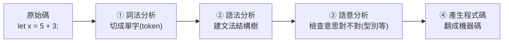

# [cs-4-3] 編譯器在做什麼：詞法 → 語法 → 語意 → 產生程式碼

> **本章目標**：打開「編譯器」這個黑盒子，看它怎麼一步步把你寫的文字，理解、檢查、最後翻譯成機器碼。

## 你會學到

- 編譯器內部的幾個階段
- 詞法分析、語法分析在做什麼
- 語意分析怎麼抓出「型別錯誤」等問題
- 為什麼了解這個能幫你看懂編譯錯誤訊息

## 概念說明

### 編譯不是「一步翻譯」，而是「一條產線」

[cs-4-2] 說編譯器把原始碼翻成機器碼。但這個「翻譯」其實是**一條多階段的產線**——像理解一句話，要先認字、再看文法、再懂意思，最後才能翻譯。編譯器也類似：



這張圖在說：編譯器把原始碼依序送過「詞法 → 語法 → 語意 → 產碼」幾個階段，每階段做一件事。我們一個個看。

### ① 詞法分析：把文字切成「單字」

**詞法分析（lexical analysis）** 把你寫的一長串字元，切成一個個有意義的「**詞元（token）**」——就像把一個句子斷成一個個單字：

```
原始碼：  let x = 5 + 3;
切成 token： [let] [x] [=] [5] [+] [3] [;]
            關鍵字 名稱 符號 數字 ...
```

如果你打了一個它不認得的怪字元，詞法分析這關就會報錯。

### ② 語法分析：檢查文法、建樹

**語法分析（parsing）** 拿這些 token，檢查它們的排列「**符不符合語言的文法**」，並組成一棵「**語法樹**」表達結構：

```
「let x = 5 + 3;」符合「let 名稱 = 運算式;」的文法 ✓
建成樹：
        =
       / \
      x   +
         / \
        5   3
```

如果文法錯了（例如少了分號、括號不對稱），語法分析會報錯——這就是你常看到的「syntax error（語法錯誤）」。比喻：這關像檢查句子的文法結構對不對。

### ③ 語意分析：檢查「意思」對不對

文法對，不代表「意思」對。**語意分析（semantic analysis）** 檢查更深的問題——尤其是**型別檢查**：

```
let x: i32 = "hello";   ← 文法完全正確，但「意思」錯了：
                          把字串塞給整數型別 → 型別不符！
```

這一關抓的是「型別錯誤、用了沒宣告的變數」這類問題。**這正是 rust 課程裡編譯器幫你擋掉一堆 bug 的地方**——[rust-0-1] 說的「編譯期抓錯」，很多就發生在語意分析。強型別語言（Rust、TypeScript）在這關特別嚴格，所以能提早抓出很多問題。

### ④ 產生程式碼：翻成機器碼

通過前面所有檢查後，編譯器才真正**產生機器碼**（[cs-4-1]）。現代編譯器在這步還會做**最佳化**——把你的程式碼改寫成「等效但更快」的版本（例如 [rust-5-1] 提的零成本抽象、迭代器優化，就是編譯器在這階段施展的魔法）。

### 為什麼懂這個有用？

了解編譯階段，能讓你**看懂編譯錯誤、知道從哪修**：

```
「unexpected token / syntax error」 → 語法分析關（文法問題：括號、分號…）
「type mismatch / 型別不符」        → 語意分析關（意思問題：型別對不上）
「cannot find value `x`」           → 語意分析關（用了沒宣告的東西）
```

下次看到編譯錯誤，你能大概判斷「它卡在哪個階段」，修起來更有方向。

## 範例：一行程式的編譯之旅

```
你寫：  let total = price * 2;

① 詞法：切成 [let][total][=][price][*][2][;]
② 語法：符合「let 名稱 = 運算式;」→ 建樹 ✓
③ 語意：檢查 price 有宣告嗎？是數字嗎？能乘 2 嗎？✓
④ 產碼：翻成「載入 price、乘以 2、存到 total」的機器碼

→ 四關都過，這行才成功編譯。任何一關出錯，就是你看到的編譯錯誤。
```

## 小練習

1. 說出編譯器的四個階段，並各用一句話描述。
2. 「let x: i32 = "hello";」會在哪個階段被抓出來？為什麼不是語法分析？
3. 思考題：為什麼「強型別語言（Rust）的語意分析比較嚴格」能幫你提早發現 bug？

## 課外讀物

> 編譯期抓錯是 Rust 的核心優勢 → **rust 課程 [rust-0-1]**；強型別 → **rust 課程 [rust-1-2]**、[課外讀物 E-6-4：TypeScript 最佳實踐](../../../課外讀物/E-6-best-practices/E-6-4-typescript-best-practices.md)

> 下一步：Java/C# 的位元組碼與虛擬機 → 本書 Part 4-4
