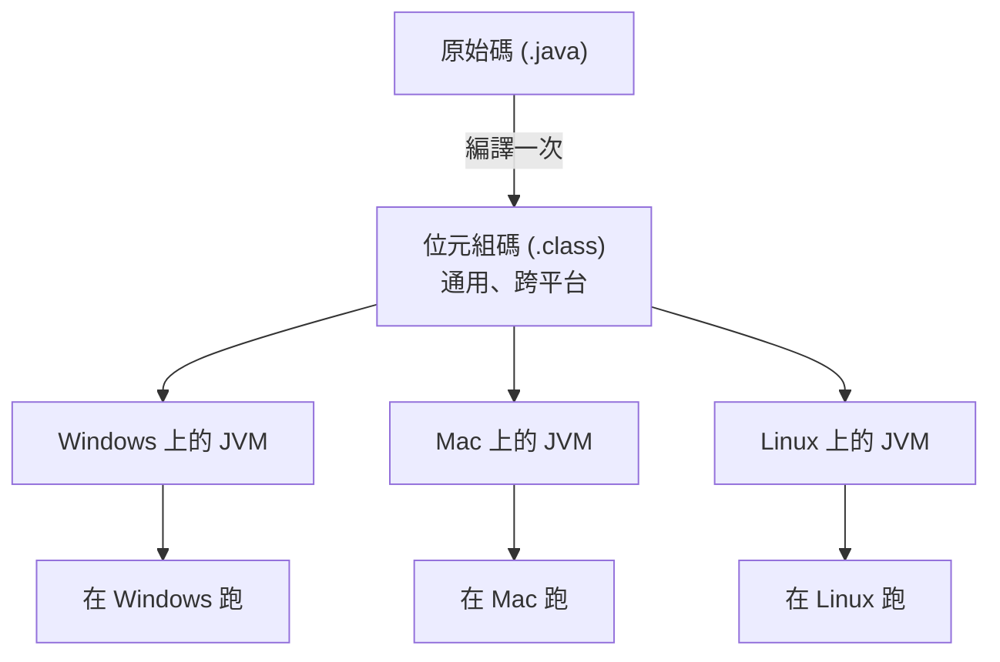

# [cs-4-4] 虛擬機與位元組碼：Java / .NET 怎麼「一次編譯、到處執行」

> **本章目標**：理解 Java、C# 這類語言的「混合」執行方式——先編譯成「位元組碼」，再由「虛擬機」執行，以及它怎麼達成跨平台。

## 你會學到

- 純編譯的跨平台難題
- 「位元組碼」是什麼：介於原始碼和機器碼之間
- 「虛擬機（VM）」怎麼執行位元組碼
- 「一次編譯，到處執行」的原理

## 概念說明

### 純編譯的跨平台難題

[cs-4-2] 說編譯產生「機器碼執行檔」，跑得快。但有個問題——**機器碼是綁定特定 CPU 和作業系統的**：

```
為 Windows + Intel CPU 編譯的執行檔
   → 不能直接在 Mac 上跑、不能在手機（不同 CPU）上跑
   → 想支援不同平台，得「為每個平台各編譯一次」，很麻煩
```

純直譯（[cs-4-2]）雖然跨平台（同一份原始碼到處跑），但慢。**有沒有辦法兼顧「跨平台」和「還算快」？** Java 和 .NET（C#）走了一條聰明的中間路線。

### 位元組碼：中間語言

Java/C# 的做法是：**先編譯，但不編譯成「某個 CPU 的機器碼」，而是編譯成一種「通用的中間碼」——位元組碼（bytecode）。**

```
位元組碼像「世界語」：
   不是任何一台真實 CPU 的母語，
   而是一種「虛擬的、通用的」指令格式。
   它比原始碼低階（接近機器碼），但又不綁定特定 CPU。
```

你的 Java 原始碼 → 編譯成位元組碼（`.class` 檔）。這個位元組碼在任何平台上**都一樣**。

### 虛擬機：執行位元組碼的「假 CPU」

但位元組碼不是真 CPU 的機器碼，誰來執行它？答案是**虛擬機（Virtual Machine, VM）**——一個軟體做的「假 CPU」：

- Java 的叫 **JVM（Java Virtual Machine）**
- C#/.NET 的叫 **CLR（Common Language Runtime）**



這張圖在說：原始碼**只編譯一次**成位元組碼，這份位元組碼可以丟到任何平台——只要那個平台**裝了對應的虛擬機（JVM）**，虛擬機就負責把位元組碼翻譯/執行成「該平台 CPU 看得懂的動作」。

### 「一次編譯，到處執行」

這就是 Java 著名的口號 **「Write Once, Run Anywhere（一次編寫，到處執行）」** 的原理：

```
你：寫一次原始碼 → 編譯一次成位元組碼
然後：同一份位元組碼，丟到 Windows / Mac / Linux / 各種裝置
     各平台的 JVM 負責「在地化」執行
→ 跨平台的麻煩，從「你」轉移到「虛擬機」身上。
  虛擬機幫你吸收了平台差異。
```

代價是：要先裝虛擬機（JVM/CLR），而且多一層虛擬機，速度通常略慢於純編譯（如 C/Rust）。但現代虛擬機很聰明，會用 **JIT（Just-In-Time，即時編譯）**——執行時把常跑的位元組碼「動態編譯成真機器碼」加速，所以效能其實相當不錯。

### 三種執行方式總覽

把 [cs-4-2] 和這章串起來，三種光譜：

| 方式 | 代表語言 | 特性 |
|------|---------|------|
| 純編譯 | C、C++、Rust | 最快，但綁平台、要各編一次 |
| 位元組碼 + VM | Java、C# | 跨平台、還算快，要裝 VM |
| 純直譯 | Python、Ruby | 最靈活、即寫即跑，但較慢 |

> 你會在 **csharp 課程**遇到 .NET 的 CLR；它和這裡講的 JVM 是同類概念。

## 範例：跨平台的實際好處

```
一家公司開發了一個 Java 後端服務：
   開發者在 Mac 上寫、編譯成位元組碼
   測試在 Linux 伺服器跑（裝了 JVM）→ 直接跑，不用重編
   有些工具在 Windows 跑（裝了 JVM）→ 一樣那份位元組碼

→ 「同一份編譯產物，到處能跑」省下大量「為每個平台重編、適配」的功夫。
  這是 Java 在企業界長紅的原因之一。
```

## 小練習

1. 用自己的話解釋「位元組碼」是什麼，它和機器碼的關鍵差別在哪。
2. 「一次編譯，到處執行」是怎麼做到的？虛擬機（JVM）扮演什麼角色？
3. 思考題：位元組碼 + 虛擬機，相比「純編譯（Rust）」和「純直譯（Python）」，各自取捨了什麼？

## 課外讀物

> C#/.NET 的 CLR 與這裡的 JVM 同類 → **csharp 課程**

> 三種執行方式的光譜 → 複習本書 Part 4-2：編譯 vs 直譯

> 下一步：函式庫怎麼被「組」進你的程式 → 本書 Part 4-5：連結與載入
