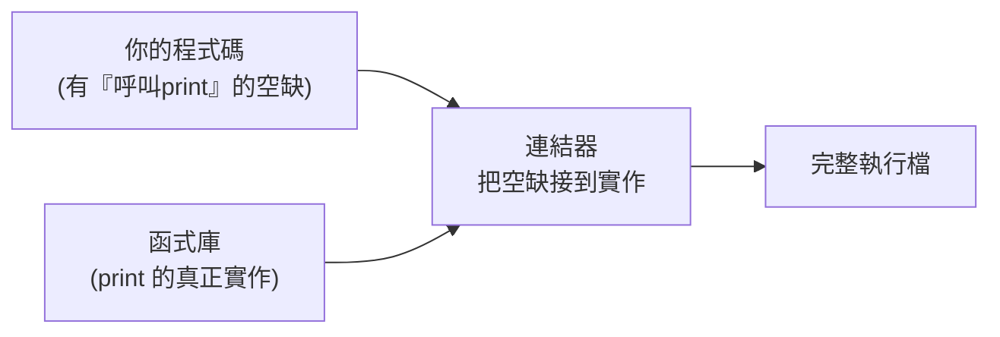

# [cs-4-5] 連結與載入：函式庫怎麼被組進你的程式

> **本章目標**：理解你的程式怎麼和「別人寫好的函式庫」組合在一起——編譯後的「連結」步驟，以及程式被載入記憶體執行的過程。

## 你會學到

- 為什麼程式不是「單一一塊」而是要「組裝」
- 連結（linking）：把你的程式和函式庫接起來
- 靜態連結 vs 動態連結
- 載入（loading）：程式怎麼進記憶體開始跑

## 概念說明

### 你的程式不是孤島

你寫程式時會用到很多「別人寫好的東西」——印出文字的功能、數學函式、處理網路的套件（[rust-7-2] 的 crate、[課外讀物 E-2](../../../課外讀物/E-2-npm/E-2-1-npm-intro.md) 的 npm 套件）。這些**函式庫（library）** 不是你寫的，但你的程式要用它們。

所以「產生最終可執行程式」其實有個「**組裝**」的步驟——把你的程式碼和它用到的函式庫**接在一起**。這個步驟就是**連結（linking）**。

```
比喻：你寫的程式像「組裝家具時你自己做的部分」，
     函式庫像「現成的零件包」。
     連結 = 把你的部分和現成零件「鎖在一起」，成為完整成品。
```

### 連結：把缺的部分補上

編譯（[cs-4-3]）把你的每個原始碼檔翻成機器碼，但裡面會有「**待填的空缺**」——例如你呼叫了 `print` 函式，但 `print` 的實作在函式庫裡，你的檔案裡只有「這裡要呼叫 print」的記號。

**連結器（linker）** 的工作就是：**把這些空缺，對應到函式庫裡真正的實作，全部接起來**，產生一個完整、能跑的執行檔。



這張圖在說：連結器把「你的程式」和「函式庫」拼在一起，補上所有空缺，產生最終的完整執行檔。

### 靜態連結 vs 動態連結

連結有兩種時機與方式：

**靜態連結（static linking）**：在編譯時，**把函式庫的程式碼「複製」進你的執行檔**。結果是一個「什麼都自帶」的大執行檔。

```
優點：自給自足，丟到別台機器就能跑（不依賴外部函式庫）
缺點：執行檔較大；多個程式各自帶一份相同函式庫 → 浪費空間
```

> 這呼應 **rust 課程 [rust-9-6]** 說的「Rust 編譯出一個獨立執行檔，丟上去就能跑」——很大程度是靜態連結的功勞。

**動態連結（dynamic linking）**：執行檔裡**不含**函式庫程式碼，只記「我需要某個函式庫」。等到**執行時**，再去系統裡載入那個共享的函式庫。

```
優點：執行檔小；多個程式「共用」同一份函式庫（省空間）
缺點：依賴目標機器有裝那個函式庫，沒有就跑不起來
     （Windows 的 .dll、Linux 的 .so 就是這種共享函式庫）
```

你可能看過「缺少 XXX.dll 無法執行」的錯誤——那就是動態連結找不到需要的函式庫。

### 載入：程式怎麼開始跑

連結好的執行檔躺在硬碟上。當你「執行」它，作業系統的**載入器（loader）** 負責：

```
1. 把執行檔從硬碟「載入」到記憶體（RAM，cs-3-5）
2. 設定好它需要的記憶體空間（程式碼區、資料區、堆疊、堆積…）
3. 把 CPU 的程式計數器（cs-3-3）指向程式的進入點（像 main）
4. CPU 開始執行 → 程式跑起來
```

這就是「雙擊一個程式 → 它跑起來」中間，作業系統默默做的事。**rust 課程 [rust-2-1]** 的堆疊、堆積，就是載入時為程式設定好的記憶體區域。

## 範例：從原始碼到執行的完整旅程

把 Part 4 整個串起來：

```
1. 你寫原始碼（高階語言）              [cs-4-1]
2. 編譯器：詞法→語法→語意→產生機器碼   [cs-4-3]
3. 連結器：把你的碼和函式庫接起來       [本章]
   → 得到完整執行檔
4. 載入器：把執行檔載入記憶體           [本章]
5. CPU：取指→解碼→執行，跑起來          [cs-3-3]

→ 從「你打的文字」到「CPU 執行」，要走完這一整條產線。
  現在你對「程式怎麼跑起來」有完整的圖像了。
```

## 小練習

1. 用「組裝家具」的比喻，解釋「連結」在做什麼。
2. 靜態連結和動態連結各有什麼優缺點？「缺少 .dll」的錯誤和哪種有關？
3. 思考題：為什麼 Rust 編譯出的「自帶一切的執行檔」（偏靜態連結）特別好部署？（提示：呼應 rust-9-6。）

## 課外讀物

> Rust「單一執行檔好部署」的優勢 → **rust 課程 [rust-9-6]**

> 套件/函式庫生態 → **rust 課程 [rust-7-2]**、[課外讀物 E-2：npm 與套件生態](../../../課外讀物/E-2-npm/E-2-1-npm-intro.md)

> 本 Part 完成！下一步：管理這一切的「作業系統」 → 本書 Part 5
