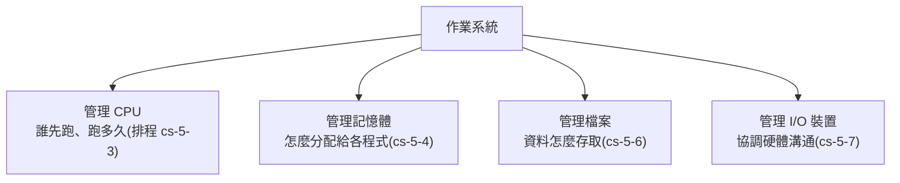

# [cs-5-1] 作業系統是什麼？為什麼非有它不可

> **本章目標**：理解作業系統的角色——它是「硬體」和「你的程式」之間的大管家，管理一切資源，讓程式不用直接面對複雜又危險的硬體。

## 你會學到

- 作業系統（OS）是什麼、做什麼
- 為什麼程式不直接操作硬體
- OS 的核心職責：資源管理與抽象
- 「核心（kernel）」是什麼

## 概念說明

### 你的程式不是直接跑在硬體上

到 Part 4 為止，你以為程式是「直接在 CPU 和記憶體上跑」。但其實中間還隔著一層超重要的軟體——**作業系統（Operating System, OS）**，例如 Windows、macOS、Linux、Android。

你的程式其實是「**跑在作業系統之上**」，由作業系統來協調它和硬體的互動。比喻：

```
硬體（CPU、記憶體、硬碟、網路卡…）像一棟大樓的各種設施。
你的程式像入住的房客。
作業系統像「大樓管理員」：
   房客（程式）不用自己去操作電梯機房、配電盤、水塔（硬體），
   只要跟管理員（OS）說「我要用電、要用網路」，管理員幫你協調。
```

### 為什麼程式不直接操作硬體？

你可能想：「程式直接控制硬體不是更快嗎？」但那會是災難，原因有三：

**① 太複雜**。每種硬體（不同廠牌的硬碟、網卡、顯卡）操作方式都不同。如果每個程式都要自己會操作所有硬體，程式設計師會瘋掉。OS 把硬體的複雜細節**藏起來**，提供統一、簡單的方式（這叫「抽象」，[cs-8-1]）。

```
沒有 OS：每個程式都要自己會「操作這台特定型號的硬碟」
有 OS：  程式只要說「幫我存這個檔案」，OS 處理底層細節
        → 不管底下是 SSD 還 HDD、哪個廠牌，程式都用同一招
```

**② 不安全**。如果每個程式都能直接亂搞硬體和記憶體，一個壞程式（或惡意程式）就能搞垮整台機器、偷別的程式的資料。OS 當「守門員」，管控誰能做什麼。

**③ 要共享**。一台電腦同時跑很多程式，它們要共用一顆 CPU、一份記憶體。誰先用 CPU？記憶體怎麼分？**必須有人協調**，否則大家搶成一團。這就是 OS 的核心工作。

### OS 的核心職責

作業系統主要管理四大資源，這也是 Part 5 接下來的章節地圖：



這張圖在說：OS 像一個全方位的管家，管理 CPU、記憶體、檔案、I/O 這幾大資源，讓眾多程式能和平、有效率地共用一台電腦的硬體。

### 核心（kernel）：OS 最核心的部分

作業系統最核心、最關鍵的部分叫**核心（kernel）**——它直接管理硬體、掌握最高權限，負責上面說的資源管理。你平常用的「桌面、視窗、設定」等只是 OS 的外圍，核心是底層的引擎。

OS 把世界分成兩個權限等級：

```
核心模式（kernel mode）：核心執行，有完整權限，能直接碰硬體
使用者模式（user mode）：你的程式執行，權限受限，碰硬體要「拜託核心」
```

這個分級是安全的關鍵——你的程式被關在「使用者模式」的沙盒裡，想做敏感操作（讀檔、上網）必須透過核心提供的「**系統呼叫（system call）**」請求，核心審核後代為執行。這樣壞程式就無法直接破壞系統。

## 範例：存一個檔案，OS 做了什麼

```
你的程式想存一個檔案，它只做一件事：呼叫「寫檔案」這個系統呼叫。
背後 OS（核心）默默處理：
   1. 檢查你有沒有權限寫這個位置（安全）
   2. 找出硬碟上哪裡有空間（管理儲存）
   3. 操作實際的硬碟硬體把資料寫下去（隱藏硬體細節）
   4. 更新檔案系統的記錄（cs-5-6）

→ 你的程式完全不用知道硬碟怎麼運作。
  OS 把「複雜、危險、要共享」的部分全包了。
```

這就是為什麼說「非有 OS 不可」——沒有它，寫程式會是惡夢，電腦也無法安全地同時做很多事。

## 小練習

1. 用「大樓管理員」的比喻，解釋作業系統的角色。
2. 說出「程式不直接操作硬體」的三個理由（複雜、安全、共享），各舉一個例子。
3. 「核心模式」和「使用者模式」的差別是什麼？這個分級為什麼對安全重要？

## 課外讀物

> 實際操作作業系統（Linux）→ **infra 課程**、[課外讀物 E-1：終端機操作](../../../課外讀物/E-1-terminal/E-1-1-what-is-terminal.md)

> 「隱藏複雜、提供簡單介面」是抽象的精神 → 本書 Part 8-1

> 下一步：OS 怎麼管理「正在執行的程式」 → 本書 Part 5-2：行程與執行緒
