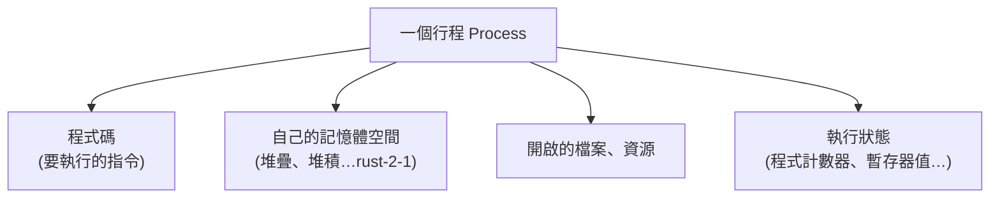

# [cs-5-2] 行程（Process）與執行緒（Thread）：程式「跑起來」的樣子

> **本章目標**：區分「程式」和「正在執行的程式」，認識行程與執行緒這兩個作業系統管理執行單位的核心概念。

## 你會學到

- 「程式」與「行程」的差別
- 行程（process）：執行中的程式 + 它的資源
- 執行緒（thread）：行程內的執行單元
- 行程與執行緒怎麼對應到並行（呼應 rust 課程）

## 概念說明

### 程式 vs 行程：食譜 vs 正在做菜

先分清兩個常被混用的詞：

```
程式（program）：躺在硬碟上的「執行檔」——靜態的、死的，像一本食譜。
行程（process）：那個程式「被執行起來」的狀態——動態的、活的，
                像「廚師正照著食譜做菜」這個進行中的活動。
```

同一個程式可以同時開很多個行程——例如你開三個記事本視窗，是「一個程式、三個行程」（像三個廚師照同一本食譜各做各的）。

### 行程：執行中的程式 + 它的家當

當作業系統「執行」一個程式，它會建立一個**行程**，並配給它一套專屬資源：



這張圖在說：一個行程不只是「程式碼」，還包含它**專屬的記憶體空間**、開啟的資源、執行到哪的狀態。關鍵是——**每個行程有自己「獨立」的記憶體空間，彼此隔離**：

```
行程 A 不能直接讀行程 B 的記憶體（OS 隔離保護）
→ 好處：一個程式崩潰，不會搞垮別的程式（穩定、安全）
→ 例如瀏覽器常把每個分頁做成獨立行程，一個分頁掛了不影響其他
```

這個隔離是 [cs-5-1] 說的「安全」的具體體現，由 OS 的記憶體管理（[cs-5-4]）保證。

### 執行緒：行程內的執行小隊

一個行程內部，工作可以再切成多條「同時進行的執行線」——這就是**執行緒（thread）**。

```
行程像「一間工廠」（有廠房、原料、設備＝記憶體與資源）。
執行緒像「工廠裡的工人」：
   一個工廠可以有多個工人（多執行緒），同時做不同的活，
   而他們「共享」同一間工廠的廠房和原料（同一個行程的記憶體）。
```

關鍵差別：

| | 行程（process）| 執行緒（thread）|
|---|------|------|
| 記憶體 | 各自獨立、隔離 | 同行程的執行緒**共享**記憶體 |
| 隔離性 | 強（一個掛了不影響別的）| 弱（一個執行緒搞壞共享資料，全遭殃）|
| 建立成本 | 較重 | 較輕 |
| 溝通 | 較麻煩（要跨行程機制）| 容易（直接共享記憶體）|

### 連到並行：共享記憶體的雙面刃

「同一行程的執行緒共享記憶體」這件事，是**並行程式設計**的關鍵——也是危險的根源。回憶 **rust 課程 [rust-8-3]、[rust-8-4]**：

```
多執行緒共享記憶體 → 能高效合作（一起處理一份資料）
                  → 但若同時亂改共享資料 → 資料競爭（data race）！
```

這就是為什麼 rust 課程花那麼大力氣講「所有權」和「Arc/Mutex」——因為執行緒共享記憶體很強大，但要小心保護。**這一章的「執行緒共享記憶體」，正是 rust 並行那些規則要解決的底層問題。**

## 範例：一個瀏覽器的行程與執行緒

```
你打開的瀏覽器（如 Chrome）：
   行程層面：每個分頁常是「獨立行程」
      → 一個分頁的網頁崩潰，不會拖垮整個瀏覽器（隔離）
   執行緒層面：單一分頁內部用「多個執行緒」
      → 一個負責畫面、一個負責下載、一個跑 JavaScript…同時進行
      → 它們共享這個分頁的記憶體，所以能高效合作

→ 行程給「隔離與穩定」，執行緒給「行程內的高效並行」。
```

## 小練習

1. 用「食譜 vs 做菜」「工廠 vs 工人」的比喻，分別解釋「程式 vs 行程」和「行程 vs 執行緒」。
2. 行程之間的記憶體是隔離的，執行緒之間是共享的——這各帶來什麼好處與風險？
3. 思考題：為什麼「執行緒共享記憶體」既是並行的優勢、又是 rust 課程要小心處理（Arc/Mutex）的原因？

## 課外讀物

> 多執行緒、共享記憶體的危險與 Rust 的解法 → **rust 課程 [rust-8-3]、[rust-8-4]**

> 下一步：單顆 CPU 怎麼「同時」跑這麼多行程/執行緒 → 本書 Part 5-3：CPU 排程
