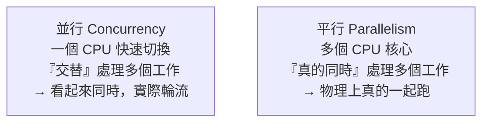

# [cs-5-3] CPU 排程：單核心怎麼「假裝同時」跑很多程式

> **本章目標**：理解一個你天天經歷卻沒想過的魔術——一顆 CPU 一次只能做一件事，為什麼你能同時聽音樂、開瀏覽器、打字？答案是「排程」。

## 你會學到

- 並行（concurrency）vs 平行（parallelism）的差別
- 「分時」：CPU 快速切換造成「同時」的錯覺
- 排程器（scheduler）的工作
- 多核心怎麼真正「同時」

## 概念說明

### 一個矛盾：一核 CPU 卻能「同時」做很多事

一顆 CPU 核心，**任何時刻只能執行一條指令**（[cs-3-3]）。但你的電腦明明同時在播音樂、跑瀏覽器、接收訊息……怎麼辦到的？

答案是個聰明的錯覺——**CPU 飛快地在各個工作之間「切換」**，每個工作做一小段就換下一個，切換得太快，你的感官以為它們「同時」在跑。這叫**分時（time-sharing）**。

```
比喻：一個廚師（CPU）服務很多桌客人（程式）。
   他不是同時做所有菜，而是：
   切 A 桌的菜 30 秒 → 換去炒 B 桌 → 換去 C 桌擺盤 → 回 A 桌…
   切換超快，每桌客人都「感覺廚師一直在服務我」。
```

### 並行 vs 平行：重要的區分

這裡要分清兩個常被混用的詞：



這張圖在說：

- **並行（concurrency）**：「處理多件事」的能力，靠單核心快速切換達成「看似同時」——本質是**輪流**。
- **平行（parallelism）**：「真的同時執行」，需要**多個核心**，物理上一起跑。

一個比喻：並行像「一個人輪流陪兩個小孩玩，切很快讓兩個都覺得有人陪」；平行像「兩個大人各陪一個小孩，真的同時」。現代電腦兩者並用——多核心（平行）+ 每個核心上分時切換（並行）。

> rust 課程 [rust-8-5] 講的「async（並行，少執行緒處理多工）」vs「多執行緒（可平行）」就是這個區分的應用。

### 排程器：決定「接下來輪到誰」

既然 CPU 要不斷切換，**「下一個輪到哪個工作、做多久」由誰決定？** 由作業系統裡的**排程器（scheduler）** 決定。它要做艱難的權衡：

```
排程器要兼顧很多目標（常常互相衝突）：
   公平：每個程式都要分到 CPU，別讓誰餓死
   反應快：你按鍵、滑鼠要馬上有反應（互動程式優先）
   效率：別把時間浪費在「切換」本身（切換也有成本）
   優先級：重要的工作（如系統關鍵任務）先做
```

排程器用各種演算法來決定順序（輪流、依優先級、依等待時間…）。它是 OS 最核心的部分之一——調度得好，電腦就「順」；調度不好，就會「卡頓」。

### 切換的代價：上下文切換

每次 CPU 從工作 A 換到工作 B，要做一件事叫**上下文切換（context switch）**：

```
切換前：把 A 的「現場」（暫存器、程式計數器 cs-3-3 等狀態）儲存起來
切換後：把 B 之前存的「現場」載入，讓 B 從上次中斷的地方繼續
→ 這個「存檔/讀檔」本身要花時間，是一種「純開銷」
```

所以切換不是免費的——切太頻繁，時間都耗在切換上，反而沒效率。這也是為什麼「開太多程式會變慢」的原因之一。排程器要拿捏「切換頻率」的平衡。

## 範例：你打字時發生的切換

```
你一邊聽音樂、一邊在瀏覽器打字（單核心情境）：
   ...播放器解碼一小段音樂 → (切換) → 瀏覽器處理你的按鍵
   → (切換) → 播放器再解碼一段 → (切換) → 顯示你打的字...
   每秒切換成千上萬次

→ 你「感覺」音樂沒斷、打字即時回應，
  其實 CPU 在飛快輪流服務它們——這就是並行（分時）的魔術。
  若是多核心，部分工作能真正平行，更順。
```

## 小練習

1. 用「一個廚師服務多桌」的比喻，解釋「分時」怎麼造成「同時」的錯覺。
2. 並行（concurrency）和平行（parallelism）的關鍵差別是什麼？單核心能達成哪一個？
3. 思考題：「上下文切換」是什麼？為什麼「開很多程式」可能讓電腦變慢？

## 課外讀物

> async（並行）vs 多執行緒（可平行）的應用 → **rust 課程 [rust-8-5]、[rust-8-3]**

> 多核心讓平行成為可能 → 複習本書 Part 2-5（摩爾定律放緩後轉向多核心）

> 下一步：OS 怎麼管理記憶體、讓每個程式以為自己獨佔 → 本書 Part 5-4
