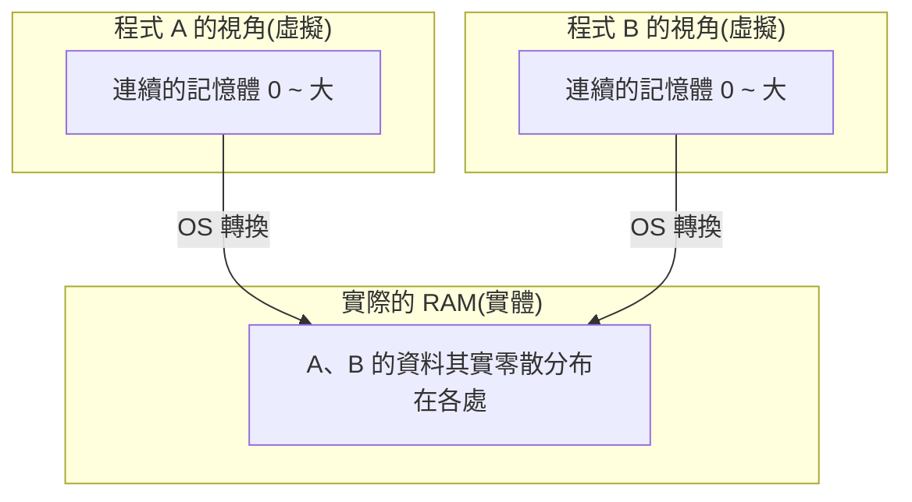

# [cs-5-4] 記憶體管理與虛擬記憶體：每個程式都以為自己獨佔記憶體

> **本章目標**：理解作業系統怎麼把有限的記憶體分配給眾多程式，以及「虛擬記憶體」這個巧妙的幻覺——讓每個程式都以為自己擁有一整片連續、獨佔的記憶體。

## 你會學到

- 多程式共用記憶體的難題
- 「虛擬記憶體」：給每個程式一個假象
- 虛擬位址 → 實體位址的轉換
- 用硬碟「擴充」記憶體（swap）與其代價

## 概念說明

### 難題：大家要共用一份記憶體

一台電腦同時跑很多程式（[cs-5-2] 的多個行程），但 RAM（[cs-3-5]）只有一份、容量有限。難題來了：

```
怎麼把有限的 RAM 分給大家，又要：
   隔離：程式 A 不能亂讀/亂改程式 B 的記憶體（安全 cs-5-1）
   彈性：程式不知道自己會被分到哪塊實體記憶體
   夠用：萬一所有程式要的記憶體加起來超過實體 RAM 怎麼辦？
```

作業系統的神來之筆叫**虛擬記憶體（virtual memory）**。

### 虛擬記憶體：給每個程式一個美好的幻覺

虛擬記憶體的核心點子是：**讓每個程式都以為自己「獨佔一整片、從 0 開始、連續的記憶體」**，但這是假象——OS 在背後偷偷把這些「虛擬位址」對應到「實際的實體位址」。



這張圖在說：程式 A 和 B **都以為自己擁有「從 0 開始的完整記憶體」**，但實際上它們的資料零散分布在實體 RAM 的各個角落，由 OS 負責「虛擬位址 → 實體位址」的轉換。

這個幻覺帶來巨大好處：

```
① 簡單：程式不用管「我被分到哪、記憶體夠不夠連續」，
        它眼中永遠是一片乾淨連續的空間。
② 隔離：A 的虛擬位址 100 和 B 的虛擬位址 100 對應到「不同的實體位置」，
        A 根本碰不到 B 的記憶體 → 安全（cs-5-1 的隔離就靠這個）。
③ 彈性：OS 能自由搬動、分配實體記憶體，程式無感。
```

### 虛擬位址怎麼變成實體位址

OS 把記憶體切成固定大小的「**頁（page）**」來管理，並維護一張「**頁表（page table）**」記錄「每個虛擬頁 → 對應哪個實體頁」。CPU 裡有專門的硬體（MMU）幫忙快速做這個轉換。

```
程式存取「虛擬位址 X」
   → MMU 查頁表 → 找到對應的「實體位址 Y」
   → 真正去 Y 讀寫
這個轉換對程式完全透明，它只看到虛擬位址。
```

你在 **rust 課程 [rust-2-1]、[rust-2-5]** 用的記憶體位址、指標，其實都是「虛擬位址」——你的程式看到的是 OS 給的那層幻覺。

### 用硬碟擴充記憶體：swap

虛擬記憶體還有一招——**當實體 RAM 不夠用，把「暫時用不到的記憶體內容」搬到硬碟上**（叫 swap 或分頁檔），騰出 RAM 給急需的程式。需要時再搬回來。

```
好處：讓「所有程式要的記憶體總和 > 實體 RAM」也能運作
代價：硬碟比 RAM 慢太多（cs-3-4 階層）！
     一旦頻繁地把資料在 RAM 和硬碟間搬來搬去（叫 thrashing 抖動），
     電腦會慢到爆 → 這就是「記憶體不足時電腦狂卡」的真相
```

所以「加 RAM」對常常記憶體吃緊的電腦很有感——減少了拿慢速硬碟當記憶體用的窘境。

## 範例：兩個程式的「位址 100」

```
程式 A 和程式 B 都存取「自己的虛擬位址 100」：
   A 的虛擬位址 100 → OS 轉換 → 實體位址 5000
   B 的虛擬位址 100 → OS 轉換 → 實體位址 9000
→ 同樣是「位址 100」，卻對應到完全不同的實體位置。
  所以 A 和 B 各玩各的，永遠不會踩到對方的記憶體。
  這就是「每個程式都以為自己獨佔記憶體」的幻覺，由 OS 完美維持。
```

## 小練習

1. 用自己的話解釋：虛擬記憶體給每個程式什麼樣的「幻覺」？這個幻覺有什麼好處？
2. 為什麼程式 A 和程式 B 「同樣的虛擬位址」不會互相干擾？
3. 思考題：「swap（用硬碟當記憶體）」讓記憶體看似變大，但為什麼用多了電腦會超卡？（提示：回憶 cs-3-4 硬碟和 RAM 的速度差。）

## 課外讀物

> 你在 Rust 用的指標/位址都是「虛擬位址」 → **rust 課程 [rust-2-1]、[rust-2-5]**

> 記憶體不足、洩漏在線上系統的影響與監控 → **sre 課程**

> 下一步：多執行緒共享記憶體帶來的麻煩 → 本書 Part 5-5：並行的麻煩
