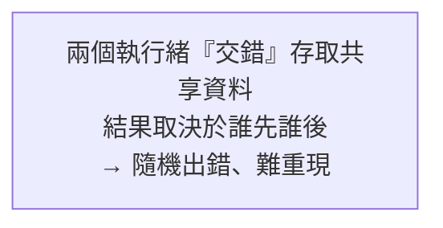

# [cs-5-5] 並行的麻煩：競爭條件、死結、互斥鎖

> **本章目標**：認識並行（多執行緒同時跑）帶來的經典麻煩——競爭條件與死結，以及解決它們的工具「互斥鎖」。這是 rust 課程並行章節的底層原理。

## 你會學到

- 競爭條件（race condition）：為什麼「同時改」會出錯
- 互斥鎖（mutex）：怎麼保護共享資料
- 死結（deadlock）：互相等待的僵局
- 為什麼並行 bug 這麼難抓

## 概念說明

### 共享帶來的麻煩

[cs-5-2] 說同一行程的執行緒**共享記憶體**——這讓它們能合作，但也埋下大麻煩：**當多個執行緒同時存取、修改同一份資料，可能出錯。**

### 競爭條件：同時改的災難

最經典的問題是**競爭條件（race condition）**——**結果取決於「執行緒剛好誰先誰後」，而這個順序是不可預測的。** 看一個「兩個執行緒各把計數器加 1」的例子：

```
「加 1」這個動作，其實是三步：
   1. 讀取目前的值
   2. 把值加 1
   3. 寫回去

如果兩個執行緒「交錯」執行（計數器原本是 5，期望變成 7）：
   執行緒A 讀到 5
   執行緒B 讀到 5         ← 還沒等 A 寫回！
   A 算 5+1=6，寫回 6
   B 算 5+1=6，寫回 6     ← 兩次加 1，結果卻只有 6！應該是 7
→ 丟失了一次加法。這就是競爭條件。
```



可怕的是——這個 bug **不一定每次都發生**，要剛好「交錯」才出事。所以它隨機出現、難以重現，是並行 bug 惡名昭彰的原因。

### 互斥鎖：一次只准一個人動

解決競爭條件的經典工具是**互斥鎖（mutex，mutual exclusion）**。回憶 **rust 課程 [rust-8-4]** 的「廁所門鎖」比喻：

```
互斥鎖規定：要存取共享資料，先「取得鎖」；用完「釋放鎖」。
   同一時間只有一個執行緒能持有鎖。
   別人想存取 → 得等鎖被釋放。
→ 把「讀-改-寫」這三步保護起來，不被別人插隊 → 競爭條件消失。
```

加了鎖之後，剛才的計數器例子就正確了：A 持鎖完成「讀-加-寫」並釋放，B 才能進來——不會交錯。

> 這正是 **rust 課程 [rust-8-4]** 的 `Mutex` 在做的事。而 [rust-8-3] 的「無懼並行」更進一步——Rust 用編譯期規則，讓你「忘記加鎖去碰共享資料」直接編譯失敗。本章的麻煩，就是 Rust 那套設計想根除的東西。

### 死結：互相等待的僵局

鎖解決了競爭條件，但用不好會帶來新麻煩——**死結（deadlock）**：兩個（或多個）執行緒**互相等待對方手上的鎖**，結果誰都動不了，永遠卡住。

```
經典死結：
   執行緒 A 持有鎖1，正在等鎖2
   執行緒 B 持有鎖2，正在等鎖1
   → A 等 B 放鎖2，B 等 A 放鎖1 → 兩個永遠互等 → 卡死
```

比喻：兩個人過獨木橋，各走到一半、面對面，都堅持「你先退我才走」——結果兩個都過不去。

死結的四個必要條件（互斥、持有並等待、不可搶奪、循環等待）只要破壞其一就能避免，常見做法是「**規定所有人都用固定順序取鎖**」（例如永遠先拿鎖1再拿鎖2），就不會形成循環等待。

> Rust 的型別系統擋得了競爭條件，但**擋不了死結**（[rust-8-4] 提過）——死結是邏輯問題，要靠設計避免。

### 為什麼並行 bug 這麼難抓？

```
① 不可重現：要「剛好的時序」才出錯，可能跑一千次才中一次
② 換環境就變：在你電腦好好的，上線到別的機器就出包（時序不同）
③ 加 log 反而不出現：你一加診斷碼，時序變了，bug 躲起來了（海森堡 bug）
→ 這就是為什麼「無懼並行」這麼有價值——
  能在編譯期擋掉，遠勝於上線後抓鬼。
```

## 範例：銀行帳戶的競爭條件

```
你的帳戶有 1000 元。同時發生兩筆「提款 800」（例如重複點擊）：
   提款A 讀到餘額 1000 → 夠！準備扣
   提款B 讀到餘額 1000 → 夠！準備扣   ← 還沒等 A 扣完
   A 扣 800 → 餘額 200
   B 扣 800 → 餘額 -600  ← 災難！超領了

加上互斥鎖：A 先鎖住帳戶完成「檢查+扣款」再放鎖，
   B 才能進來，這時讀到的是 200，發現不夠 → 拒絕。✓
→ 金融系統對並行控制錙銖必較，正是因為這種錯會出大事。
```

## 小練習

1. 用「兩個執行緒各加 1，結果卻只加了 1」的例子，解釋競爭條件為什麼發生。
2. 互斥鎖怎麼解決競爭條件？用「廁所門鎖」的比喻說明。
3. 思考題：用「兩個人過獨木橋」描述死結，並想一個避免它的規則。

## 課外讀物

> Rust 怎麼用所有權在編譯期擋掉競爭條件 → **rust 課程 [rust-8-3]、[rust-8-4]**

> 並行控制在快取、分散式系統的應用 → **快取課程 Part 6**

> 下一步：OS 怎麼管理檔案 → 本書 Part 5-6：檔案系統
