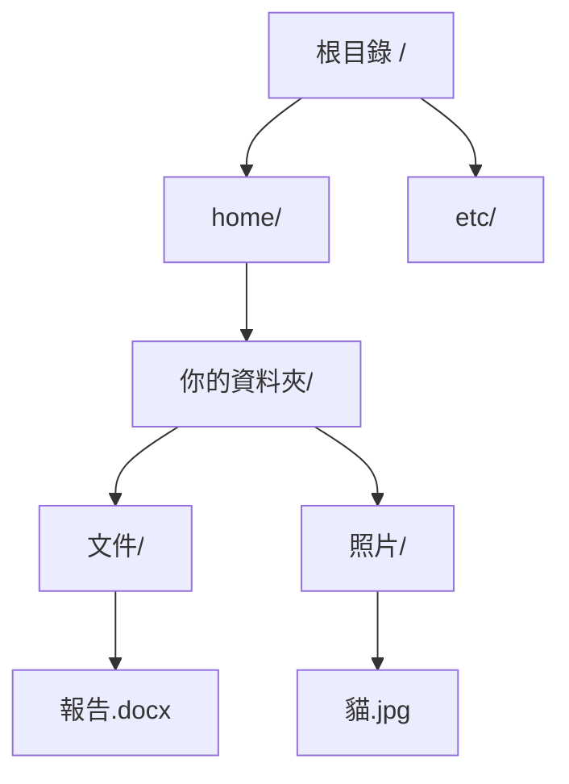

# [cs-5-6] 檔案系統：資料在磁碟上怎麼被組織

> **本章目標**：理解作業系統怎麼把「一堆 0 和 1」組織成你熟悉的「檔案和資料夾」，以及檔案系統在背後做的事。

## 你會學到

- 檔案系統是什麼、解決什麼問題
- 「檔案」與「資料夾」的抽象
- 路徑、副檔名是什麼
- 檔案系統背後怎麼管理磁碟空間

## 概念說明

### 從「一堆位元組」到「檔案和資料夾」

硬碟（[cs-3-6]）本質上只是「一大片能存 0 和 1 的空間」。如果直接面對它，你看到的是「第幾號到第幾號位元組存了什麼」——根本沒法用。

**檔案系統（file system）** 就是作業系統提供的一層組織，把這片混沌的儲存空間，整理成你熟悉的**檔案（file）** 和**資料夾（folder/directory）**：

```
沒有檔案系統：硬碟 = 一大片無名的位元組海洋，無從找起。
有檔案系統：  整理成「報告.docx」「照片資料夾」這種有名字、有結構的東西。
```

這是 [cs-5-1] 說的「抽象」的好例子——OS 把硬碟的複雜細節藏起來，給你「檔案」這個好用的概念。你存檔案時根本不用管「它實際存在硬碟哪幾個位置」。

### 檔案：有名字的一包資料

**檔案**就是「一包有名字的相關資料」。檔案系統幫每個檔案記錄一些資訊（叫「中介資料/metadata」）：

```
一個檔案，檔案系統幫它記著：
   檔名（報告.docx）
   大小、建立/修改時間
   權限（誰能讀、誰能寫——呼應 cs-5-1 安全）
   實際內容存在硬碟的哪些位置
```

### 資料夾：樹狀的組織

檔案多了要分類，所以有**資料夾**（也叫目錄）——資料夾裡能放檔案，也能放別的資料夾，形成一棵**樹狀結構**：



這張圖在說：檔案系統是一棵樹，從「根目錄」往下分支成各層資料夾，最後是檔案。這個樹狀組織讓你能有條理地分類大量檔案。

### 路徑：檔案的「地址」

要指出某個檔案在樹的哪裡，用**路徑（path）**——從根目錄一路指到檔案：

```
/home/你的資料夾/照片/貓.jpg
↑根  ↑一層層資料夾          ↑檔案
```

你在 [課外讀物 E-1](../../../課外讀物/E-1-terminal/E-1-1-what-is-terminal.md) 終端機、**rust 課程**寫檔案、本課程章節的連結路徑，用的都是這個概念。路徑分「絕對路徑」（從根開始）和「相對路徑」（從目前位置開始）。

### 副檔名：給人和程式的提示

檔名最後那個 `.docx`、`.jpg`、`.rs` 叫**副檔名**——它**提示「這是什麼類型的檔案」**，讓作業系統知道該用哪個程式打開，也讓你一眼看出檔案種類。

```
報告.docx → 文件，用 Word 開
貓.jpg    → 圖片，用看圖程式開
main.rs   → Rust 原始碼
注意：副檔名只是「提示/慣例」，改掉它不會改變檔案的真實內容。
```

### 背後：怎麼管理磁碟空間

檔案系統還要管理「硬碟空間怎麼分配」——這其實和 [cs-5-4] 記憶體管理有點像。它把硬碟切成小「區塊（block）」，記錄「哪些區塊空著、哪個檔案用了哪些區塊」。

一個有趣的後果——**檔案的資料常常不是連續存放的**（東一塊西一塊，叫「碎片化」）。傳統 HDD（[cs-3-6]）碎片化會變慢（磁頭要到處移動），所以以前有「磁碟重組」。SSD 因為沒有機械移動，碎片化影響小，不需要重組。

## 範例：刪檔案發生什麼

一個常被誤解的概念：

```
你「刪除」一個檔案時，通常檔案系統只是：
   把它的記錄標記為「這塊空間可以再用了」，
   但「實際的 0 和 1 內容」當下還留在硬碟上！
   只是你看不到它，且空間隨時可能被新資料覆蓋。

→ 這就是為什麼「刪掉的檔案有時能被救援軟體救回」
  （只要還沒被新資料覆蓋）。
→ 也是為什麼「要徹底銷毀機密資料」不能只按刪除，
  得「覆寫」那塊空間（資安考量，課外讀物 E-10）。
```

## 小練習

1. 用自己的話解釋：檔案系統把「硬碟上的一堆位元組」變成了什麼讓人好用的東西？
2. 寫出一個檔案路徑，標出哪部分是資料夾、哪部分是檔名、哪部分是副檔名。
3. 思考題：為什麼「刪除檔案」後，有時還能用軟體救回來？要徹底銷毀該怎麼做？

## 課外讀物

> 在終端機操作檔案與路徑 → [課外讀物 E-1：終端機操作](../../../課外讀物/E-1-terminal/E-1-1-what-is-terminal.md)、**infra 課程**

> 徹底銷毀資料的資安考量 → [課外讀物 E-10：Web Security 基礎](../../../課外讀物/E-10-security/E-10-1-web-security-overview.md)

> 下一步：硬體裝置怎麼和 CPU 溝通 → 本書 Part 5-7：I/O 與中斷
