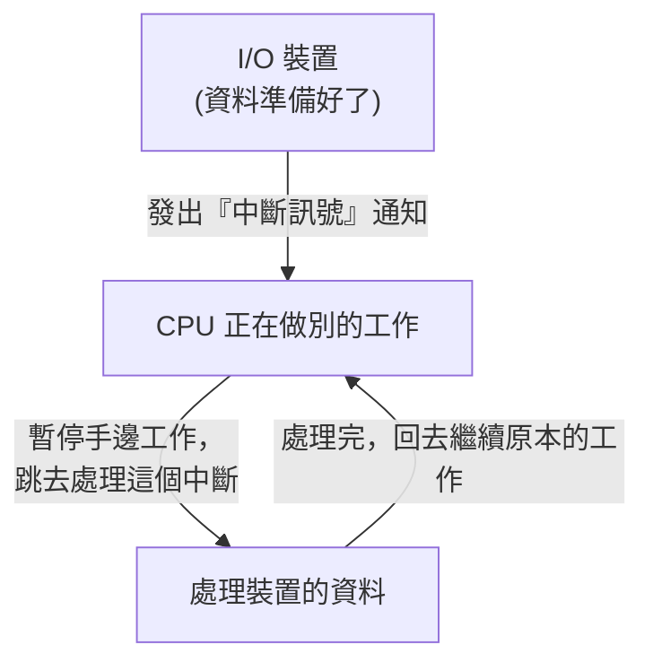

# [cs-5-7] I/O 與中斷：硬體怎麼「通知」CPU

> **本章目標**：理解 CPU 怎麼和速度慢很多的 I/O 裝置（鍵盤、硬碟、網路）打交道，以及「中斷」這個讓 CPU 不必傻等的關鍵機制。

## 你會學到

- CPU 和 I/O 裝置的「速度落差」問題
- 笨方法：輪詢（polling）為什麼浪費
- 中斷（interrupt）：讓裝置「主動通知」CPU
- 中斷怎麼讓系統又快又有反應

## 概念說明

### 速度落差：CPU 太快，裝置太慢

CPU 快得驚人（每秒幾十億次運算，[cs-3-2]）。但 I/O 裝置（[cs-3-7]）相對慢得可憐：

```
CPU 等一個按鍵 → 你按鍵的間隔，對 CPU 像「等好幾個世紀」
CPU 等硬碟資料 → 硬碟（尤其 HDD）慢 CPU 好幾個數量級
```

問題來了：CPU 需要 I/O 裝置的資料（你的按鍵、硬碟的檔案），但裝置這麼慢，**CPU 該怎麼等？** 有兩種方法。

### 笨方法：輪詢（一直問）

最直覺的方法叫**輪詢（polling）**——**CPU 不斷地問裝置「好了沒？好了沒？」**：

```
CPU：鍵盤有按鍵嗎？ → 沒有
CPU：有了嗎？ → 沒有
CPU：有了嗎？ → 沒有
...（問了幾百萬次）...
CPU：有了嗎？ → 有了！處理按鍵
```

問題很明顯——**CPU 把大量時間浪費在「一直問」上，什麼正事都沒做**。就像你煮東西時，一直站在鍋子前每秒看一次「滾了沒」，沒辦法去做別的事。太浪費了。

### 聰明方法：中斷（被通知）

更好的方法叫**中斷（interrupt）**——**CPU 不主動問，而是去做別的事；當裝置準備好了，由「裝置主動通知 CPU」**：

```
比喻：
   輪詢 = 你站在微波爐前一直盯著看好了沒（乾等）
   中斷 = 你按下微波爐去做別的事，「叮」一聲響了你才回來（被通知）
```



這張圖在說：CPU 平常做自己的事，**裝置好了會「發中斷訊號」叫它**——CPU 收到後，暫停手邊工作、跳去處理（呼應 [cs-5-3] 的上下文切換），處理完再回來繼續。這樣 CPU **不用傻等**，時間能拿去做有用的事。

### 中斷怎麼運作

```
1. CPU 叫硬碟「去把某檔案讀出來」，然後 CPU 就去做別的事（不等）
2. 硬碟慢慢讀（這期間 CPU 在忙別的）
3. 硬碟讀好了 → 發出「中斷訊號」
4. CPU 收到中斷 → 存下目前工作的現場 → 跳去執行「中斷處理程式」拿資料
5. 處理完 → 恢復現場，繼續原本被打斷的工作
```

這個機制讓電腦能**同時應付很多慢速裝置，又不浪費 CPU**。你打字時系統反應靈敏、背景能同時下載檔案，靠的就是中斷——CPU 不必為任何一個慢裝置乾等。

### 連到「非同步」

這個「別傻等、好了再通知我」的思想，你應該覺得眼熟——它正是 **rust 課程 [rust-8-5]** 非同步（async）的精神！

```
中斷（硬體層）：CPU 不等慢裝置，被通知才處理
非同步（軟體層）：程式不等慢操作(網路/IO)，完成才回來處理
→ 同一個智慧：「面對慢的東西，別傻等，去做別的，好了再回來。」
  從硬體的中斷，到軟體的 async，是一脈相承的設計哲學。
```

## 範例：你按下鍵盤

```
你打字時按下一個鍵：
   1. CPU 正在忙（跑程式、算東西）
   2. 鍵盤偵測到你按鍵 → 發出「中斷」
   3. CPU 收到中斷 → 暫停手邊事 → 跳去「讀取這個按鍵是什麼」
   4. 處理完（把字交給對應程式）→ 回去繼續原本的工作

→ 整個過程快到你無感，而 CPU 在你「沒按鍵的空檔」一直在做別的事，
  沒有浪費在「盯著鍵盤等你按」。這就是中斷的價值。
```

## 小練習

1. 用「微波爐」的比喻，解釋輪詢（polling）和中斷（interrupt）的差別。
2. 為什麼「輪詢」浪費 CPU？「中斷」怎麼解決這個浪費？
3. 思考題：硬體的「中斷」和 rust 課程的「非同步（async）」，背後是不是同一種智慧？用一句話描述這個共同的智慧。

## 課外讀物

> 「別傻等、好了再通知」的軟體版——非同步 → **rust 課程 [rust-8-5]：async**

> 中斷處理涉及上下文切換 → 複習本書 Part 5-3：CPU 排程

> 本 Part 完成！下一步：把電腦連起來的網路 → 本書 Part 6
