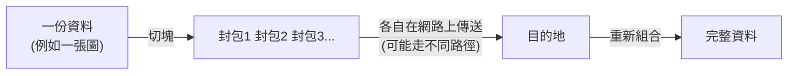

# [cs-6-1] 網路是什麼：把電腦連起來交換資料

> **本章目標**：建立對電腦網路最基本的認識——它就是「把電腦連起來、讓它們能交換資料」的系統，以及為什麼這改變了世界。

## 你會學到

- 網路的本質：連接 + 交換資料
- 區域網路 vs 網際網路
- 「封包」：資料怎麼被切塊傳送
- 主從架構（client-server）的基本概念

## 概念說明

### 網路的本質很單純

前面五個 Part 都在講「一台電腦內部」。但電腦真正改變世界，是在它們**連起來**之後。**網路（network）** 的本質可以濃縮成一句話：

> **把多台電腦連接起來，讓它們能互相交換資料。**

就這麼簡單。你滑手機、看影片、傳訊息、用任何 App，骨子裡都是「你的裝置」和「某台伺服器」在網路上交換資料。

```
比喻：網路像「郵政系統」。
   每台電腦像一棟有地址的房子。
   資料像信件。
   網路負責「把信從一棟房子，正確送到另一棟」。
```

### 從區域到全球

網路有不同規模：

```
區域網路（LAN）：一個小範圍內的電腦互連
   例如：你家的 Wi-Fi 連著手機、電視、筆電 → 一個小網路
網際網路（Internet）：把全世界無數的網路「連接起來」的超大網路
   "Internet" = inter-network = 網路與網路的互聯
```

所以「網際網路」不是一台巨大的電腦，而是**無數小網路互相連接**形成的「網路的網路」。你家的小網路，透過電信商連到更大的網路，最終連上全球——你就能和地球另一端的伺服器交換資料。

### 封包：把資料切成小塊寄

網路傳資料有個關鍵手法——**不是把整份資料一口氣傳完，而是切成很多小塊**，叫**封包（packet）**，一塊一塊傳，到目的地再組合回來。



這張圖在說：資料被切成封包，各自在網路上傳送，到目的地再拼回完整資料。為什麼要切塊？

```
① 共享線路：很多人的封包能交錯在同一條線上傳，不用一個人佔住整條
② 容錯：某個封包掉了，只要重傳那一個，不用整份重來
③ 彈性：不同封包能走不同路徑，哪條通走哪條
```

這個「切成封包」的設計，是網路能高效、可靠運作的基礎（細節在 [cs-6-3]）。

### 主從架構：誰要、誰給

網路上的電腦常分兩種角色——這是**主從架構（client-server）**：

```
客戶端（client）：發出請求的一方（你的瀏覽器、手機 App）
                「我要看這個網頁/影片」
伺服器（server）：提供服務、回應請求的一方（網站的伺服器）
                「好，這是你要的資料」
```

你用網路的大部分行為，都是「你的 client 向某個 server 要東西，server 回給你」。比喻：client 像餐廳客人（點餐），server 像廚房（出菜）。這個「請求—回應」模式，是 [cs-6-4] 和你之後學 Web（basic Part 4、rust 課程 Part 9）的核心。

## 範例：傳一則訊息

```
你傳一則訊息給朋友：
   1. 你的手機（client）把訊息交給網路
   2. 訊息被切成封包
   3. 封包經過你家 Wi-Fi → 電信商 → 網際網路 → 訊息服務的伺服器
   4. 伺服器（server）收到、處理、再轉發給你朋友的手機
   5. 封包到你朋友手機 → 組合回完整訊息 → 顯示

→ 一則「秒到」的訊息，背後是封包在全球網路上的一趟旅程。
```

## 小練習

1. 用「郵政系統」的比喻，解釋網路的本質。
2. 為什麼網路要把資料切成「封包」傳送，而不是整份一起傳？說兩個好處。
3. 用「餐廳」的比喻，解釋 client 和 server 的角色，並各舉一個你生活中的例子。

## 課外讀物

> 網路怎麼運作的完整入門 → [課外讀物 E-3-1：網際網路是怎麼運作的](../../../課外讀物/E-3-network/E-3-1-how-internet-works.md)

> 下一步：網路怎麼分層管理這麼複雜的事 → 本書 Part 6-2：OSI 與 TCP/IP
