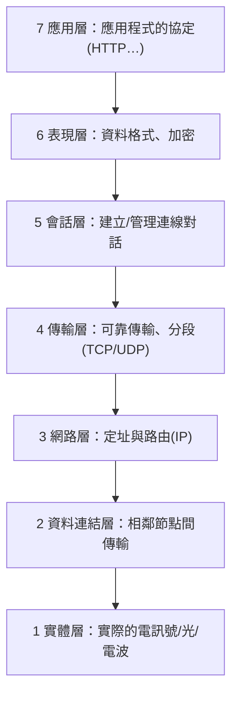

# [cs-6-2] 分層的智慧：OSI 七層與 TCP/IP 模型

> **本章目標**：理解網路為什麼要「分層」，認識 OSI 與 TCP/IP 這兩個分層模型，看懂「每一層各管一件事」的設計智慧。

## 你會學到

- 為什麼網路要分層
- OSI 七層模型的概念
- 較實際的 TCP/IP 四層模型
- 「每層只管自己的事」帶來什麼好處

## 概念說明

### 網路太複雜，所以分層

[cs-6-1] 的網路要處理超多事：實體訊號怎麼傳、封包怎麼定位、資料怎麼確保不丟、應用程式怎麼理解內容……如果全部混在一起設計，會是一團亂麻。

解法是**分層（layering）**——**把網路通訊拆成好幾層，每一層只負責一件事，並依賴下一層提供的服務。** 這呼應 [cs-8-1] 的抽象思想。比喻：

```
寄一個國際包裹的分工：
   你：只管「寫信內容 + 收件人」（最上層，你關心的事）
   郵局：負責「貼郵資、分類」
   貨運：負責「裝上飛機/卡車」
   你不用懂飛機怎麼飛，貨運不用懂你信裡寫什麼。
   → 每一層只管自己那塊，彼此配合，整體就運作了。
```

### OSI 七層模型：教科書的標準

**OSI 模型**是一個概念性的標準，把網路分成**七層**，由下（最貼近硬體）到上（最貼近應用）：



這張圖在說：從最底的「實體訊號」到最頂的「應用程式」，OSI 分七層，每層各司其職。記憶重點不是背七層，而是理解「**越下面越接近硬體訊號，越上面越接近你用的應用**」。

### TCP/IP 模型：實際在用的

OSI 是教科書概念，**真實網際網路用的是更精簡的 TCP/IP 模型**（常見分四層）。可以把它看成 OSI 的實用簡化版：

| TCP/IP 層 | 負責 | 對應例子 |
|----------|------|---------|
| **應用層** | 應用程式的協定 | HTTP、DNS、Email |
| **傳輸層** | 端對端傳輸、可靠性 | TCP、UDP |
| **網路層** | 跨網路定址與路由 | IP |
| **連結層** | 實體網路傳輸 | Wi-Fi、乙太網路 |

兩個關鍵主角的名字就來自這裡——**TCP**（傳輸層，負責「可靠傳輸」）和 **IP**（網路層，負責「定址與找路」），它們是網際網路的兩大支柱（[cs-6-3] 會講 IP）。

### 分層的好處

為什麼這個設計這麼成功？

```
① 各司其職、好理解：每層只解決一個問題，設計與除錯都簡單。
② 可替換：換 Wi-Fi 或有線網路（連結層變了），上層的 HTTP 完全不用改。
③ 標準化協作：不同廠商只要遵守同一層的「介面約定」，產品就能互通。
④ 封裝：上層不用懂下層細節（你用 HTTP 時不用管訊號怎麼在電纜裡跑）。
```

這正是 [cs-8-1] 抽象、[cs-5-1] OS 隱藏硬體的同一種智慧——**用分層把複雜度切開、各個擊破**。整個現代網路能運作，這個分層思想功不可沒。

## 範例：你開一個網頁，資料穿過各層

```
你在瀏覽器輸入網址、按 Enter：
   應用層：瀏覽器用 HTTP 說「我要這個網頁」
   傳輸層：TCP 把請求切段、確保可靠送達
   網路層：IP 決定「這要送去哪個位址、走哪條路」
   連結層：透過你的 Wi-Fi 變成實際訊號送出去

到了伺服器那端，再「由下往上」一層層拆解回 HTTP 請求。
回應網頁時，同樣穿過這些層回來。
→ 你只看到「網頁出現了」，底下是資料穿越各層的精密協作。
```

## 小練習

1. 用「寄國際包裹的分工」比喻，解釋網路為什麼要分層。
2. 說出 TCP/IP 模型的四層，以及 TCP 和 IP 各屬於哪一層、負責什麼。
3. 思考題：「把家裡網路從有線換成 Wi-Fi，上網的網頁和 App 完全不用改」——這體現了分層的哪個好處？

## 課外讀物

> HTTP（應用層協定）的細節 → [課外讀物 E-3-3：HTTP 協定](../../../課外讀物/E-3-network/E-3-3-http-protocol.md)、**basic 課程 Part 4**

> 分層 = 抽象的應用 → 本書 Part 8-1：抽象

> 下一步：網路層的 IP、封包、路由 → 本書 Part 6-3
