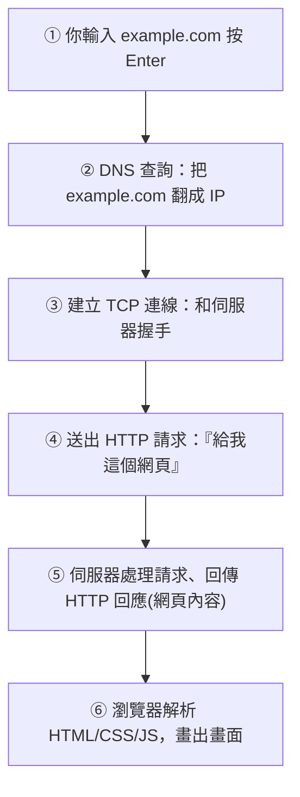

# [cs-6-4] 從網址到網頁：一次請求的完整旅程

> **本章目標**：把 Part 6 學的網路知識全部串起來，完整走一遍「你在瀏覽器輸入網址、按 Enter，到網頁出現」中間發生的事。

## 你會學到

- 從輸入網址到看到網頁的完整步驟
- DNS、TCP、HTTP 各在哪一步出場
- 「請求—回應」的全貌
- 這個過程怎麼動用了整本書學的東西

## 概念說明

### 一個經典問題

「**在瀏覽器輸入網址、按下 Enter 後，發生了什麼事？**」這是電腦科學與工程師面試的經典題目，因為它幾乎串起了整個計算機與網路的知識。學完 Part 6，你已經有能力回答它了。我們一步步走。

### 完整旅程



逐步說明（把前幾章串起來）：

**① 你輸入網址**：例如 `example.com`。

**② DNS 查詢**（[cs-6-3]）：網址是給人看的，網路要 IP。瀏覽器先透過 DNS 把 `example.com` 翻譯成 IP 位址（像查電話簿）。

**③ 建立 TCP 連線**（[cs-6-3]）：拿到 IP 後，你的裝置和伺服器先用 TCP「握手」建立一條可靠的連線——確保接下來資料能可靠傳輸。（若是 HTTPS，這裡還會多一步加密協商，[課外讀物 E-3-2](../../../課外讀物/E-3-network/E-3-2-https-tls.md)。）

**④ 送出 HTTP 請求**：連線建好，瀏覽器用 **HTTP**（應用層協定）送出請求：「請給我這個網頁。」（這就是 [cs-6-1] 的 client 向 server 發請求。）

**⑤ 伺服器回應**：伺服器收到請求、處理（可能查資料庫等），把網頁內容（HTML/CSS/JS）打包成 HTTP 回應送回來。這些資料被切成封包（[cs-6-1]）、經路由（[cs-6-3]）一站站傳回你的裝置、由 TCP 確保完整。

**⑥ 瀏覽器渲染**：瀏覽器收到 HTML/CSS/JavaScript，解析它們、計算版面、畫出你看到的網頁。期間可能再發更多請求（拿圖片、其他資源）。

整個過程通常在**不到一秒**內完成。

### 這動用了整本書的知識

最精彩的是——這個日常動作，幾乎用上了你在這門課學的所有東西：

```
你打的網址文字 → 編碼成 0 和 1               (Part 1 資料表示)
瀏覽器程式由 CPU 執行                          (Part 3、4 硬體與執行)
作業系統協調記憶體、網路卡、分時跑瀏覽器        (Part 5 作業系統)
DNS、TCP、IP、HTTP、路由、封包                  (Part 6 網路，本 Part)
回來的網頁資料存進記憶體、由 CPU 渲染            (Part 3、5)
```

一個「打開網頁」的瞬間，背後是計算機科學每一層的精密協作。這就是為什麼這個問題是經典——它是整個領域的縮影。

### 連到你之後會學的

這個「請求—回應」流程，正是你做 Web 開發的核心：

```
你在 basic 課程 Part 4 學「前後端串接」→ 就是寫這個請求與回應
你在 rust 課程 Part 9 用 Axum 做後端    → 就是寫「步驟⑤」的伺服器
   (收到 HTTP 請求 → 處理 → 回傳回應)
```

所以這一章不只是知識，更是你之後寫網路程式的地圖。

## 範例：用工程師的話回答面試題

```
「輸入網址到看到網頁，發生什麼事？」一個精簡的好答案：

1. DNS 把網址解析成 IP
2. 與伺服器建立 TCP 連線（HTTPS 還會 TLS 加密協商）
3. 瀏覽器送出 HTTP 請求
4. 伺服器處理並回傳 HTTP 回應（HTML 等）
5. 瀏覽器解析 HTML/CSS/JS 並渲染畫面，過程中可能再請求其他資源

→ 能講出這條鏈、並知道每步在解決什麼，就展現了完整的網路理解。
```

## 小練習

1. 不看上面，自己用「步驟」寫出「輸入網址到看到網頁」的流程，再對照檢查。
2. 在這個流程裡，DNS、TCP、HTTP 各出現在哪一步、各負責什麼？
3. 思考題：這個流程怎麼用到了 Part 1（資料表示）、Part 5（作業系統）？各舉一個點。

## 課外讀物

> 這個流程的完整深入（含 HTTPS） → [課外讀物 E-3-1：網際網路是怎麼運作的](../../../課外讀物/E-3-network/E-3-1-how-internet-works.md)、[課外讀物 E-3-2：HTTPS/TLS](../../../課外讀物/E-3-network/E-3-2-https-tls.md)

> 動手寫「步驟⑤」的伺服器 → **rust 課程 Part 9（Axum）**、**basic 課程 Part 4**

> 本 Part 完成！下一步：資料怎麼有效率地組織（演算法、資料庫初探）→ 本書 Part 7
