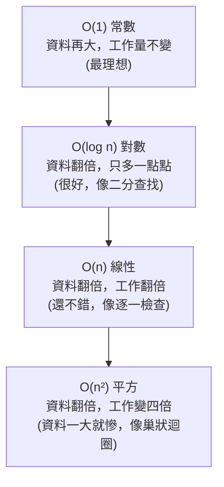

# [cs-7-1] 演算法是什麼？好壞怎麼衡量（Big-O 直覺）

> **本章目標**：建立對「演算法」的基本認識，並用直覺的方式理解「怎麼衡量一個演算法的好壞」——這是橋接到 dsa 課程的起點。

## 你會學到

- 演算法是什麼：解決問題的步驟
- 同一個問題可以有好幾種解法，好壞差很多
- 「Big-O」的直覺：用「成長速度」衡量效率
- 為什麼「資料變大時」才看得出差別

## 概念說明

### 演算法：解決問題的步驟

**演算法（algorithm）** 聽起來高深，其實就是——**解決某個問題的一套明確步驟**。就像食譜是「做菜的步驟」，演算法是「解題的步驟」。

```
「在電話簿裡找某個人的電話」也是個問題，可以有不同演算法：
   演算法 A：從第一頁開始，一個一個翻，直到找到
   演算法 B：翻到中間，看目標在前半還後半，往那半再對折…（二分）
→ 同一個問題，兩種步驟，效率天差地別。
```

關鍵洞見是：**同一個問題，往往有好幾種演算法，而它們的「效率」可能差非常多。** 寫程式不只要「能解出來」，更要「用好的演算法解」——尤其資料一大，差別會被放大成「秒回 vs 等到天荒地老」。

### 怎麼衡量「好壞」？看成長速度

怎麼比較兩個演算法誰好？不是看「在某台電腦上跑幾秒」（不同電腦速度不同，不公平），而是看一個更本質的東西——**當資料量變大，所需的工作量「成長得多快」**。這就是 **Big-O** 的精神。

比喻：

```
不要問「這個演算法跑幾秒」（看電腦快慢，不公平）
要問「資料量翻倍時，工作量會怎麼變」：
   有的演算法：資料翻倍，工作也才翻倍（成長溫和）
   有的演算法：資料翻倍，工作變四倍、甚至爆炸（成長可怕）
→ 看「成長的趨勢」，比看「絕對秒數」更能判斷好壞。
```

### 幾種常見的成長速度

用 Big-O 記號（讀作「Big O」），幾個常見的等級，從好到壞：



這張圖在說：Big-O 描述「資料量 n 變大時，工作量怎麼成長」。`O(1)` 最理想（完全不受資料量影響），`O(n²)` 在資料一大時很糟。回到電話簿的例子：「一頁頁翻」是 `O(n)`，「二分對折」是 `O(log n)`——後者好太多，這就是為什麼字典、電話簿要「排序好」讓你能二分查找。

### 為什麼「資料大」才看得出差別

Big-O 的差別，在資料小時不明顯，**資料一大就天差地別**：

```
找一筆資料：
   資料 100 筆：    O(n) 約 100 步， O(log n) 約 7 步 → 差不多
   資料 10 億筆：   O(n) 約 10 億步，O(log n) 約 30 步 → 天壤之別！

→ 這就是為什麼大公司、大資料量的系統，對演算法效率錙銖必較。
  資料越大，選對演算法的價值越高。
```

呼應 [課外讀物 E-11](../../../課外讀物/E-11-performance/E-11-1-frontend-performance.md) 的效能主題——很多效能問題，根源是「用了成長太快的演算法」。

### 這只是直覺版

這一章給你「演算法、效率、Big-O」的**直覺**，夠你理解「為什麼演算法重要」。但要真正學會**分析複雜度、掌握各種資料結構與經典演算法**，那是一整門學問——就是 **dsa 課程（資料結構與演算法）** 的主題。這一章是那本書的入口。

## 範例：兩種找法的差距

```
在 1,000,000 筆「已排序」的資料中找一個數：

逐一檢查 O(n)：最壞要看 100 萬筆
二分查找 O(log n)：每次砍一半 → 100萬 → 50萬 → 25萬 →…→ 約 20 步就找到！

20 步 vs 100 萬步 —— 這就是「選對演算法」的威力。
而二分查找能用的前提是「資料已排序」，這又牽涉到排序演算法…
→ 這些，dsa 課程會帶你一一掌握。
```

## 小練習

1. 用自己的話解釋「演算法」，並舉一個生活中「同一問題有不同解法、效率不同」的例子。
2. 為什麼衡量演算法好壞要看「成長速度（Big-O）」而不是「跑幾秒」？
3. 思考題：`O(n)` 和 `O(log n)` 在資料量「很小」時差別大嗎？「很大」時呢？這說明了什麼？

## 課外讀物

> 完整學習複雜度分析、各種資料結構與演算法 → **dsa 課程（資料結構與演算法）**——本章是它的入口

> 演算法效率與系統效能 → [課外讀物 E-11：效能與快取](../../../課外讀物/E-11-performance/E-11-1-frontend-performance.md)

> 下一步：演算法的好搭檔——資料結構 → 本書 Part 7-2
