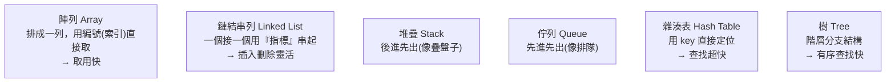

# [cs-7-2] 資料結構初探：為什麼資料要有「結構」

> **本章目標**：理解「資料結構」是什麼、為什麼選對資料結構這麼重要，並對幾個常見的結構建立初步印象——這是橋接到 dsa 課程的第二塊跳板。

## 你會學到

- 資料結構是什麼：組織資料的方式
- 為什麼「怎麼放資料」會影響「操作快不快」
- 幾個常見資料結構的初步印象
- 資料結構與演算法的關係

## 概念說明

### 資料結構：組織資料的方式

[cs-7-1] 講演算法（解題步驟）。**資料結構（data structure）** 是它的好搭檔——**組織、儲存資料的方式**。

關鍵洞見：**同一批資料，用不同的方式組織，操作起來的效率差很多。** 就像同樣一堆東西，「隨便堆」和「分類收進有標籤的櫃子」，找東西的速度天差地別。

```
比喻：你有 1000 本書。
   隨便堆成一疊 → 找特定一本要一本本翻（慢）
   照書名排好上架 → 能快速定位（快）
   建一個索引卡 → 查卡片直接知道在哪（更快）
→ 「書沒變，但組織方式變了」，找書的效率就完全不同。
  資料結構就是在研究「資料該怎麼組織，才能高效操作」。
```

### 怎麼放，決定怎麼操作快不快

不同資料結構，擅長的操作不同。沒有「最好的資料結構」，只有「最適合某種操作的資料結構」：

```
有的結構：「照順序取用」很快，但「中間插入」很慢
有的結構：「用 key 查找」超快，但「照順序列出」沒辦法
有的結構：「取最大/最小值」很快，但「找特定值」普通
→ 選資料結構 = 看「你最常做什麼操作」，選擅長那個的。
```

這就是為什麼工程師要懂多種資料結構——**針對問題選對工具**。

### 幾個常見的資料結構（初步印象）

先建立印象，dsa 課程會逐一深入：



這張圖在說：常見資料結構各有「拿手好戲」——陣列擅長索引取用、雜湊表擅長 key 查找、樹擅長有序查找等。你在 **rust 課程**已經見過一些了：[rust-6-1] 的 `Vec`（動態陣列）、[rust-6-3] 的 `HashMap`（雜湊表）、[rust-3-6] 的堆疊（`while let pop`）——它們都是這些資料結構的實作。

### 資料結構 + 演算法 = 程式的核心

資料結構（怎麼放）和演算法（怎麼處理）密不可分——**好的演算法常常依賴對的資料結構**：

```
[cs-7-1] 的「二分查找」很快，但前提是「資料放在『已排序的陣列』裡」
   → 演算法（二分查找）依賴 資料結構（有序陣列）
雜湊表讓「查找」變 O(1)，是很多高效演算法的基礎
→ 「資料結構 + 演算法」合起來，是寫出高效程式的核心功夫。
  電腦科學甚至有句名言：「程式 = 資料結構 + 演算法」。
```

這也是為什麼它們會合成**一本書**——dsa 課程把這對好搭檔一起教。

## 範例：選對結構的威力

```
需求：一個系統要頻繁「用使用者 ID 查使用者資料」。

用「陣列」存：每次查都要從頭一個個比對 ID → O(n)，慢
用「雜湊表」存（ID 當 key）：用 ID 直接定位 → O(1)，超快

→ 一百萬個使用者時，前者每次查可能要比對幾十萬次，
  後者幾乎瞬間。同樣的資料，選對結構就是這麼大的差別。
  這就是 rust 課程 [rust-6-3] HashMap 存在的理由。
```

## 小練習

1. 用「1000 本書怎麼放」的比喻，解釋「資料結構」為什麼影響操作效率。
2. 為什麼說「沒有最好的資料結構，只有最適合某操作的」？舉一個例子。
3. 思考題：你在 rust 課程用過的 `Vec`（[rust-6-1]）和 `HashMap`（[rust-6-3]），各自擅長什麼操作？

## 課外讀物

> 完整深入各種資料結構（含實作與複雜度）→ **dsa 課程（資料結構與演算法）**

> 你用過的資料結構實作 → **rust 課程 [rust-6-1] Vec、[rust-6-3] HashMap**

> 下一步：一種特別的資料組織——資料庫 → 本書 Part 7-3
