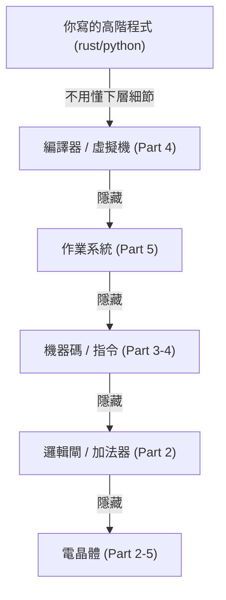

# [cs-8-1] 抽象（Abstraction）：計算機科學最重要的一個觀念

> **本章目標**：理解貫穿整門課、也貫穿整個計算機科學的核心思想——抽象。它是人類駕馭巨大複雜度的根本武器。

## 你會學到

- 抽象是什麼：隱藏細節、只露出重點
- 為什麼抽象讓複雜系統變得可管理
- 整門課其實一直在示範抽象
- 「抽象層」怎麼層層堆疊

## 概念說明

### 抽象：隱藏細節，只看重點

如果要說整個計算機科學「最重要的一個觀念」，很多人會選——**抽象（abstraction）**。它的意思是：

> **隱藏複雜的內部細節，只對外露出「簡單、好用的介面」。**

讓使用者「不用懂裡面怎麼運作，也能正確使用」。比喻：

```
開車：你只要會「踏油門、轉方向盤」（簡單介面）
     不用懂「引擎內燃機怎麼爆炸做功、變速箱怎麼換檔」（複雜細節）
→ 「駕駛」這個介面，把汽車的複雜機械「抽象」掉了。
  你能開車，不代表你會造引擎——抽象讓你不必懂全部就能用。
```

### 為什麼抽象這麼重要？

因為**人腦無法一次掌握巨大的複雜度**。一台電腦、一個軟體系統，複雜到沒有任何人能同時理解它的每個細節。抽象是人類對付這種複雜的唯一辦法——**把複雜切成一層層，每一層只需理解「下一層提供什麼」，不用懂「下一層怎麼做到的」。**

```
沒有抽象：要寫一個網頁，你得懂電晶體、機器碼、網路封包… 全部 → 不可能
有抽象：  你用高階語言（不用懂機器碼）、用 HTTP 函式庫（不用懂封包）…
         每一層都把下面的複雜藏起來 → 你才可能完成工作
```

### 整門課其實一直在講抽象

回頭看，這門課從頭到尾都在示範「一層抽象蓋在另一層上」：



這張圖在說：每一層都「站在下一層的肩膀上」，並把下一層的複雜**隱藏**起來。你寫 Rust 時，不用想「這變成什麼機器碼、CPU 怎麼執行、電晶體怎麼開關」——下面每一層都幫你抽象掉了。**這整座金字塔，就是抽象層層堆疊的成果。**

具體例子，你在這門課都見過：

- **作業系統**（[cs-5-1]）把硬體抽象成「系統呼叫」——你存檔不用懂硬碟怎麼運作。
- **高階語言**（[cs-4-1]）把機器碼抽象掉——你寫 `a + b` 不用管暫存器。
- **網路分層**（[cs-6-2]）每層抽象下一層——你用 HTTP 不用懂封包路由。
- **函式**（rust/basic）把一段邏輯抽象成「一個名字」——呼叫它不用看實作。

### 抽象的代價與藝術

抽象不是免費的，也不是越多越好：

```
好的抽象：介面簡單、隱藏該藏的、不洩漏內部細節 → 好用又好維護
壞的抽象：洩漏細節、或藏太多導致「出問題時無從查」
過度抽象：層層包裹太多，反而難懂、難追蹤

→ 設計「恰到好處的抽象」是工程的藝術。
  這也是為什麼「懂底層」仍然重要——當抽象漏水(出 bug)時，
  你得能掀開它、往下一層查（呼應 cs-0-1 為什麼學底層）。
```

這呼應你在 [課外讀物 E-7（SOLID）](../../../課外讀物/E-7-solid/E-7-1-solid-overview.md)、[E-6（Clean Code）](../../../課外讀物/E-6-best-practices/E-6-1-what-is-clean-code.md) 會學的設計原則——好的程式就是好的抽象：介面清楚、職責分明、隱藏實作細節。

## 範例：你打一行字背後的抽象塔

```
你在程式裡寫：  print("Hello")

這一行底下，是一整座抽象塔在支撐：
   print 函式 → 隱藏了「怎麼把字送到螢幕」
   作業系統 → 隱藏了「怎麼操作顯示硬體」
   機器碼 → 隱藏了「CPU 怎麼執行」
   邏輯閘、電晶體 → 隱藏了「電怎麼流動」

你只寫一行，卻調動了整座塔。每一層都讓你「不用懂下面，也能用」。
→ 這就是抽象的威力，也是人類能建造如此複雜系統的祕密。
```

## 小練習

1. 用「開車」的比喻，解釋抽象是什麼（隱藏什麼、露出什麼）。
2. 為什麼說「抽象是人類對付複雜度的唯一辦法」？舉這門課裡的一個抽象例子。
3. 思考題：既然有抽象幫我們隱藏細節，為什麼工程師「還是要懂底層」？（提示：呼應 cs-0-1，當抽象出問題時。）

## 課外讀物

> 好的抽象 = 好的設計原則 → [課外讀物 E-7：SOLID 原則](../../../課外讀物/E-7-solid/E-7-1-solid-overview.md)、[課外讀物 E-6：Clean Code](../../../課外讀物/E-6-best-practices/E-6-1-what-is-clean-code.md)

> 為什麼懂底層重要 → 複習本書 Part 0-1

> 下一步：軟體的層次怎麼從硬體往上疊 → 本書 Part 8-2
