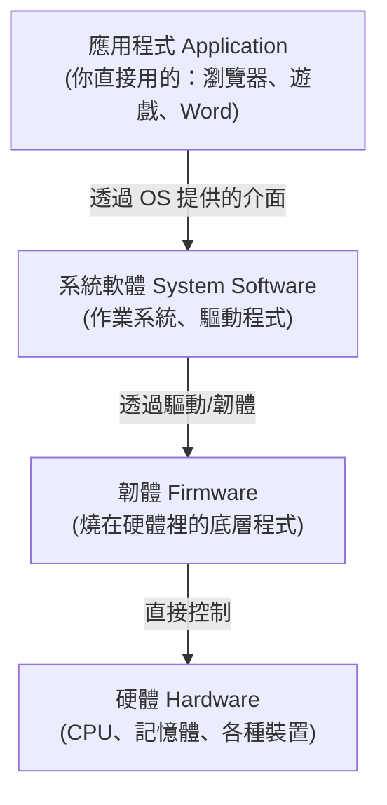

# [cs-8-2] 軟體的層次：應用程式 → 系統軟體 → 韌體 → 硬體

> **本章目標**：把一台電腦從「你點的 App」到「底層硬體」之間的軟體層次理清楚，看懂每一層的角色與彼此的關係。

## 你會學到

- 軟體分成哪些層次
- 應用程式、系統軟體、韌體各是什麼
- 它們怎麼一層層往下依賴到硬體
- 「驅動程式」扮演什麼角色

## 概念說明

### 從你點的 App 到硬體，中間有好幾層

[cs-8-1] 說抽象層層堆疊。具體到「軟體」，從你直接接觸的 App 到底層硬體之間，可以分成幾個層次：



這張圖在說：軟體是一座「由上往下依賴」的塔——你用的 App 站在系統軟體上，系統軟體站在韌體上，韌體直接控制硬體。我們一層層看。

### 應用程式：你直接使用的

**應用程式（application software）** 是「為使用者完成特定任務」的軟體——也就是你平常直接打開、操作的那些：

```
瀏覽器、文書處理、遊戲、聊天 App、你寫的程式…
特點：面向「使用者的需求」，跑在作業系統提供的環境之上。
```

你在 basic、rust、csharp 課程寫的程式，大多是這一層。應用程式不直接碰硬體——它透過系統軟體（OS）提供的介面做事（[cs-5-1] 的系統呼叫）。

### 系統軟體：管理與支援

**系統軟體（system software）** 不是給使用者「完成任務」的，而是「**管理電腦、支撐應用程式運作**」的底層軟體。最核心的就是：

- **作業系統**（[cs-5]）：管理資源、提供應用程式運作的環境。
- **驅動程式（device driver）**：讓作業系統能操作「特定硬體裝置」的翻譯官（下面細說）。

系統軟體是「應用程式」和「硬體」之間的橋樑。沒有它，應用程式無從運作。

### 驅動程式：硬體的翻譯官

**驅動程式**是個關鍵角色，值得單獨說。問題是：世界上有無數種硬體（不同廠牌的印表機、顯卡、滑鼠…），作業系統不可能內建「怎麼操作每一種」。

```
解法：每個硬體裝置，配一個「驅動程式」——
   它知道「怎麼跟這個特定裝置溝通」，
   並向作業系統提供「標準的操作介面」。
→ 作業系統只要會用「標準介面」，驅動程式負責翻譯成「這個裝置的specific操作」。
```

比喻：驅動程式像「特定外語的翻譯」——OS 說通用語，驅動把它翻成「這台印表機聽得懂的話」。這就是為什麼裝新硬體有時要「安裝驅動程式」——你在給作業系統補上「和這個新裝置溝通的翻譯官」。

### 韌體：燒在硬體裡的底層程式

**韌體（firmware）** 是「**燒錄在硬體裝置內部**」的底層程式——它介於軟體和硬體之間，讓硬體裝置「知道怎麼動起來」：

```
韌體的例子：
   電腦開機時跑的 BIOS/UEFI（在主機板上）
   你的路由器、硬碟、鍵盤裡，都有自己的小韌體
特點：很底層、很貼近硬體、通常不太會去改它（但偶爾會「更新韌體」）。
```

比喻：如果說硬體是「身體」，韌體就像「與生俱來的本能反應」——燒在裡面、讓硬體一通電就知道基本怎麼運作。

## 範例：一次列印穿越各層

```
你在 Word 點「列印」：
   應用程式（Word）：「我要印這份文件」→ 呼叫 OS 的列印功能
   系統軟體（OS）：協調列印工作，交給印表機的「驅動程式」
   驅動程式：把通用的列印指令，翻成「這台特定印表機」聽得懂的命令
   韌體（印表機內）：控制印表機的硬體實際噴墨、進紙
   硬體：紙張印出來

→ 你只點了一下「列印」，指令穿過了應用→系統→驅動→韌體→硬體。
  每一層只跟相鄰層打交道，各司其職（呼應 cs-8-1 抽象）。
```

## 小練習

1. 把這些歸到對的層次：Chrome 瀏覽器、Windows、印表機驅動程式、主機板 BIOS。
2. 用自己的話解釋「驅動程式」的角色，以及為什麼裝新硬體常要裝驅動。
3. 思考題：應用程式為什麼「不直接操作硬體」，而要透過系統軟體？（提示：呼應 cs-5-1 的複雜、安全、共享。）

## 課外讀物

> 作業系統這層的詳細運作 → 複習本書 Part 5

> 軟體層次體現的「抽象」 → 複習本書 Part 8-1

> 下一步：寫應用程式的不同「風格」——程式設計典範 → 本書 Part 8-3
