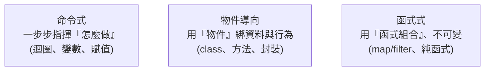

# [cs-8-3] 程式設計典範簡介：命令式、物件導向、函式式

> **本章目標**：認識幾種主要的「程式設計典範」——寫程式的不同思維風格，理解它們各自的特點，以及為什麼現代語言常常混用。

## 你會學到

- 「程式設計典範」是什麼
- 命令式：一步步指揮電腦
- 物件導向：用「物件」組織程式
- 函式式：用「函式」與不可變組合

## 概念說明

### 典範：寫程式的思維風格

**程式設計典範（programming paradigm）** 是「**組織與思考程式的不同風格**」。同一個問題，用不同典範會寫出風格很不一樣的程式。比喻：

```
典範像「蓋房子的建築風格」——古典、現代、極簡…
   都能蓋出能住的房子，但結構與美學不同。
程式典範也是——都能解決問題，但組織程式的方式與思維不同。
```

主要有三大典範，現代語言常常**同時支援多種**，讓你按需混用。

### 命令式：一步步下命令

**命令式（imperative）** 是最直覺的風格——**一步一步明確告訴電腦「怎麼做」**，像寫食譜步驟：

```
命令式風格（怎麼做）：
   建立一個空清單 result
   對每個數字：
      如果是偶數，把它加進 result
   回傳 result
→ 你明確指揮每一步、管理狀態的變化。
```

這是最貼近 [cs-3-3] 指令週期「一條條執行」的風格，也是大多數人最先學的。你寫的迴圈、if、變數賦值，都是命令式。

### 物件導向：用「物件」組織

**物件導向（Object-Oriented, OO）** 把程式組織成一個個**物件**——**把「資料」和「操作這些資料的行為」綁在一起**：

```
物件導向風格：
   定義一個「銀行帳戶」物件，它有：
      資料：餘額
      行為：存款()、提款()、查餘額()
   → 資料和操作它的行為「封裝」在一起，外界透過行為來互動。
```

你在 **rust 課程 [rust-3-2]** 的「方法與 impl」、basic 課程的 class，就是物件導向的概念。它擅長「把複雜系統拆成一個個有清楚職責的物件」，呼應 [課外讀物 E-7（SOLID）](../../../課外讀物/E-7-solid/E-7-1-solid-overview.md) 的設計原則。

### 函式式：用「函式」與不可變

**函式式（functional）** 的風格強調：**用函式組合來表達運算，盡量「不改變狀態」（用不可變資料）**：

```
函式式風格（描述你要什麼）：
   numbers.filter(是偶數).map(乘以2)
   → 不手動管迴圈和變數，而是「把資料流過一連串函式轉換」
   → 偏好「不可變」：不改原資料，而是產生新資料
```

你在 **rust 課程 [rust-6-4]（迭代器 map/filter）、[rust-6-5]（閉包）、[rust-1-1]（預設不可變）** 體驗過濃濃的函式式風味。函式式的好處是：沒有「到處變動的狀態」，程式更好推理、更不容易出並行 bug（呼應 [cs-5-5]、rust 的無懼並行）。

### 對照與混用



這張圖在說三大典範各有風格。**重點：現代語言大多「多典範」**——Rust、Python、JavaScript 等都同時支援這幾種，讓你「**按問題選最合適的風格，甚至混用**」：

```
Rust 的例子：
   用 struct + impl 組織（物件導向味）
   用迭代器 map/filter + 不可變（函式式味）
   用迴圈處理流程（命令式味）
→ 同一個程式裡，哪種好用就用哪種。懂多種典範，工具箱更豐富。
```

## 範例：同一個任務，三種風格

```
任務：把清單裡的偶數，各乘以 2。

命令式：
   建空清單 → for 迴圈逐個 → if 偶數 → 乘 2 → 加進清單

物件導向：
   設計一個 NumberProcessor 物件，有個 processEvens() 方法封裝這邏輯

函式式：
   numbers.filter(x => x 是偶數).map(x => x * 2)

→ 都得到一樣的結果，但思維與寫法很不同。
  rust 課程 [rust-6-4] 你已經會用最後那種函式式寫法了。
```

## 小練習

1. 用一句話分別概括三大典範的核心思想（命令式、物件導向、函式式）。
2. 你在 rust 課程用過的「`impl` 方法」和「迭代器 `map/filter`」，各屬於哪種典範風格？
3. 思考題：為什麼現代語言要「多典範」（同時支援多種風格）？這給工程師什麼好處？

## 課外讀物

> 物件導向的設計原則 → [課外讀物 E-7：SOLID 原則](../../../課外讀物/E-7-solid/E-7-1-solid-overview.md)

> 函式式風味的實作 → **rust 課程 [rust-6-4] 迭代器、[rust-6-5] 閉包、[rust-1-1] 不可變**

> 本 Part 完成！下一步：計算的邊界與未來 → 本書 Part 9
