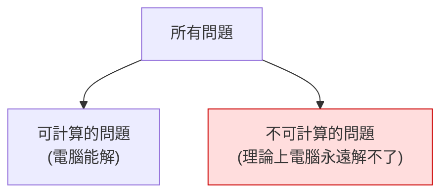

# [cs-9-1] 計算理論初探：哪些問題電腦「算得出來」（可計算性、圖靈機）

> **本章目標**：認識一個深刻的問題——「電腦是不是萬能的？」並透過圖靈機與「不可計算問題」，理解計算本身的極限。

## 你會學到

- 「計算理論」在問什麼
- 圖靈機：定義「什麼是計算」的抽象模型
- 「可計算」與「不可計算」的問題
- 著名的「停機問題」

## 概念說明

### 電腦是萬能的嗎？

前面整門課都在講「電腦怎麼運作、能做什麼」。但有個更深的問題：**電腦是不是萬能的？有沒有「再強的電腦也永遠算不出來」的問題？**

答案很驚人——**有**。而且這不是「電腦不夠快」的問題，是**理論上根本不可能**，再快一兆倍也沒用。研究這類問題的學問，叫**計算理論（theory of computation）**。

### 圖靈機：什麼叫「計算」

要討論「電腦能算什麼」，得先嚴謹定義「**什麼是計算**」。1936 年，**圖靈（Alan Turing，[cs-0-3] 提過）** 提出一個極簡的抽象機器——**圖靈機（Turing machine）**：

```
圖靈機是個想像的機器（不是真的要造）：
   一條無限長的紙帶（分成格子，能讀寫符號）
   一個讀寫頭（能左右移動、讀格子、改格子）
   一套簡單規則（依目前狀態和讀到的符號，決定下一步）

就這麼簡單，但它能表達「任何一步步進行的計算」。
```

圖靈機重要在哪？它給了「計算」一個**精確的數學定義**。有個影響深遠的論點（邱奇—圖靈論題）大意是：**任何「能被機械化計算」的東西，圖靈機都能算**。所以「圖靈機算得出來的」≈「任何電腦算得出來的」——它定義了計算的範圍。你今天的電腦、手機，本質上都是「圖靈機」的實現。

> 「圖靈完備（Turing complete）」這個你可能聽過的詞，就是指「一個系統的計算能力等同圖靈機」。

### 可計算 vs 不可計算

有了精確定義，就能問：**有沒有問題是「連圖靈機都算不出來」的？** 答案是肯定的——存在**不可計算（uncomputable）** 的問題：**不管多強的電腦、給多少時間，都不可能寫出一個保證正確解出它的程式。**



這張圖在說：問題的世界分成兩塊——可計算的（電腦能解），和**不可計算的**（電腦永遠解不了）。後者的存在，劃出了「計算的邊界」。

### 著名的停機問題

最有名的不可計算問題是**停機問題（halting problem）**：

> **能不能寫一個程式，它讀入「任意一個程式 + 輸入」，就能判斷『那個程式會不會跑完停下來（而不是無限迴圈下去）』？**

圖靈證明了：**這樣的程式不可能存在**。不管你多努力，都無法寫出一個「萬用的、能判斷任何程式會不會停」的程式。這是個用「自我矛盾」證明的漂亮結果（假設它存在，就能造出一個矛盾的情況）。

```
停機問題的意義：
   它證明了「有些關於程式的問題，程式本身永遠無法可靠回答」。
   這不是技術不夠，是邏輯上的不可能。
→ 計算有它的「天花板」，這是計算理論最深刻的洞見之一。
```

實務上的影響：很多「我們希望工具能自動完美做到」的事（例如「自動判斷任何程式有沒有 bug / 會不會無窮迴圈」），因為和停機問題相關，**理論上不可能做到完美**——工具只能盡力、近似，但無法保證對所有程式都正確。

## 範例：為什麼「完美的 bug 偵測器」不存在

```
你可能想：「為什麼沒有一個工具，能自動抓出『所有』程式的所有 bug？」
部分答案就在這裡：
   「判斷任意程式會不會無限迴圈」= 停機問題 = 不可計算
   所以「對任意程式都完美正確的分析工具」理論上不存在。

→ 這就是為什麼我們需要「測試」（課外讀物 E-9）——
  既然無法「證明程式對所有情況都正確」，
  就用測試「檢驗它在許多重要情況下正確」。
  理論的極限，塑造了實務的做法。
```

## 小練習

1. 用自己的話解釋：「不可計算的問題」和「電腦不夠快」有什麼本質不同？
2. 圖靈機為什麼重要？（提示：它定義了什麼？）
3. 思考題：停機問題的「不可能」，為什麼意味著「不存在能完美抓出所有程式 bug 的工具」？這和我們為什麼要寫測試有什麼關係？

## 課外讀物

> 圖靈這個人與計算史 → 複習本書 Part 0-3：電腦發展簡史

> 既然無法證明完全正確，就用測試檢驗 → [課外讀物 E-9：測試](../../../課外讀物/E-9-testing/E-9-1-why-test.md)

> 下一步：有些問題「可計算但慢到不可行」——P vs NP → 本書 Part 9-2
