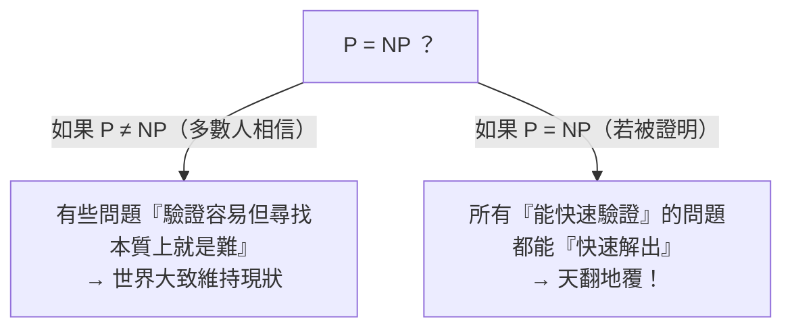

# [cs-9-2] 🎈 P vs NP：有些問題「算得出來但慢到天荒地老」

> **本章目標**：認識計算機科學最著名的未解難題「P vs NP」，理解「容易驗證」和「容易找到答案」之間的巨大鴻溝，以及它為什麼牽動整個世界。

## 你會學到

- 「可計算」之外的另一個維度：要算多久
- P 問題與 NP 問題的直覺
- 「驗證答案容易，但找答案難」的核心概念
- 為什麼 P vs NP 這麼重要（連加密都靠它）

## 概念說明

> 🎈 趣味章節。這是個百萬美元懸賞的未解之謎，輕鬆感受一下它的魅力。

### 「能算」和「來得及算」是兩回事

[cs-9-1] 講「可不可計算」。但就算一個問題「可計算」，還有另一個關鍵維度——**要算多久？** 有些問題理論上能算，但**所需時間長到天荒地老**（例如比宇宙年齡還久），實務上等於沒用。

P vs NP 就是在問這類「**難不難算**」的問題。我們用兩個直覺的類別。

### P：能「快速解出」的問題

**P 類問題**：能用「**還算快**」的演算法解出來的問題（嚴謹說是「多項式時間」，直覺就是「資料變大時，時間成長得溫和、可接受」，呼應 [cs-7-1] 的 Big-O）。

```
例子：把一串數字排序、在排好的清單裡找一個數（二分查找）
→ 這些有高效演算法，資料再大也能在合理時間內解決。P 類 = 「好解」。
```

### NP：能「快速驗證答案」的問題

**NP 類問題**：**「給你一個答案，你能快速『驗證』它對不對」，但「自己『找出』答案可能很難」** 的問題。

關鍵在「**驗證容易，但尋找可能很難**」這個不對稱。比喻：

```
拼圖：
   給你一幅「拼好的」拼圖 → 你一眼能驗證「對，拼好了」（容易驗證）
   但要你「從一堆散片拼出來」 → 可能要試超久（難尋找）

數獨：
   給你一個「填好的」數獨 → 很快能檢查每行每列對不對（容易驗證）
   要你「解開一個空的」→ 可能很費力（難尋找）
```

很多重要的真實問題都是 NP（規劃路線、排程、資源分配…）——它們的「最佳解」可能要試極大量的組合才找得到。

### 世紀難題：P = NP 嗎？

現在問題來了。所有 P 問題顯然也是 NP（能快速解，當然能快速驗證）。真正的世紀大哉問是：

> **NP 問題，是不是其實也都能「快速解出」？也就是 P = NP 嗎？**



這張圖在說：P vs NP 在問「驗證容易的問題，是否找答案也都容易」。**沒有人知道答案**——這是計算機科學最著名的未解難題，懸賞 100 萬美元（千禧年大獎難題之一）。大多數人「相信」P ≠ NP（有些問題就是本質上難解），但**沒人能證明**。

### 為什麼這超級重要？連加密都靠它

P vs NP 不是純學術——它牽動現實世界，尤其是**加密**（[cs-9-3]）：

```
現代加密的安全性，建立在「某些問題很難解」之上：
   例如「把一個大數分解成兩個質數的乘積」極難（要試超久）
   → 所以加密很安全（破解 = 解那個難問題 = 來不及）

但如果有一天證明了 P = NP（這些難問題其實都能快速解）：
   → 現有的加密可能瞬間全部崩潰！
   → 網路安全、銀行、密碼…整個數位世界的安全基礎動搖
```

所以 P vs NP 不只是數學家的玩具——**它關係到整個數位文明的安全根基**。這也是為什麼它這麼出名、這麼重要。

## 範例：感受「驗證 vs 尋找」的鴻溝

```
一個 NP 問題（裝箱/組合最佳化的味道）：
   「這 100 件行李，能不能剛好裝進這幾個箱子、不超重？」

驗證：給你一個「裝法」，你照著擺、秤重 → 很快知道「行得通」✓
尋找：要你「自己找出可行的裝法」→ 組合多到爆，可能要試天文數字種

100 件物品，可能的組合數比宇宙原子還多。
→ 「驗證一個答案」和「找出那個答案」，難度可能差了天與地。
  這個鴻溝，就是 P vs NP 的核心。
```

## 小練習

1. 用「拼圖」或「數獨」的例子，解釋「驗證答案容易，但尋找答案難」是什麼意思。
2. 用自己的話說 P vs NP 在問什麼。（提示：能快速驗證的，是否也能快速解出？）
3. 思考題：如果有一天證明了「P = NP」，為什麼可能對「網路加密」造成大災難？

## 課外讀物

> 加密為什麼靠「難解問題」 → 本書 Part 9-3：加密與資安基礎

> 演算法效率、Big-O → 複習本書 Part 7-1、**dsa 課程 Part 1**

> 下一步：保護資料的加密技術 → 本書 Part 9-3
