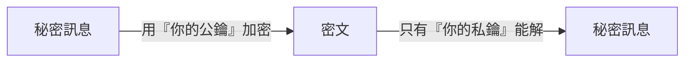

# [cs-9-3] 加密與資安基礎：對稱/非對稱加密、雜湊

> **本章目標**：建立資訊安全最核心的幾個概念——加密怎麼保護資料、對稱與非對稱加密的差別、雜湊是什麼，理解你每天在用卻沒察覺的安全機制。

## 你會學到

- 加密的目的：讓資料「只有該看的人看得懂」
- 對稱加密 vs 非對稱加密
- 雜湊（hash）：單向的指紋，與密碼怎麼存
- 這些怎麼用在你每天的上網（HTTPS）

## 概念說明

### 加密：讓資料只有對的人看得懂

網路上的資料會經過很多節點（[cs-6-3] 的路由）。如果是明文傳輸，中途任何人都能偷看。**加密（encryption）** 解決這個問題——**把資料變成「沒有鑰匙就看不懂的亂碼」，只有持有正確鑰匙的人能還原。**

```
原始資料（明文）──[用鑰匙加密]──→ 亂碼（密文）──[用鑰匙解密]──→ 原始資料
中途攔截到的人，只看到亂碼，沒鑰匙還原不了。
```

比喻：加密像「上鎖的保險箱」——東西放進去鎖上，只有有鑰匙的人能打開。加密的核心問題就變成：**鑰匙怎麼管理？** 這分出兩種加密。

### 對稱加密：同一把鑰匙

**對稱加密（symmetric）**：**加密和解密用「同一把鑰匙」**。

```
我用鑰匙 K 把資料鎖起來，你也用「同一把 K」打開。
優點：快、效率高。
問題：「怎麼把鑰匙 K 安全地交給對方？」
     如果鑰匙在傳遞時被攔截，加密就破功了 → 這是「金鑰交換」難題。
```

### 非對稱加密：一對鑰匙

**非對稱加密（asymmetric）** 巧妙地解決了「鑰匙怎麼交」的難題——**用「一對」鑰匙：公鑰和私鑰**：

```
每人有一對鑰匙：
   公鑰（public key）：公開給所有人，用來「加密」
   私鑰（private key）：自己嚴格保密，用來「解密」

神奇之處：用「公鑰」鎖的，只有對應的「私鑰」能開。
→ 別人想傳秘密給你：用「你的公鑰」加密 → 只有「你的私鑰」能解
→ 公鑰隨便公開都沒關係，因為它只能加密、不能解密！
  「鑰匙怎麼安全交付」的難題就解決了。
```



這張圖在說：非對稱加密讓「公鑰公開、私鑰保密」，公鑰加密的東西只有私鑰能解——巧妙解決了金鑰交換問題。代價是它比對稱加密**慢**。所以實務上常「兩者並用」：用非對稱加密**安全地交換一把對稱鑰匙**，之後用快速的對稱加密傳大量資料——這正是 HTTPS 的做法。

### 雜湊：單向的指紋

**雜湊（hash）** 和加密不同——**它是「單向」的：能把任意資料變成一個固定長度的「指紋」，但無法從指紋反推回原資料。**

```
雜湊函式特性：
   同樣的輸入 → 永遠得到同樣的指紋
   輸入差一點點 → 指紋天差地別
   無法從指紋反推原文（單向）
   幾乎不可能找到「兩個不同輸入有相同指紋」（抗碰撞）
```

雜湊最重要的用途之一是**安全地存密碼**：

```
網站「絕對不該」存你的明文密碼！正確做法：
   存你密碼的「雜湊值（指紋）」，不存密碼本身。
   你登入時 → 把你輸入的密碼也雜湊 → 比對兩個指紋是否相同。
→ 這樣即使資料庫被偷，駭客拿到的是一堆指紋，反推不出原密碼。
  （實務上還要加「鹽 salt」等強化，見課外讀物 E-10）
```

> 密碼儲存、雜湊加鹽的完整實務 → [課外讀物 E-10-6：密碼儲存](../../../課外讀物/E-10-security/E-10-6-password-storage.md)

你在 **rust 課程 [rust-6-3] 的 HashMap** 用的也是「雜湊」概念（把 key 變指紋來定位），但那是為了「查找快」，和這裡「為了安全」是同一個數學工具的不同應用。

### 你每天都在用：HTTPS

這些概念，你每天上網都在用——**HTTPS**（網址前面的鎖頭）：

```
你連上 HTTPS 網站時：
   用「非對稱加密」安全地協商出一把「對稱鑰匙」
   之後用這把對稱鑰匙加密你和網站之間的所有資料
→ 你的密碼、信用卡號在傳輸中都是加密的，中途攔截看到的是亂碼。
  這就是「為什麼別在沒有 HTTPS（鎖頭）的網站輸入密碼」。
```

> HTTPS/TLS 的完整運作 → [課外讀物 E-3-2：HTTPS/TLS](../../../課外讀物/E-3-network/E-3-2-https-tls.md)

## 範例：登入網站背後的安全

```
你在 HTTPS 網站登入：
   1. HTTPS 加密你和網站間的連線（對稱+非對稱加密）
      → 中途沒人能偷看你傳的密碼
   2. 網站收到密碼後，「雜湊」它，和資料庫存的「雜湊值」比對
      → 網站根本沒存你的明文密碼，比指紋就好
   3. 相符 → 登入成功

→ 加密保護「傳輸中」，雜湊保護「儲存中」。兩者各司其職，
  共同守護你的密碼。這套機制你天天在用，卻渾然不覺。
```

## 小練習

1. 用「保險箱鑰匙」的比喻，解釋對稱加密和非對稱加密的差別。
2. 為什麼網站該存密碼的「雜湊值」而不是明文密碼？這怎麼在「資料庫被偷」時保護使用者？
3. 思考題：為什麼非對稱加密能解決「鑰匙怎麼安全交給對方」的難題？（提示：公鑰能公開的關鍵是什麼？）

## 課外讀物

> Web 安全的完整入門（含密碼儲存、常見攻擊）→ [課外讀物 E-10：Web Security 基礎](../../../課外讀物/E-10-security/E-10-1-web-security-overview.md)、[課外讀物 E-10-6：密碼儲存](../../../課外讀物/E-10-security/E-10-6-password-storage.md)

> HTTPS/TLS 怎麼運作 → [課外讀物 E-3-2：HTTPS/TLS](../../../課外讀物/E-3-network/E-3-2-https-tls.md)

> 加密安全與 P vs NP 的關係 → 複習本書 Part 9-2

> 下一步：電腦怎麼「學習」——AI → 本書 Part 9-4
