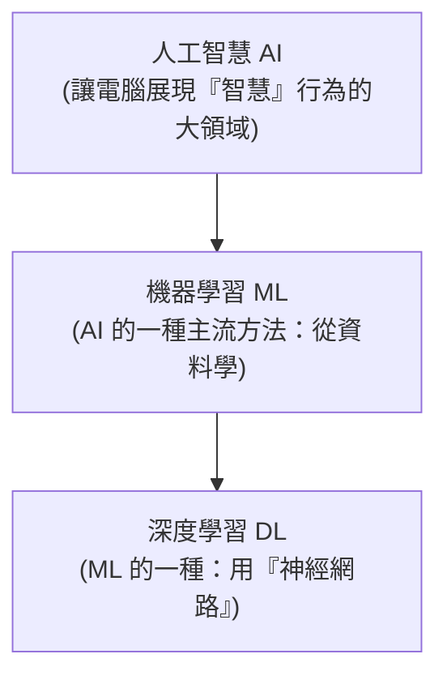
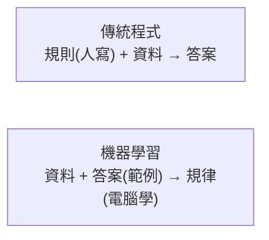

# [cs-9-4] 人工智慧與機器學習：電腦怎麼「學」（概念）

> **本章目標**：建立對人工智慧與機器學習的正確直覺——電腦不是「被寫死規則」，而是「從大量資料中學出規律」，以及這和傳統程式的根本差別。

## 你會學到

- AI、機器學習、深度學習的關係
- 傳統程式 vs 機器學習的根本差別
- 機器學習怎麼「從資料學規律」
- 對 AI 能力與限制的務實認識

## 概念說明

### AI、機器學習、深度學習

這幾個詞常被混用，先理清關係——它們是「層層包含」的：



這張圖在說：**AI** 是最大的領域（讓電腦表現得「聰明」）；**機器學習（ML）** 是實現 AI 的主流方法（從資料學習）；**深度學習（DL）** 是 ML 的一種強大技術（用神經網路）。今天紅遍天的大型語言模型，就屬於深度學習。

### 根本差別：寫規則 vs 學規律

傳統程式和機器學習有個**根本性的不同**，這是理解 AI 的關鍵：

```
傳統程式（前面整門課）：
   人類「寫死規則」，電腦照規則執行
   例：if 溫度 > 30 then 開冷氣  ← 規則是人寫的

機器學習：
   人類「給大量範例」，電腦「自己學出規律」
   例：給它幾萬張「貓」和「狗」的照片（標好答案），
      它自己學出「怎麼分辨貓狗」的規律，
      之後能判斷「沒看過的新照片」是貓是狗。
   ← 規律不是人寫的，是電腦從資料「學」出來的！
```



這張圖在說兩者「輸入輸出」反過來了：傳統程式是「人給規則，算出答案」；機器學習是「給它資料和答案，讓它學出規則」。**這個翻轉，是 AI 革命的核心。**

### 機器學習怎麼「學」

機器學習的核心流程，直覺版：

```
1. 訓練（training）：餵給模型大量「範例資料」（通常含正確答案）
2. 模型調整自己內部的「參數」，讓它的預測越來越接近正確答案
   （像不斷練習、從錯誤中修正）
3. 訓練好後 → 給它「沒看過的新資料」，它用學到的規律做預測
```

比喻：像教小孩認動物——你不是給他一套「貓的精確定義規則」，而是指著很多動物告訴他「這是貓、這是狗」，看多了他自己就會認了。機器學習也是「**看大量範例，歸納出規律**」。深度學習用的「神經網路」，靈感正來自大腦神經元的連結方式。

### 務實看待 AI：強大但有限

AI 很強大，但要有務實的認識，避免過度神化或恐慌：

```
AI 擅長：從大量資料中找規律、辨識模式、生成內容、處理模糊的任務
AI 的限制與風險：
   它「學什麼像什麼」——資料有偏見，它就學到偏見
   它會「自信地說錯」（尤其語言模型會「一本正經地胡說」）
   它不是真的「理解」，而是「統計上的規律」
   → 用 AI 的產出要查證，別照單全收（尤其重要決策）
```

對工程師來說，AI 是越來越重要的工具（包括幫你寫程式的 AI 助手），但**底層的計算機原理（這整門課）依然是根基**——AI 也是跑在 CPU、記憶體、需要演算法與資料的程式，只是換了一種「從資料學」的範式。

## 範例：垃圾郵件過濾

```
「判斷一封信是不是垃圾郵件」：

傳統程式做法：人寫規則
   if 標題含「中獎」or「免費」then 標記垃圾
   → 規則寫不完，騙子換個說法就破功

機器學習做法：
   餵給模型幾十萬封「已標好『是/不是垃圾』」的信
   模型自己學出「垃圾信的特徵規律」
   → 之後能判斷新信，還能隨新型垃圾信「再訓練」進化

→ 這就是為什麼現代垃圾郵件過濾、推薦系統、語音辨識
  幾乎都改用機器學習——規律太複雜，「學」比「寫死」更有效。
```

## 小練習

1. 用「層層包含」說明 AI、機器學習、深度學習的關係。
2. 用自己的話講「傳統程式」和「機器學習」最根本的差別（提示：規則是誰給的？）。
3. 思考題：為什麼說「AI 會自信地說錯」「資料有偏見它就學到偏見」？這提醒我們使用 AI 產出時該注意什麼？

## 課外讀物

> AI 也跑在這門課講的硬體與演算法之上 → 複習本書 Part 3（硬體）、Part 7（演算法）

> 機器學習大量依賴資料與運算 → **aws 課程**（雲端運算資源）、**dsa 課程**（演算法基礎）

> 下一步：計算的下一個前沿——量子計算 → 本書 Part 9-5
