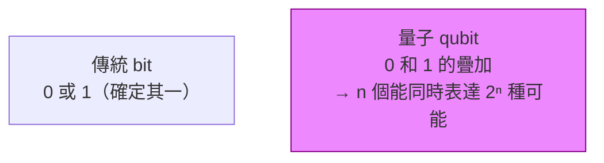

# [cs-9-5] 🎈 電腦的未來：量子計算簡介

> **本章目標**：用輕鬆的方式認識「量子計算」這個計算的下一個前沿——它和傳統電腦有何根本不同，能解決什麼、又不是萬能，為這門課畫下展望未來的句點。

## 你會學到

- 量子計算和傳統電腦的根本差別
- 「量子位元（qubit）」的疊加概念
- 量子電腦擅長與不擅長的事
- 它對加密的潛在衝擊

## 概念說明

> 🎈 趣味章節，也是這門課的尾聲。量子計算很燒腦，這裡只建立直覺、感受未來的可能。

### 一個全新的計算方式

這整門課的電腦，都建立在「**位元（bit）只能是 0 或 1**」（[cs-1-1]）之上。**量子計算（quantum computing）** 從最底層就不一樣——它利用量子物理的奇特現象來計算，是一種**根本不同的計算範式**，不是「更快的傳統電腦」。

### 量子位元：可以「同時是 0 和 1」

傳統位元一次只能是 0 或 1。量子計算用**量子位元（qubit）**，它有個違反直覺的特性——**疊加（superposition）**：

```
傳統 bit：是 0「或」1（二選一）
量子 qubit：可以處於「同時是 0 和 1」的疊加狀態
            （直到你「測量」它，才塌縮成確定的 0 或 1）
```

比喻（不精確但抓直覺）：

```
傳統 bit 像「一枚躺在桌上的硬幣」：不是正面就是反面。
qubit 像「一枚旋轉中的硬幣」：在轉的時候，「正反同時存在」的感覺，
   你伸手按住（測量）它才會定下來是正或反。
```

關鍵威力在於——**n 個 qubit 能同時表達 2ⁿ 種狀態的疊加**。這讓量子電腦在某些特定問題上，能「同時探索海量可能性」，達到傳統電腦難以企及的平行度。



這張圖在說：qubit 的疊加特性，讓量子電腦能以一種「同時探索眾多可能」的方式運算——這是它和傳統電腦最根本的差異。

### 量子電腦不是「萬能的超級電腦」

很重要的觀念——**量子電腦不是「什麼都更快的電腦」，它只在「特定類型的問題」上有優勢**：

```
量子電腦擅長的（特定問題）：
   分解大質數（威脅現有加密！見下）
   搜尋超大解空間、模擬量子系統（如分子、材料、藥物）、某些最佳化

量子電腦不擅長/沒優勢的：
   你日常做的大部分事（上網、文書、玩遊戲）→ 傳統電腦反而更實用
→ 未來更可能是「量子電腦處理特定難題 + 傳統電腦處理日常」並存，
  而不是量子電腦取代你的筆電。
```

而且量子電腦目前還很「嬌貴」——需要極低溫、極度隔絕干擾，容易出錯，還在發展早期。它是「**令人興奮的未來**」，但不是「明天就取代一切」。

### 對加密的衝擊

還記得 [cs-9-3] 說「現代加密靠某些難題（如分解大質數）很難解」嗎？**量子電腦剛好可能快速解開其中一些難題**：

```
若大型量子電腦成熟：
   它能快速分解大質數 → 現在很多「非對稱加密」可能被破解
   → 這呼應 cs-9-2 P vs NP 對加密的威脅，是另一條路徑

所以人們已經在研發「後量子密碼學（post-quantum cryptography）」——
   設計「連量子電腦也難破解」的新加密方法，提前佈局。
→ 計算的演進，永遠和安全的攻防並肩前進。
```

## 範例：為什麼量子「同時探索」很厲害

```
想像一個迷宮，要找出口：
   傳統電腦：一條路一條路試（或很聰明地試），本質是「逐一探索」
   量子電腦（理想化的直覺）：利用疊加，像「同時探索很多條路」，
      再用量子特性讓「對的路」浮現出來

→ 對「要從海量可能中找答案」的特定問題（呼應 cs-9-2 的 NP 味道），
  這種「同時探索」可能帶來傳統電腦難及的威力。
  （注意：這是高度簡化的直覺，真實量子演算法精妙得多。）
```

## 小練習

1. 用「躺著的硬幣 vs 旋轉的硬幣」比喻，解釋傳統 bit 和量子 qubit 的差別。
2. 為什麼說「量子電腦不會取代你的筆電」？它的優勢在哪類問題？
3. 思考題：量子電腦對「現有加密」可能有什麼衝擊？為什麼人們已在研究「後量子密碼學」？

## 課外讀物

> 加密為什麼靠難解問題、量子的威脅 → 複習本書 Part 9-2（P vs NP）、Part 9-3（加密）

> 🎓 **恭喜你完成計算機概論！** 你已經從「0 和 1」一路走到「計算的邊界與未來」，建立了完整的底層直覺。

> 接下來把這些原理用起來 → **basic 課程**（寫程式）、**dsa 課程**（演算法與資料結構）、**rust 課程**（系統程式）、**infra/aws 課程**（作業系統與網路的實戰）
