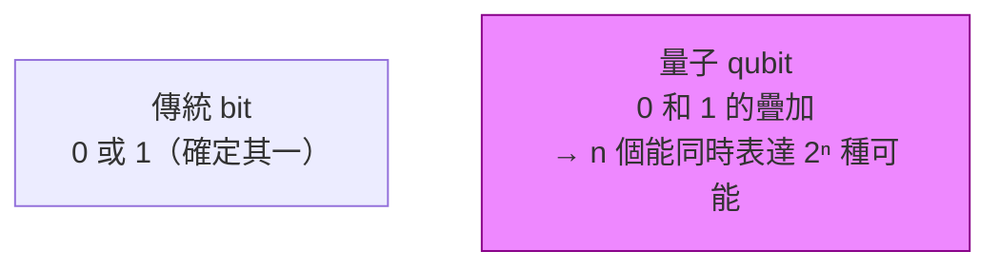

# [cs-9-5] 🎈 電腦的未來：量子計算簡介

> **本章目標**：用輕鬆的方式認識「量子計算」這個計算的下一個前沿——它和傳統電腦有何根本不同，能解決什麼、又不是萬能，為這門課畫下展望未來的句點。

## 你會學到

- 量子計算和傳統電腦的根本差別
- 「量子位元（qubit）」的疊加概念
- 量子電腦擅長與不擅長的事
- 它對加密的潛在衝擊

## 概念說明

> 🎈 趣味章節，也是這門課的尾聲。量子計算很燒腦，這裡只建立直覺、感受未來的可能。

### 一個全新的計算方式

這整門課的電腦，都建立在「**位元（bit）只能是 0 或 1**」（[cs-1-1]）之上。**量子計算（quantum computing）** 從最底層就不一樣——它利用量子物理的奇特現象來計算，是一種**根本不同的計算範式**，不是「更快的傳統電腦」。

### 量子位元：可以「同時是 0 和 1」

傳統位元一次只能是 0 或 1。量子計算用**量子位元（qubit）**，它有個違反直覺的特性——**疊加（superposition）**：

```
傳統 bit：是 0「或」1（二選一）
量子 qubit：可以處於「同時是 0 和 1」的疊加狀態
            （直到你「測量」它，才塌縮成確定的 0 或 1）
```

比喻（不精確但抓直覺）：

```
傳統 bit 像「一枚躺在桌上的硬幣」：不是正面就是反面。
qubit 像「一枚旋轉中的硬幣」：在轉的時候，「正反同時存在」的感覺，
   你伸手按住（測量）它才會定下來是正或反。
```

關鍵威力在於——**n 個 qubit 能同時表達 2ⁿ 種狀態的疊加**。這讓量子電腦在某些特定問題上，能「同時探索海量可能性」，達到傳統電腦難以企及的平行度。


```mermaid
graph TB
    BIT["傳統 bit<br/>0 或 1（確定其一）"]
    QUBIT["量子 qubit<br/>0 和 1 的疊加<br/>→ n 個能同時表達 2ⁿ 種可能"]
    style QUBIT fill:#e8f,stroke:#808
```

這張圖在說：qubit 的疊加特性，讓量子電腦能以一種「同時探索眾多可能」的方式運算——這是它和傳統電腦最根本的差異。

### 量子電腦不是「萬能的超級電腦」

很重要的觀念——**量子電腦不是「什麼都更快的電腦」，它只在「特定類型的問題」上有優勢**：

```
量子電腦擅長的（特定問題）：
   分解大質數（威脅現有加密！見下）
   搜尋超大解空間、模擬量子系統（如分子、材料、藥物）、某些最佳化

量子電腦不擅長/沒優勢的：
   你日常做的大部分事（上網、文書、玩遊戲）→ 傳統電腦反而更實用
→ 未來更可能是「量子電腦處理特定難題 + 傳統電腦處理日常」並存，
  而不是量子電腦取代你的筆電。
```

而且量子電腦目前還很「嬌貴」——需要極低溫、極度隔絕干擾，容易出錯，還在發展早期。它是「**令人興奮的未來**」，但不是「明天就取代一切」。

### 對加密的衝擊

還記得 [cs-9-3] 說「現代加密靠某些難題（如分解大質數）很難解」嗎？**量子電腦剛好可能快速解開其中一些難題**：

```
若大型量子電腦成熟：
   它能快速分解大質數 → 現在很多「非對稱加密」可能被破解
   → 這呼應 cs-9-2 P vs NP 對加密的威脅，是另一條路徑

所以人們已經在研發「後量子密碼學（post-quantum cryptography）」——
   設計「連量子電腦也難破解」的新加密方法，提前佈局。
→ 計算的演進，永遠和安全的攻防並肩前進。
```

## 範例：為什麼量子「同時探索」很厲害

```
想像一個迷宮，要找出口：
   傳統電腦：一條路一條路試（或很聰明地試），本質是「逐一探索」
   量子電腦（理想化的直覺）：利用疊加，像「同時探索很多條路」，
      再用量子特性讓「對的路」浮現出來

→ 對「要從海量可能中找答案」的特定問題（呼應 cs-9-2 的 NP 味道），
  這種「同時探索」可能帶來傳統電腦難及的威力。
  （注意：這是高度簡化的直覺，真實量子演算法精妙得多。）
```

## 小練習

1. 用「躺著的硬幣 vs 旋轉的硬幣」比喻，解釋傳統 bit 和量子 qubit 的差別。
2. 為什麼說「量子電腦不會取代你的筆電」？它的優勢在哪類問題？
3. 思考題：量子電腦對「現有加密」可能有什麼衝擊？為什麼人們已在研究「後量子密碼學」？

<details>
<summary>參考解答</summary>

**第 1 題：用「躺著的硬幣 vs 旋轉的硬幣」比喻 bit 和 qubit**

- **傳統 bit ＝躺在桌上的硬幣**：它一次只能處於一個確定狀態——不是正面（1）就是反面（0），二選一，沒有中間地帶。
- **量子 qubit ＝旋轉中的硬幣**：在它高速旋轉的時候，「正」和「反」彷彿**同時存在**，這就是**疊加（superposition）**——qubit 可以同時是 0 和 1。但這狀態很脆弱：一旦你伸手按住它（也就是「**測量**」），它就會**塌縮**成一個確定的正或反（0 或 1）。

關鍵差異：bit 一次只表達「一個確定值」，qubit 在被測量前可處於「0 和 1 的疊加」。更進一步，**n 個 qubit 能同時表達 2ⁿ 種狀態的疊加**，這正是量子電腦在某些問題上能「同時探索海量可能」的威力來源。

**第 2 題：為什麼量子電腦不會取代你的筆電**

因為量子電腦**不是「什麼都更快的超級電腦」，它只在特定類型的問題上有優勢**，不是全面碾壓傳統電腦。

- **它擅長的是特定難題**：分解大質數、搜尋超大解空間、模擬量子系統（分子、材料、藥物）、某些最佳化問題——這些「要從天文數字的可能性裡找答案」的問題，才吃得到它「同時探索」的紅利。
- **你日常在做的事它反而沒優勢**：上網、打字、看影片、玩遊戲這類任務，傳統電腦又便宜又實用，量子電腦幫不上忙、甚至更不適合。
- **它現在還很嬌貴**：需要極低溫、極度隔絕干擾、容易出錯，還在發展早期。

所以更可能的未來是「**量子電腦處理特定難題 ＋ 傳統電腦處理日常**」兩者並存，而不是量子電腦取代你的筆電。

**第 3 題（思考題）：量子電腦對現有加密的衝擊，與後量子密碼學**

**衝擊**：很多現代**非對稱加密**的安全性，是建立在「某些問題很難解」之上——最典型的就是「把一個大數分解回它的兩個質因數」極度困難，傳統電腦要試到天荒地老，所以加密才安全。但**量子電腦恰好可能快速解開這類問題**（分解大質數正是它擅長的特定難題之一）。也就是說，一旦大型、穩定的量子電腦成熟，現在許多「被當成難到破不了」的非對稱加密，可能被**快速破解**——這跟 P vs NP 對加密的威脅（cs-9-2）異曲同工，只是走的是另一條路徑。

**為什麼現在就研究後量子密碼學**：因為安全的攻防必須**提前佈局**，不能等量子電腦造好了才臨時抱佛腳。原因有幾點：

1. **加密演算法的汰換很慢**：要設計、標準化、讓全世界的系統都換上新方法，需要很多年，得趁早開始。
2. **「先偷存、日後再解」的風險**：攻擊者可以現在就把加密的資料攔截存起來，等未來量子電腦成熟再回頭解密。所以對「需要長期保密」的資料，現在就得換上抗量子的加密。

於是人們正在研發**後量子密碼學（post-quantum cryptography）**——設計「**連量子電腦也難以破解**」的新加密方法，趕在威脅真正來臨前就準備好。計算的演進，永遠和安全的攻防並肩前進。

</details>

## 課外讀物

> 加密為什麼靠難解問題、量子的威脅 → 複習本書 Part 9-2（P vs NP）、Part 9-3（加密）

> 🎓 **恭喜你完成計算機概論！** 你已經從「0 和 1」一路走到「計算的邊界與未來」，建立了完整的底層直覺。

> 接下來把這些原理用起來 → **basic 課程**（寫程式）、**dsa 課程**（演算法與資料結構）、**rust 課程**（系統程式）、**infra/aws 課程**（作業系統與網路的實戰）
