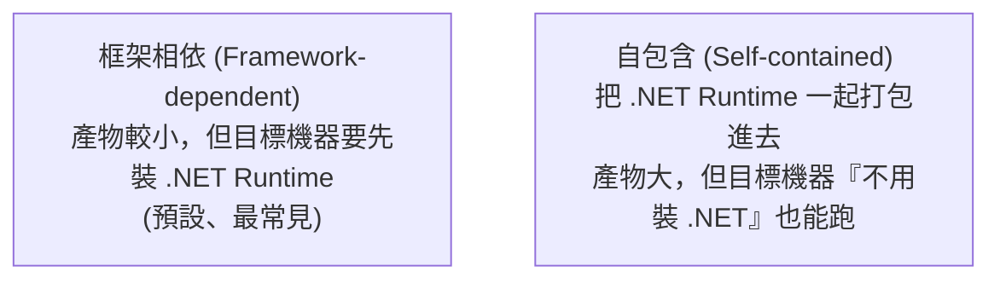

# [csharp-10-1] 發佈（Publish）你的 .NET 應用

> **本章目標**：學會把開發中的 .NET 專案「發佈」成可部署的產物，理解 Debug 與 Release 的差別，為部署上線做準備。

## 你會學到

- 「發佈（publish）」是什麼、和 build 的差別
- Debug vs Release 組態
- `dotnet publish` 怎麼用
- 框架相依 vs 自包含部署

## 概念說明

### 從「開發」到「可部署」

你開發時用 `dotnet run`（[csharp-0-3]）。但要**部署到伺服器**，需要把專案打包成「**最佳化、可獨立執行的產物**」——這個動作叫**發佈（publish）**。

```
dotnet run / build：開發用，產出「Debug 版」（含除錯資訊、未最佳化）
dotnet publish：部署用，產出「Release 版」（最佳化、精簡，準備好上線的檔案）
```

這呼應 **rust 課程 [rust-9-6]** 的 `cargo build --release`——同樣是「把開發版變成最佳化的上線版」。

### Debug vs Release

```
Debug（開發組態）：
   含完整除錯資訊、不做最佳化 → 方便除錯，但較慢、檔案大
Release（正式組態）：
   做最佳化、去除除錯資訊 → 跑得快、檔案精簡 → 上線用這個
→ 部署一定要用 Release 版！（Debug 版上線 = 慢 + 洩漏除錯資訊）
```

## 程式碼範例

### dotnet publish

```bash
# 發佈成 Release 版
dotnet publish -c Release -o ./publish

# -c Release：用 Release 組態（最佳化）
# -o ./publish：輸出到 publish 資料夾
```

說明：這會編譯成 Release 版、把程式和它需要的東西收集到 `./publish` 資料夾。裡面是「**可以丟到伺服器執行的完整產物**」——包含你的 DLL、設定檔、相依套件等。

執行發佈後的產物：

```bash
cd publish
dotnet MyApi.dll        # 用 dotnet 執行發佈的應用
```

### 框架相依 vs 自包含

發佈有兩種模式，差別在「目標機器要不要先裝 .NET」：



```bash
# 框架相依（預設）：較小，但伺服器要有 .NET Runtime
dotnet publish -c Release

# 自包含：把 runtime 打包進去，伺服器不用裝 .NET（指定目標平台）
dotnet publish -c Release --self-contained -r linux-x64
```

說明：

- **框架相依**：產物小，但部署的伺服器要先裝對應的 .NET Runtime（[csharp-0-2]）。
- **自包含**：把 Runtime 一起打包，產物大但「**目標機器什麼都不用裝**」就能跑。

**現代部署其實常用 Docker（[csharp-10-2]）**——把應用和環境一起打包成 image，就不用煩惱「目標機器有沒有裝 .NET」這個問題了。所以下一章的容器化是更主流的做法。

### 發佈前的檢查清單

```
□ 用 Release 組態（-c Release）
□ 機密不在產物裡（走環境變數/密鑰服務，csharp-9-3）
□ 設定正確的環境（appsettings.Production.json，csharp-4-5）
□ 測試都通過（dotnet test，csharp-8）
□ 正式環境關掉 Swagger 等開發工具（csharp-4-2）
```

## 小練習

1. 用 `dotnet publish -c Release -o ./publish` 發佈你的 API，看 publish 資料夾裡有什麼。
2. 用 `dotnet MyApi.dll` 執行發佈後的產物，確認能跑。
3. 思考題：為什麼部署要用 Release 而非 Debug 版？「框架相依」和「自包含」各適合什麼情境？

<details>
<summary>參考解答</summary>

**練習 1（動手做）**：在你的 API 專案根目錄（有 `.csproj` 的地方）執行：

```bash
dotnet publish -c Release -o ./publish
```

跑完後看 `publish` 資料夾，你大致會看到：

- `MyApi.dll`：你的應用主體（編譯後的中介語言，不是原始碼 `.cs`）。
- `MyApi.exe`（Windows）或無副檔名的可執行檔（自包含時才有）：啟動器。
- `appsettings.json`、`appsettings.Production.json`：設定檔（csharp-4-5）。
- `MyApi.deps.json`：描述這個應用依賴哪些套件。
- `MyApi.runtimeconfig.json`：告訴 runtime 該用哪個 .NET 版本、參數。
- 一堆第三方套件的 `.dll`（EF Core、JWT 套件等）。
- 靜態檔（若有 `wwwroot`）。

驗收點：資料夾裡看得到 `MyApi.dll` 跟一批 `.dll`，且**沒有** `bin/`、`obj/`、`.cs` 原始碼。這一步需自行實機驗證。

**練習 2（動手做）**：

```bash
cd publish
dotnet MyApi.dll
```

驗收點：終端機出現 `Now listening on: http://localhost:5000`（或你設定的埠）之類的訊息，表示發佈產物能獨立跑起來。用瀏覽器或 `curl` 打一個端點確認有回應。注意這裡是用 `dotnet MyApi.dll` 執行「發佈後的 DLL」，不是 `dotnet run`（那是開發用、會重新編譯）。這一步需自行實機驗證。

**練習 3（思考題）**：

- **為什麼用 Release 而非 Debug？** Debug 版保留完整除錯資訊、且**不做最佳化**，是為了方便你邊跑邊除錯；代價是跑得慢、檔案大，而且除錯符號可能洩漏內部實作細節。Release 版做了最佳化、去掉多餘除錯資訊，跑得快又精簡，正是上線該有的樣子。用 Debug 版上線 = 又慢又可能洩漏資訊，是常見的低級失誤。

- **框架相依（framework-dependent）適合**：你能掌控目標機器、確定上面裝了對應版本的 .NET Runtime 的情境（例如公司內部標準化的伺服器、或用 Docker 時 base image 已含 runtime）。優點是產物小、多個 app 可共用同一份 runtime、runtime 有安全更新時不用重發你的 app。

- **自包含（self-contained）適合**：無法保證目標機器有 .NET、或不想在機器上裝 runtime 的情境（例如交付給客戶的獨立執行檔、或環境很雜的舊機器）。優點是「目標機器什麼都不用裝」；代價是產物大很多，而且 runtime 的安全更新要靠你重新發佈。

補充：現代部署常直接用 Docker（csharp-10-2），把 runtime 打包進 image，就繞過了「目標機器裝了沒」這個問題，所以很多時候用「框架相依 + 含 runtime 的 base image」是最省事的組合。

</details>

## 課外讀物

> 對照 Rust 的 release 發佈 → **rust 課程 [rust-9-6]**；編譯最佳化 → **cs 課程 Part 4-3**

> 機密、環境設定 → [csharp-9-3]、[csharp-4-5]

> 下一步：把應用容器化成 Docker image → [csharp-10-2]
