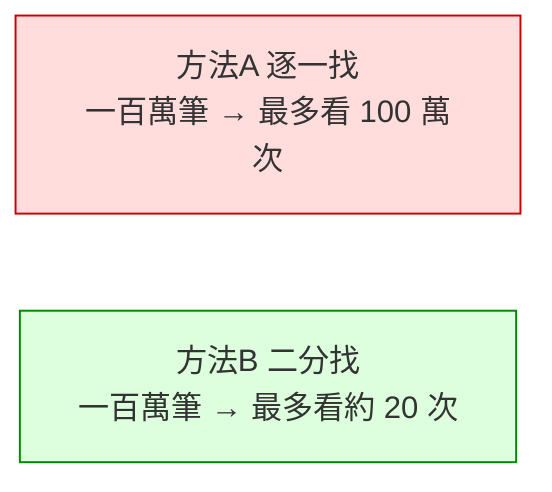

# [dsa-0-1] 為什麼要學資料結構與演算法（一個「找名字」的例子）

> **本章目標**：用一個直觀的例子，體會「選對資料結構與演算法」能讓速度差千百倍，理解為什麼這門功夫值得學。

## 你會學到

- 同一個問題，不同解法的速度可能天差地別
- 資料結構與演算法是什麼、為什麼合在一起學
- 學這個對你的實際好處
- 這門課會怎麼帶你前進

## 概念說明

### 一個找名字的例子

假設你有一本電話簿，裡面有一百萬個名字（已照字母排好），你要找「林小美」的電話。兩種找法：

```
方法 A（笨方法）：從第一頁第一個名字開始，一個一個往下看，直到找到。
   最壞情況：要看完一百萬個名字。

方法 B（聰明方法）：翻到中間，看「林」在前半還後半，
   往那半再翻中間…每次把範圍砍一半。
   最壞情況：只要看約 20 次就找到！（因為 2²⁰ ≈ 一百萬）
```



這張圖在說：**同樣一百萬筆資料、同樣一台電腦，方法 B 快了五萬倍。** 差別不在電腦，而在「**你用的方法（演算法）**」。這就是學演算法的價值——讓你的程式從「能跑」變成「跑得好」。

> 方法 B 叫「二分搜尋」，但它有個前提：資料要「先排好序」。怎麼有效率地排序？這又是一個演算法問題（Part 6）。環環相扣，正是這門課的精彩之處。

### 資料結構 + 演算法：一對好搭檔

這門課把兩個東西合在一起教，因為它們密不可分：

```
資料結構（data structure）：資料「怎麼組織、怎麼放」
   例：排成一列？用 key 對應？樹狀分層？
演算法（algorithm）：「怎麼處理」資料的步驟
   例：怎麼搜尋、怎麼排序、怎麼找最短路徑
```

關鍵：**好的演算法常常依賴對的資料結構**。上面方法 B 之所以快，是因為資料放在「**已排序的結構**」裡。資料怎麼放（結構），決定了你能用什麼方法（演算法）、跑多快。所以它們是一對——這也是為什麼這本書叫「資料結構**與**演算法」。

> 這呼應你在 **cs 課程 Part 7** 建立的直覺——那裡是入門，這門課是完整深入版。

### 學這個對你的實際好處

```
① 寫出更快的程式：資料一大，選對結構與演算法 = 秒回 vs 卡死
② 看懂與善用工具：你用的 Vec、HashMap（rust 課程）背後就是這些
③ 解決問題的思維：拿到新問題，知道怎麼拆解、選工具、評估好壞
④ 面試與進階：技術面試的核心、進階主題（系統設計）的基礎
```

最重要的或許是第③點——**這門課教你一套「思考問題、評估解法」的方法**，這比記住任何特定演算法都更有價值。

### 這門課怎麼帶你走

```
先學「怎麼衡量好壞」（Big-O，Part 1）—— 這是全書的尺
   ↓
從簡單到複雜認識資料結構（Part 2~5：線性 → 雜湊 → 樹 → 圖）
   ↓
學經典演算法策略（Part 6：排序、搜尋、遞迴、DP…）
   ↓
整合實戰：拿到問題怎麼想（Part 7）
```

範例全用 **TypeScript**（和 basic 課程一致），但每個概念都會先用**生活類比、Mermaid 圖、pseudo code** 講清楚，再給程式碼——不會一上來就丟你一堆程式。

## 範例：感受資料量放大的威力

```
找一筆資料，方法 A（逐一）vs 方法 B（二分）：

   100 筆：    A 約 100 次，B 約 7 次     → 差幾十倍，無感
   1 萬筆：    A 約 1 萬次，B 約 14 次    → 差幾百倍
   100 萬筆：  A 約 100 萬次，B 約 20 次  → 差五萬倍！
   10 億筆：   A 約 10 億次，B 約 30 次   → 差三千萬倍！！

→ 資料越大，「選對演算法」的價值越驚人。
  這就是為什麼大規模系統對這門功夫錙銖必較。
```

## 小練習

1. 用自己的話解釋：為什麼「方法 B（二分）」比「方法 A（逐一）」快這麼多？它的前提是什麼？
2. 舉一個你生活中「同一件事有快慢不同做法」的例子（不限電腦）。
3. 思考題：為什麼「資料結構」和「演算法」要合在一起學？用「二分搜尋需要排序好的資料」說明它們的關係。

## 課外讀物

> 演算法與資料結構的入門直覺 → **cs 課程 Part 7**（本門課是它的深入版）

> 你會用到的資料結構實作 → **rust 課程 [rust-6-1] Vec、[rust-6-3] HashMap**

> 下一步：準備 TypeScript 練習環境 → [dsa-0-2]
