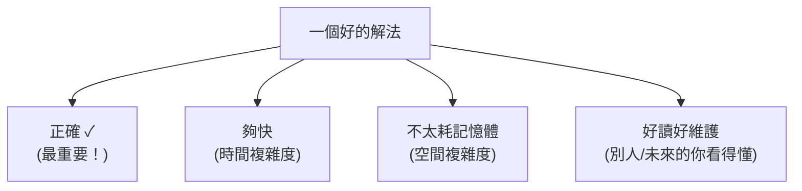

# [dsa-0-3] 怎麼判斷一個解法「好不好」：先有衡量的眼光

> **本章目標**：在深入學習之前，先建立「評估一個解法好壞」的多元視角——不只看快不快，還有記憶體、可讀性、正確性，並理解為什麼「正確」永遠是第一位。

## 你會學到

- 評估解法的多個面向（不只速度）
- 為什麼「正確」永遠排第一
- 時間 vs 空間的取捨
- 「夠好」往往勝過「最佳」

## 概念說明

### 「好」不只一個面向

[dsa-0-1] 讓你看到「快慢差千百倍」，可能讓你以為「好的解法 = 最快的解法」。但其實「好」是多面向的：



這張圖在說：評估一個解法，要看「正確、速度、記憶體、可讀性」多個面向，而不是只盯著「快」。我們逐一看。

### 正確永遠第一

**一個跑很快但會算錯的程式，毫無價值。** 所以評估解法，**正確性永遠是第一位**——先確保「對」，再談「快」。

```
順序永遠是：
   1. 先做對（正確）
   2. 再做清楚（好讀）
   3. 最後才在「真的需要時」做快（優化）

→ 這呼應「過早最佳化是萬惡之源」（課外讀物 E-11-6）：
  別還沒確認正確、也沒發現效能問題，就急著搞複雜的優化。
```

新手常犯的錯是「一開始就追求最快最炫的解法」，結果寫出又難懂又有 bug 的程式。**先用最直白的方法做對，確認沒問題，再看需不需要優化。**

### 時間 vs 空間：常見的取捨

「速度（時間）」和「記憶體（空間）」常常是一個**取捨（trade-off）**——很多時候你能「**用更多記憶體換更快的速度**」，反之亦然：

```
例子：要快速判斷「一個數字之前出現過沒」
   省記憶體做法：每次都掃過全部看有沒有 → 慢，但不佔額外空間
   省時間做法：用一個「集合」記住所有出現過的 → 快(O(1)查)，但要額外記憶體
→ 「用空間換時間」是演算法裡超常見的招（快取就是這個思想！）
```

沒有絕對的對錯——看你的場景「**比較缺什麼**」。記憶體很充裕？那就大方用空間換時間。記憶體很拮据（如嵌入式）？那就反過來。學會看情境權衡，是這門課的重要能力。

> 「用空間換時間」正是快取的核心思想 → **快取課程**、**cs 課程 Part 3-4（記憶體階層）**

### 「夠好」往往勝過「最佳」

最後一個務實的觀念——**追求「理論最佳解」不一定值得**：

```
如果資料量很小（例如永遠不超過 100 筆）：
   一個 O(n²) 的簡單解法，可能跑起來也才幾微秒，完全夠用
   硬要寫一個複雜的 O(n log n) 「最佳解」→ 程式變難懂、易出錯，收益卻趨近於零

→ 「夠好且簡單」常常勝過「最佳但複雜」。
  關鍵是「了解你的實際需求」（資料多大？跑多頻繁？），
  再決定要不要為效能犧牲簡潔。這是工程判斷，不是純理論。
```

這不代表「不用學最佳解」——你得**懂**各種解法的好壞（這門課教你），才能在當下做出「這裡用簡單的就好 / 這裡值得上最佳解」的明智判斷。**有知識，才有選擇的自由。**

## 範例：同一題的不同權衡

```
題目：判斷一個陣列裡有沒有重複的數字。

解法 A（暴力）：每個數字和其他所有數字比 → O(n²) 時間，O(1) 空間
   適合：資料很小、或記憶體極度拮据

解法 B（用集合）：邊掃邊把看過的存進 Set，遇到已存在的就是重複
   → O(n) 時間，O(n) 空間（用空間換時間）
   適合：資料較大、記憶體充裕（大多數情況）

→ 兩個都「正確」。選哪個，看你的資料量和記憶體狀況。
  這就是「評估解法」的真實樣貌——沒有絕對答案，只有適合與否。
```

## 小練習

1. 列出評估一個解法的四個面向，並說明為什麼「正確」排第一。
2. 用自己的話解釋「用空間換時間」，並說它和「快取」的關係。
3. 思考題：什麼情況下「一個簡單的 O(n²) 解法」其實比「複雜的 O(n log n) 解法」更好？（提示：和資料量、可讀性有關。）

## 課外讀物

> 「先正確、再優化，別過早最佳化」 → [課外讀物 E-11-6：後端效能分析](../../../課外讀物/E-11-performance/E-11-6-backend-profiling.md)

> 「用空間換時間」的極致應用 → **快取課程**、**cs 課程 Part 3-4**

> 本 Part 完成！下一步：精確衡量效率的工具——Big-O → [dsa-1-1]
