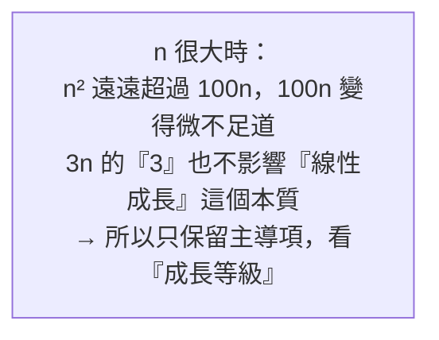

# [dsa-1-1] Big-O 是什麼：用「成長速度」而非「實際秒數」衡量效率

> **本章目標**：掌握 Big-O 記號——衡量演算法效率的通用語言。理解為什麼它用「成長速度」而非「實際秒數」，這是整本書的尺。

## 你會學到

- 為什麼不用「跑幾秒」來衡量效率
- Big-O 的核心：看「資料量成長時，工作量怎麼變」
- 怎麼從程式碼判斷 Big-O
- 為什麼忽略常數和低次項

## 概念說明

### 為什麼不用「秒數」？

要比較兩個演算法誰快，最直覺是「跑跑看幾秒」。但這不公平、也不可靠：

```
同一個演算法，在不同情況跑出的秒數都不同：
   快的電腦 vs 慢的電腦
   不同程式語言、不同當下的系統負載
→ 「秒數」受太多無關因素影響，沒辦法客觀比較「演算法本身」的好壞。
```

我們需要一個**和硬體無關、只反映演算法本質**的衡量方式。這就是 **Big-O**。

### Big-O：成長速度

Big-O 衡量的不是「跑多久」，而是——**當輸入資料量（記為 n）變大時，演算法的「工作量」成長得多快**。

```
核心問題：「資料量 n 增加時，所需的步驟數怎麼變？」
   不管你電腦多快，這個「成長趨勢」是演算法的本質特性。
```

比喻：

```
評估一輛車，不問「現在時速幾公里」（看當下路況），
而問「油門踩到底，它『能加速到多快』的潛力」（看本質）。
Big-O 看的就是演算法的「本質成長潛力」，不受一時的硬體影響。
```

### 怎麼從程式碼看 Big-O

實務上，看 Big-O 主要看「**迴圈怎麼跟著 n 跑**」。幾個基本模式：

```typescript
// O(1)：不管 n 多大，固定幾步 → 常數時間
function first(arr: number[]): number {
  return arr[0];        // 就一步，和 arr 多長無關
}

// O(n)：一個迴圈跑過 n 個元素 → 線性
function sum(arr: number[]): number {
  let total = 0;
  for (const x of arr) {   // 跑 n 次
    total += x;
  }
  return total;
}

// O(n²)：迴圈裡又有迴圈，各跑 n 次 → 平方
function hasDuplicate(arr: number[]): boolean {
  for (let i = 0; i < arr.length; i++) {       // n 次
    for (let j = i + 1; j < arr.length; j++) {  // 每次又約 n 次
      if (arr[i] === arr[j]) return true;
    }
  }
  return false;          // 總共約 n × n 步
}
```

說明：判斷 Big-O 的直覺——**數「最內層的關鍵動作，會隨 n 執行幾次」**。沒迴圈（固定步數）是 O(1)；一層跟著 n 的迴圈是 O(n)；兩層巢狀是 O(n²)。

### 忽略常數和低次項

Big-O 有個重要的簡化規則——**只看「成長最快的那一項」，忽略常數倍數和較小的項**：

```
一個演算法要 3n + 5 步  →  Big-O 寫成 O(n)（丟掉常數 3 和 5）
一個演算法要 n² + 100n 步 →  Big-O 寫成 O(n²)（n² 成長遠快過 100n）
```

為什麼能這樣丟？因為 Big-O 關心的是「**n 變得非常大時**」的趨勢：



這張圖在說：Big-O 是看「**大方向的成長等級**」，所以常數和低次項在 n 很大時無關緊要，可以丟掉。這讓我們能把演算法歸到幾個清楚的等級（[dsa-1-2] 詳列），方便比較。

> 注意：Big-O 是「成長等級」的比較。實務上常數有時也有意義（兩個都是 O(n) 但一個常數大很多），但作為「第一層篩選」，Big-O 是最重要的工具。

## 範例：判斷幾段程式的 Big-O

```typescript
// 範例 1
function f1(arr: number[]) {
  console.log(arr[0]);
  console.log(arr[arr.length - 1]);
}
// → 固定兩步，和 n 無關 → O(1)

// 範例 2
function f2(arr: number[]) {
  for (const x of arr) console.log(x);   // n 次
  for (const x of arr) console.log(x);   // 又 n 次
}
// → 2n 步，丟掉常數 → O(n)（不是 O(2n)）

// 範例 3
function f3(matrix: number[][]) {
  for (const row of matrix) {            // n 次
    for (const cell of row) {            // 每次 n 次
      console.log(cell);
    }
  }
}
// → n × n → O(n²)
```

## 小練習

1. 用自己的話解釋：為什麼用「成長速度（Big-O）」比用「跑幾秒」更適合衡量演算法？
2. 判斷這段的 Big-O：一個函式裡有「一個跑 n 次的迴圈」加上「三行固定的計算」。
3. 為什麼 `3n + 5` 的 Big-O 是 O(n)？用「n 很大時」的角度解釋為什麼能丟掉 3 和 5。

## 課外讀物

> Big-O 的入門直覺 → **cs 課程 Part 7-1**

> 效能優化要先量測再優化 → [課外讀物 E-11-6：後端效能分析](../../../課外讀物/E-11-performance/E-11-6-backend-profiling.md)

> 下一步：常見的複雜度等級一覽 → [dsa-1-2]
