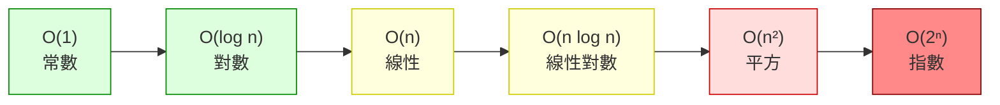

# [dsa-1-2] 常見複雜度排行：O(1)、O(log n)、O(n)、O(n log n)、O(n²)、O(2ⁿ)

> **本章目標**：認識最常見的幾種複雜度等級，建立「哪個快、哪個慢」的清楚排行，以及各自對應什麼樣的演算法。

## 你會學到

- 常見複雜度由快到慢的排行
- 每種等級的直覺與典型例子
- 在資料變大時，它們的差距有多誇張
- 怎麼快速辨認一段程式屬於哪級

## 概念說明

### 複雜度排行榜（由快到慢）

把 [dsa-1-1] 的概念整理成一張「排行榜」，這是你之後一輩子都會用到的對照表：



這張圖從左（快）到右（慢）排好了常見等級。綠色（O(1)、O(log n)）很理想，黃色（O(n)、O(n log n)）可接受，紅色（O(n²) 以上）資料一大就危險。逐一看：

### 各等級的直覺與例子

**O(1) 常數**：不管資料多大，**固定步數**。最理想。
```
例：用索引取陣列元素 arr[5]、用 key 查 HashMap
→ 一百萬筆和十筆，一樣快。
```

**O(log n) 對數**：資料翻倍，只多「一步」。非常好。
```
例：二分搜尋（dsa-0-1，每次砍一半）
→ 一百萬筆也只要約 20 步。「砍一半」類的演算法都是這級。
```

**O(n) 線性**：資料翻倍，工作翻倍。還不錯。
```
例：把陣列每個元素掃一遍（求和、找最大值）
→ 很常見也很合理，畢竟「每個都要看一次」就是 O(n)。
```

**O(n log n) 線性對數**：比 O(n) 稍慢，但仍很實用。
```
例：高效的排序演算法（合併排序、快速排序，Part 6）
→ 「排序」這件事，最好的通用做法就是這個等級。
```

**O(n²) 平方**：資料翻倍，工作變四倍。資料一大就吃力。
```
例：兩層巢狀迴圈（如簡單的排序、兩兩比對，dsa-1-1 的 hasDuplicate）
→ 小資料還行，大資料要小心。看到「巢狀迴圈」就要警覺。
```

**O(2ⁿ) 指數**：每多一個元素，工作量「翻倍」。極慢，通常不可行。
```
例：暴力窮舉所有子集合、未優化的遞迴（如直接遞迴算費氏數列）
→ n 稍大就爆炸。遇到它通常代表「需要更聰明的解法」（如 DP，Part 6）。
```

### 差距有多誇張

光看名字沒感覺，看數字就驚人了。假設 n = 1,000,000（一百萬）：

| 複雜度 | 大約步數 | 感受 |
|--------|---------|------|
| O(1) | 1 | 瞬間 |
| O(log n) | 約 20 | 瞬間 |
| O(n) | 一百萬 | 很快 |
| O(n log n) | 約兩千萬 | 還行 |
| O(n²) | 一兆 | 慢到爆 |
| O(2ⁿ) | 天文數字 | 等到宇宙毀滅 |

```
O(n²) 在一百萬筆要「一兆」步——現代電腦也要跑很久。
O(2ⁿ) 在 n=60 就超過地球上所有電腦合力跑幾百年。
→ 這就是為什麼「演算法等級」這麼關鍵：
  從 O(n²) 改進到 O(n log n)，可能就是「跑不完」變「秒回」。
```

## 範例：辨認等級的快速法

```typescript
// 看「迴圈結構」快速判斷：

arr[i]                          // 直接存取 → O(1)
每次砍一半 (while low<=high)     // → O(log n)
單層迴圈 for(...arr)             // → O(n)
排序後再單層掃 / 分治            // → O(n log n)
兩層巢狀 for 裡面 for            // → O(n²)
遞迴每次分裂成兩個子問題(無記憶)   // → 可能 O(2ⁿ)

口訣：「砍一半 → log；掃一遍 → n；巢狀 → 平方；翻倍分裂 → 指數」
```

## 小練習

1. 把這些複雜度由快到慢排序：O(n²)、O(1)、O(n log n)、O(log n)、O(n)。
2. 各舉一個對應的演算法或操作：O(1)、O(log n)、O(n)、O(n²)。
3. 思考題：一個演算法從 O(n²) 改進成 O(n log n)，在「一百萬筆資料」時大約從「一兆步」降到「兩千萬步」——這大概快了幾十倍？為什麼這種改進這麼有價值？

## 課外讀物

> 二分搜尋（O(log n)）的實作 → [dsa-1-1]、本書 Part 6-5

> 高效排序（O(n log n)）→ 本書 Part 6-4

> 下一步：時間之外的另一個維度——空間複雜度 → [dsa-1-3]
