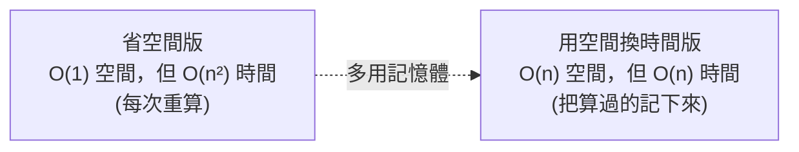

# [dsa-1-3] 時間複雜度 vs 空間複雜度：時間換空間的取捨

> **本章目標**：理解 Big-O 不只衡量「時間」，也衡量「記憶體（空間）」，以及兩者之間「互相交換」的經典取捨。

## 你會學到

- 空間複雜度是什麼
- 怎麼分析一個演算法用多少額外空間
- 「用空間換時間」的經典手法
- 怎麼在時間與空間之間權衡

## 概念說明

### Big-O 也衡量記憶體

前兩章的 Big-O 都在講「**時間**」——花多少步。但同樣的 Big-O 記號，也用來衡量「**空間**」——演算法需要多少**額外記憶體**。這叫**空間複雜度（space complexity）**。

```
時間複雜度：隨 n 增加，要做多少「步」
空間複雜度：隨 n 增加，要用多少「額外記憶體」
→ 兩者都用 O(...) 表示，都關心「隨 n 怎麼成長」。
```

為什麼要關心空間？因為記憶體也是有限資源（[cs 課程 Part 3、5]）——一個跑很快但吃光記憶體的演算法，可能讓程式崩潰。

### 怎麼分析空間複雜度

看「演算法**額外**用了多少隨 n 成長的記憶體」（通常不算「輸入本身」佔的空間）：

```typescript
// O(1) 空間：只用幾個固定變數，和 n 無關
function sum(arr: number[]): number {
  let total = 0;          // 就一個變數
  for (const x of arr) total += x;
  return total;
}
// → 不管 arr 多長，額外空間就一個 total → O(1)

// O(n) 空間：建立一個隨 n 成長的新結構
function doubled(arr: number[]): number[] {
  const result: number[] = [];   // 新陣列，會裝 n 個元素
  for (const x of arr) result.push(x * 2);
  return result;
}
// → 額外開了一個 n 長的陣列 → O(n) 空間
```

說明：判斷空間複雜度，看「**你額外開的結構（陣列、集合、遞迴堆疊…）有多大**」。只用幾個變數 = O(1)；開一個跟 n 一樣大的新容器 = O(n)。

### 經典取捨：用空間換時間

[dsa-0-3] 提過——很多時候你能「**多用一點記憶體，換取更快的速度**」，反之亦然。這是演算法設計最常見的取捨之一：



這張圖在說：很多問題有「省空間但慢」和「多用空間但快」兩種版本，你可以在它們之間選。一個經典例子——「兩數之和」問題：

```typescript
// 問題：陣列裡有沒有兩個數加起來等於 target？

// 解法 A：兩層迴圈 → O(n²) 時間，O(1) 空間
function twoSum_A(arr: number[], target: number): boolean {
  for (let i = 0; i < arr.length; i++)
    for (let j = i + 1; j < arr.length; j++)
      if (arr[i] + arr[j] === target) return true;
  return false;
}

// 解法 B：用 Set 記住看過的 → O(n) 時間，O(n) 空間
function twoSum_B(arr: number[], target: number): boolean {
  const seen = new Set<number>();
  for (const x of arr) {
    if (seen.has(target - x)) return true;   // 之前看過「湊成 target 的另一半」嗎？
    seen.add(x);
  }
  return false;
}
```

說明：解法 B 多用了一個 `Set`（O(n) 空間），換來從 O(n²) 到 O(n) 的大幅加速。**這就是「用空間換時間」**——多花記憶體記住「看過的東西」，避免重複計算/比對。

### 這就是快取的本質

「用記憶體記住算過的東西，避免重算」——你應該覺得眼熟，這正是**快取（cache）** 的核心思想！

```
快取 = 用空間（存結果）換時間（不重算/不重查）
   你在 rust 課程的 memoization、cs 課程的記憶體階層、
   整個「快取課程」，骨子裡都是這個取捨。
→ 「用空間換時間」是貫穿計算機科學的一大主題。
```

> 「用空間換時間」的極致 → **快取課程**、**cs 課程 Part 3-4（記憶體階層）**

## 範例：權衡的實際考量

```
什麼時候該「用空間換時間」？看情境：

記憶體充裕 + 速度關鍵（大多數伺服器應用）：
   → 大方用空間換時間（像 twoSum_B）

記憶體極度拮据（嵌入式裝置、超大資料放不下）：
   → 可能寧可慢一點，省下記憶體（像 twoSum_A）

→ 沒有絕對答案。懂得「兩種都存在、各自的成本」，
  才能在你的情境做出對的選擇。這就是工程判斷。
```

## 小練習

1. 分析這個函式的空間複雜度：一個函式接收陣列，建立一個新陣列存「每個元素的平方」並回傳。
2. 用自己的話解釋 `twoSum_B` 怎麼「用空間換時間」——它用 Set 記住了什麼、省下了什麼？
3. 思考題：「用空間換時間」和「快取」是同一個思想嗎？用一句話說明它們的共同點。

## 課外讀物

> 「用空間換時間」的極致 → **快取課程**、**cs 課程 Part 3-4**

> Set / Map 的實作（雜湊）→ 本書 Part 3：雜湊與集合

> 下一步：最好/最壞/平均情況與攤銷分析 → [dsa-1-4]
