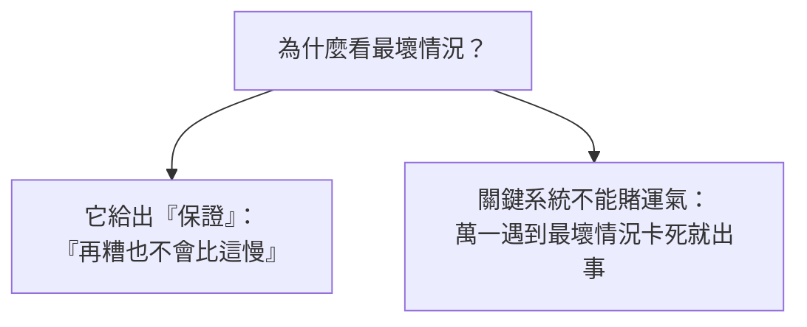
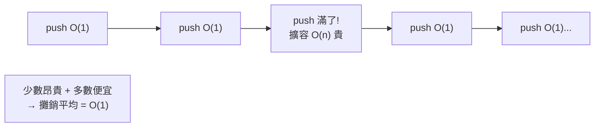

# [dsa-1-4] 最好/最壞/平均情況、攤銷分析（amortized）是什麼

> **本章目標**：理解同一個演算法在不同輸入下表現可能不同，認識最好/最壞/平均情況的區別，以及「攤銷分析」這個解釋「動態陣列為什麼算 O(1)」的關鍵概念。

## 你會學到

- 為什麼同一個演算法有「不同情況」
- 最好、最壞、平均情況的差別
- 為什麼通常最在意「最壞情況」
- 攤銷分析：偶爾很貴，但平均很便宜

## 概念說明

### 同一個演算法，表現可能不同

到目前我們講 Big-O 好像「一個演算法一個複雜度」，但其實——**同一個演算法，碰到不同的輸入，表現可能差很多**。

以「在陣列裡逐一搜尋一個數」為例：

```typescript
function search(arr: number[], target: number): number {
  for (let i = 0; i < arr.length; i++) {
    if (arr[i] === target) return i;
  }
  return -1;
}
```

```
最好情況（best case）：目標剛好是第一個 → 1 步就找到 → O(1)
最壞情況（worst case）：目標在最後、或不存在 → 找完全部 → O(n)
平均情況（average case）：平均找到一半 → 約 n/2 步 → O(n)
```

所以「這個搜尋是 O(n)」其實是在講「**最壞/平均情況**」。同一段程式，運氣好 O(1)、運氣差 O(n)。

### 通常最在意「最壞情況」

那我們報複雜度時，該用哪個？**通常最在意「最壞情況」**，原因：



這張圖在說：最壞情況提供「**效能的保證**」——你知道「不管輸入多刁鑽，最慢也就這樣」。對重要系統（不能突然卡死的），這個保證很關鍵。所以**沒特別說明時，Big-O 通常指最壞情況**。

不過「平均情況」也有價值——有些演算法最壞情況很糟、但實務上幾乎遇不到，平均表現很好（例如快速排序，Part 6），這時平均情況更能反映實際體驗。

### 攤銷分析：偶爾很貴，但平均很便宜

最後一個重要概念——**攤銷分析（amortized analysis）**。有些操作「**大部分時候很便宜，偶爾很貴**」，這時看「單次最壞」會誤導，要看「**平均分攤下來**」的成本。

最經典的例子是**動態陣列（如 TypeScript 的陣列、[rust-6-1] 的 Vec）的 push**：

```
動態陣列怎麼運作：
   它預留一塊固定大小的空間。
   push 元素時，通常直接放進去 → O(1)，便宜
   但空間滿了時：要「開一塊兩倍大的新空間、把舊的全搬過去」→ O(n)，貴！

→ 所以單看「最壞一次 push」是 O(n)（剛好遇到要擴容）。
  但「擴容」很少發生（容量翻倍才一次），
  把那次昂貴的成本「攤銷」到中間很多次便宜的 push 上，
  平均每次 push 其實是 O(1)。
```



這張圖在說：動態陣列大多數 push 便宜，偶爾擴容貴，但平均（攤銷）下來是 O(1)。比喻：

```
像「年費 vs 每次付費」：
   健身房年費一次付一大筆（貴），但分攤到每天去，每次其實很便宜。
攤銷分析就是「把偶爾的大花費，平均分攤到很多次小操作上」看真實成本。
```

所以你會看到「動態陣列 push 是攤銷 O(1)」——這個「攤銷」二字，就是在說「別被偶爾那次擴容嚇到，平均很便宜」。

## 範例：三種情況一次看懂

```typescript
// 在陣列開頭插入 vs 結尾插入

arr.push(x)      // 加在結尾：通常 O(1)（攤銷），偶爾擴容 O(n)
arr.unshift(x)   // 加在開頭：O(n)！因為要把所有現有元素往後挪一格

// 搜尋一個值
search(arr, x)   // 最好 O(1)（第一個就是）
                 // 最壞 O(n)（在最後或不存在）← 通常報這個
```

說明：`unshift`（開頭插入）每次都要挪動全部元素，所以是實打實的 O(n)，沒有攤銷的好運——這也預告了 Part 2「為什麼陣列的開頭操作慢」。

## 小練習

1. 對「逐一搜尋」演算法，說出它的最好、最壞、平均情況各是什麼複雜度。
2. 為什麼報告 Big-O 時通常用「最壞情況」？它提供了什麼保證？
3. 思考題：用「健身房年費」的比喻，解釋為什麼動態陣列的 push 是「攤銷 O(1)」而不是 O(n)。

## 課外讀物

> 動態陣列的攤銷 O(1) 實作 → 本書 Part 2-2：動態陣列、**rust 課程 [rust-6-1] Vec**

> 本 Part（全書地基）完成！下一步：從最基礎的線性資料結構開始 → 本書 Part 2

> 快速排序的「最壞 vs 平均」 → 本書 Part 6-4
